A repository for recording VSD-HDP program as below program link.

Program: [SKY130-based ASIC Design Projects](https://www.vlsisystemdesign.com/hdp/)

* watz0n (Watson Huang), wats0n.edx@gmail.com

Project-Database: [HDP-RV151](project)<br />
Project-Progress: [project.md](project.md)<br />

------

# VSD-HDP Progress Status

------

Quick-Link:<br />
[Day0](#Day0)<br />
[Day1](#Day1)<br />
[Day2](#Day2)<br />
[Day3](#Day3)<br />
[Day4](#Day4)<br />
[Day5](#Day5)<br />
[Day6](#Day6)<br />
[Day7](#Day7)<br />
[Day8](#Day8)<br />
[Day9](#Day9)<br />
[Day10](#Day10)<br />
[Day11](#Day11)<br />
[Day12](#Day12)<br />
[Day13](#Day13)<br />
[Day14](#Day14)<br />
[Day15](#Day15)<br />
[Day16](#Day16)<br />
[Day17](#Day17)<br />
[Day18](#Day18)<br />
[Day19](#Day19)<br />
[Day20](#Day20)<br />
[Day21](#Day21)<br />
[Day22-28](#Day22-28)<br />
------

## Day0

Build Environment: Windows-11 + Ubuntu-20.04(WSL2)
Note: Update OS to Win11 for systemd feature in WSL2

### Tool: Yosys

Installation Guide:
> https://yosyshq.readthedocs.io/projects/sby/en/latest/install.html#yosys-yosys-smtbmc-and-abc

Installed Dependency:
```
$ sudo apt-get install build-essential clang bison flex libreadline-dev \
                       gawk tcl-dev libffi-dev git mercurial graphviz   \
                       xdot pkg-config python python3 libftdi-dev gperf \
                       libboost-program-options-dev autoconf libgmp-dev \
                       cmake curl
```
Installation Flow:
```
$ git clone https://github.com/YosysHQ/yosys
$ cd yosys
$ make -j4
$ sudo make install
```

Progress Images:

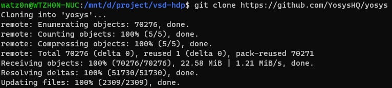<br />
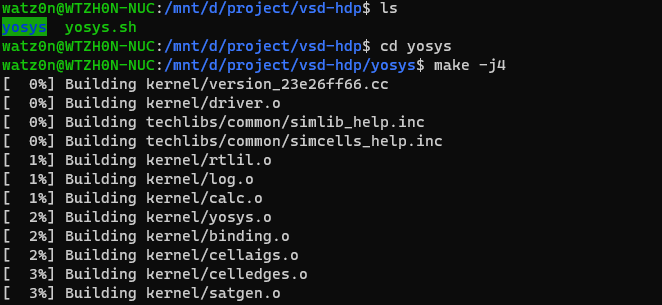<br />
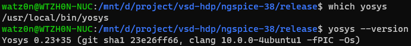<br />

### Tool: OpenSTA

Installation Guide:
> https://github.com/The-OpenROAD-Project/OpenSTA#installing-with-cmake

Additional Dependency:
```
$ sudo apt-get install swig
```
Installation Flow:
```
$ git clone https://github.com/The-OpenROAD-Project/OpenSTA.git
$ cd OpenSTA
$ mkdir build
$ cd build
$ cmake ..
$ make
$ sudo make install
```

Progress Images:

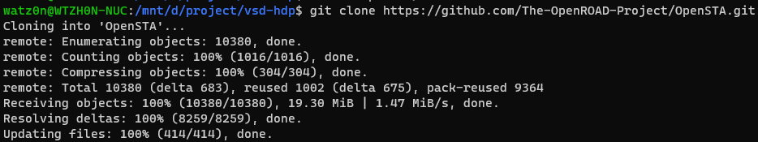<br />
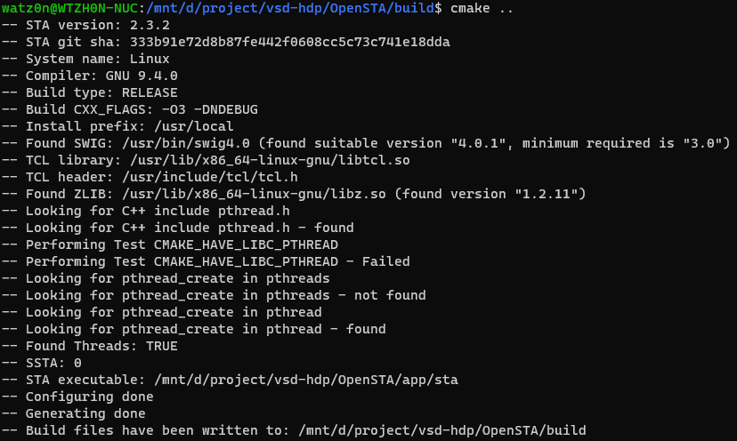<br />
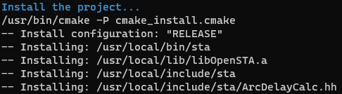<br />
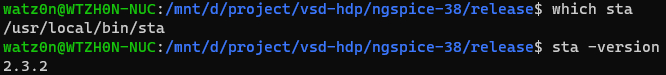<br />

### Tool: ngspice

Installation Source:
> https://sourceforge.net/projects/ngspice/files/ng-spice-rework/38/
Download File:
> ngspice-38.tar.gz

Additional Dependency:
```
$ sudo apt install libxaw7-dev
```

Installation Guide:
> https://github.com/ngspice/ngspice/blob/master/INSTALL
Chapter:
> 1.2 Install from tarball (e.g. ngspice-26.tar.gz)

Installation Flow:
```
$ tar -zxvf ngspice-38.tar.gz
$ cd ngspice-38
$ mkdir release
$ cd release
$ ../configure  --with-x --with-readline=yes --disable-debug
$ make
$ sudo make install
```

Progress Images:

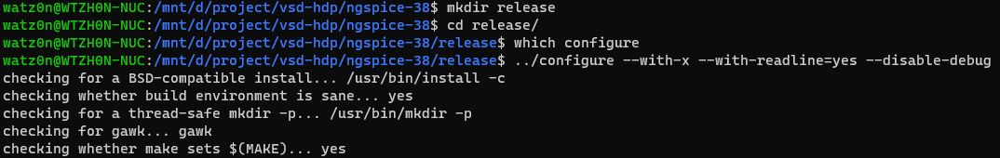<br />
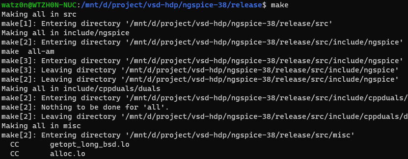<br />
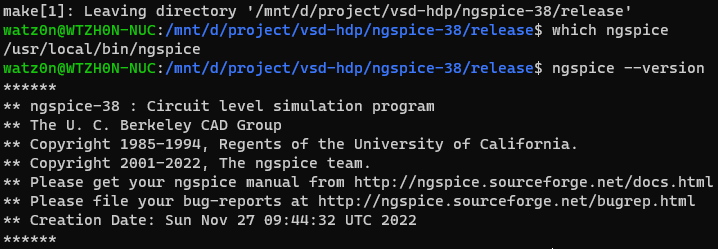<br />

------

## Day1

Goals:
1. Install Verilog Simulation Tools (iverilog, gtkwave)
2. Perform Synthesis Lab by Yosys

Lecture-Notes:
* Multiple Cell Driving Strength for timing issue adjustion (hold-time)
* PVT - Process, Voltage Temperature
    * Process : Fabrication Variation
    * Voltage : Operation Speed and Leakage Current
    * Temperature : Semiconductor is sensitive to environment condition
* `.lib` file
    * technology("cmos")
    * operating_conditions
    * cell("..."), area field
    * `.pp` : power-port abbreviation

### Tool: iverilog

Installation Source:
> https://github.com/steveicarus/iverilog/releases/tag/v11_0
Download File:
> iverilog-11_0.tar.gz

Installation Guide:
>https://github.com/steveicarus/iverilog#compilation

Installation Flow:
```
$ tar zxvf iverilog-11_0.tar.gz
$ cd iverilog-11_08
$ sh autoconf.sh
$ ./configure
$ make
$ sudo make install
```

Progress Images:

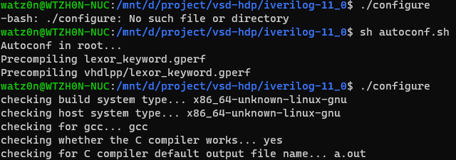<br />
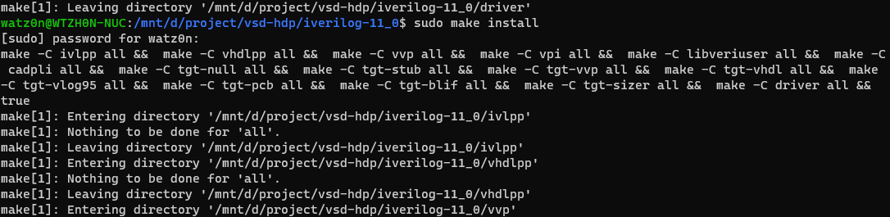<br />
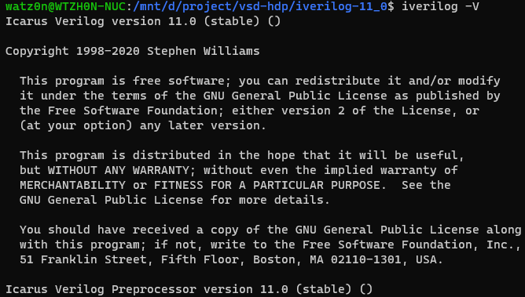<br />

### Tool: gtkwave

Apply Ubuntu-20.04 official gtkwave builds

Installation Flow:
```
$ sudo apt install libcanberra-gtk-module libcanberra-gtk3-module gtkwave
```

Progress Images:

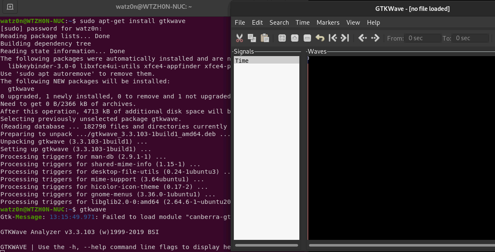<br />


### Day1-Lab1: Logic Cell Simulation

Work-Flow:
```
$ cd verilog_files
$ iverilog good_mux.v tb_good_mux.v
$ ./a.out
$ gtkwave tb_good_mux.vcd
```

Progress Images:

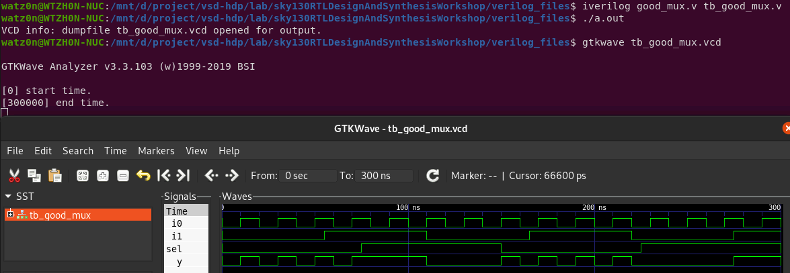<br />

### Day1-Lab2: Logic Cell Synthesis

Work-Flow:
```
$ yosys
> read_liberty -lib ../lib/sky130_fd_sc_hd__tt_025C_1v80.lib
> read_verilog good_mux.v
> synth -top good_mux
> abc -liberty ../lib/sky130_fd_sc_hd__tt_025C_1v80.lib
//--- Dot-Viewer
> show
//---
> write_verilog -noattr good_mux_netlist.v
//--- Shell Command
>!gvim good_mux_netlist.v
//---
```

Progress Images:

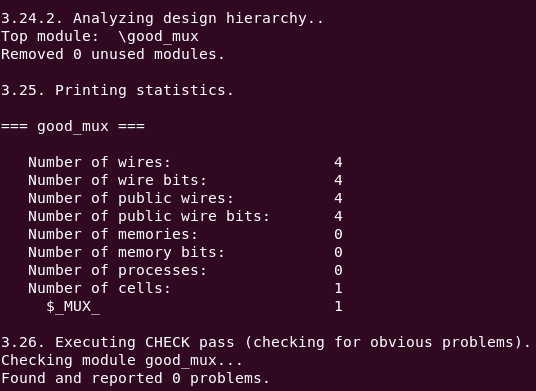<br />
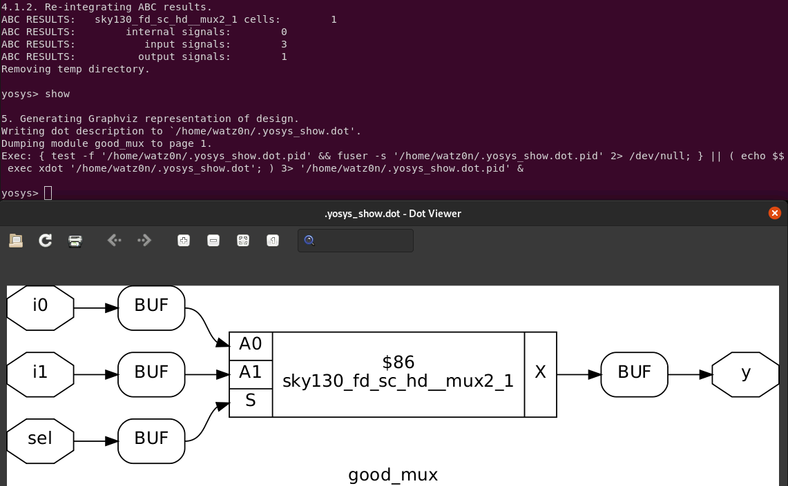<br />
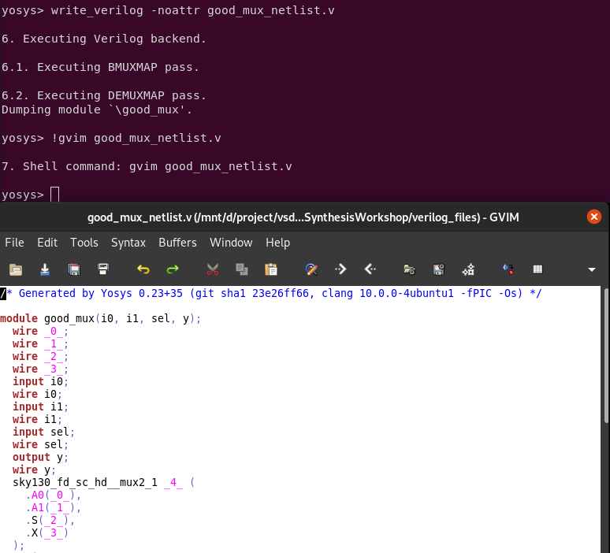<br />

------

## Day2

Goals:
1. Logic-Cell Synthesis Lab
2. Data Flip-Flop Synthesis Lab
3. Observe Yosys logic optimization

Lecture-Notes:
* NAND is stack NMOS, should be faster than NOR which is stack PMOS.
* Combinational Circuit would produce glitches, need Data Flip-Flop (DFF) to latch stable output states.
* Initial DFF value: Reset(0)/Set(1)+Sync/Async
* Interesting Optimisations: reduce multiply operation to shift-bits operation.

### Day2-Lab1: Module Hierarchy/Flatten Synthsis

Work-Flow:
```
$ yosys
> read_liberty -lib ../lib/sky130_fd_sc_hd__tt_025C_1v80.lib
> read_verilog multiple_modules.v
> synth -top multiple_modules
> abc -liberty ../lib/sky130_fd_sc_hd__tt_025C_1v80.lib
> show multiple_modules
> write_verilog -noattr multiple_modules_hier.v
> flatten
> write_verilog -noattr multiple_modules_flat.v
```

Progress Images:

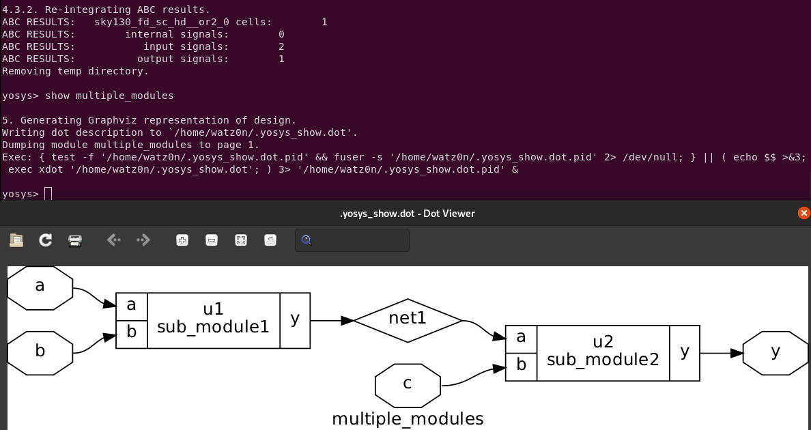<br />
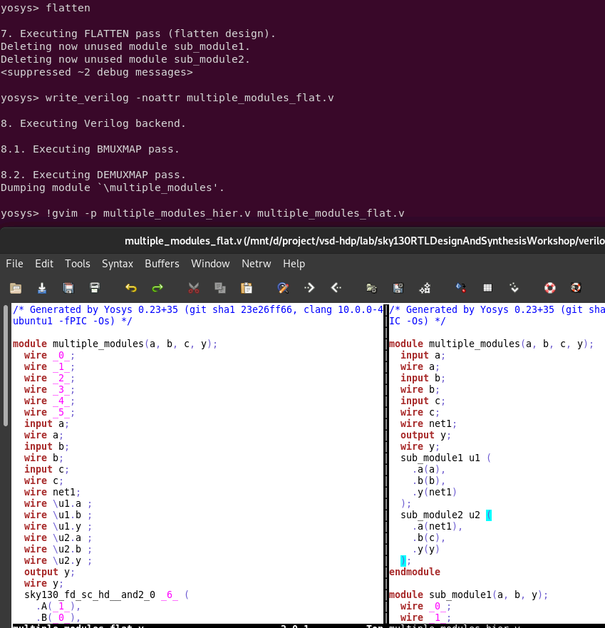<br />

### Day2-Lab2: Flip-Flop (Sequential Logic) Simulation

Work-Flow:
```
$ iverilog dff_asyncres.v tb_dff_asyncres.v
$ ./a.out
$ gtkwave tb_dff_asyncres.vcd
$ iverilog dff_async_set.v tb_dff_async_set.v
$ ./a.out
$ gtkwave tb_dff_async_set.vcd
$ iverilog dff_syncres.v tb_dff_syncres.v
$ ./a.out
$ gtkwave tb_dff_syncres.vcd
```

Progress Images:

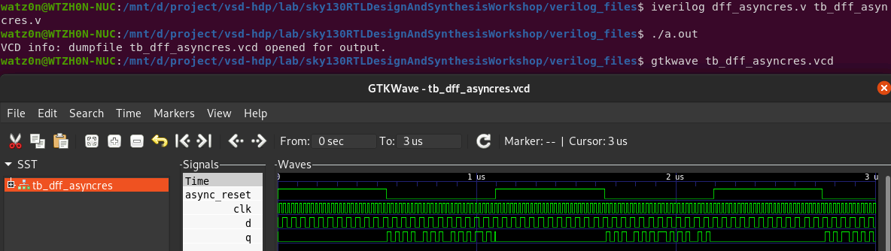<br />
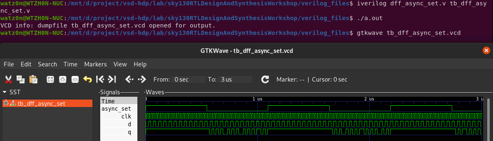<br />
<br />

### Day2-Lab3: Flip-Flop (Sequential Logic) Synthesis

Work-Flow:
```
$ yosys
> read_liberty -lib ../lib/sky130_fd_sc_hd__tt_025C_1v80.lib
> read_verilog dff_asyncres.v
> synth -top dff_asyncres
> dfflibmap -liberty ../lib/sky130_fd_sc_hd__tt_025C_1v80.lib
> abc -liberty ../lib/sky130_fd_sc_hd__tt_025C_1v80.lib
> show
> read_verilog dff_async_set.v
> synth -top dff_async_set
> dfflibmap -liberty ../lib/sky130_fd_sc_hd__tt_025C_1v80.lib
> abc -liberty ../lib/sky130_fd_sc_hd__tt_025C_1v80.lib
> show
> read_verilog dff_syncres.v
> synth -top dff_syncres
> dfflibmap -liberty ../lib/sky130_fd_sc_hd__tt_025C_1v80.lib
> abc -liberty ../lib/sky130_fd_sc_hd__tt_025C_1v80.lib
> show
```

Progress Images:

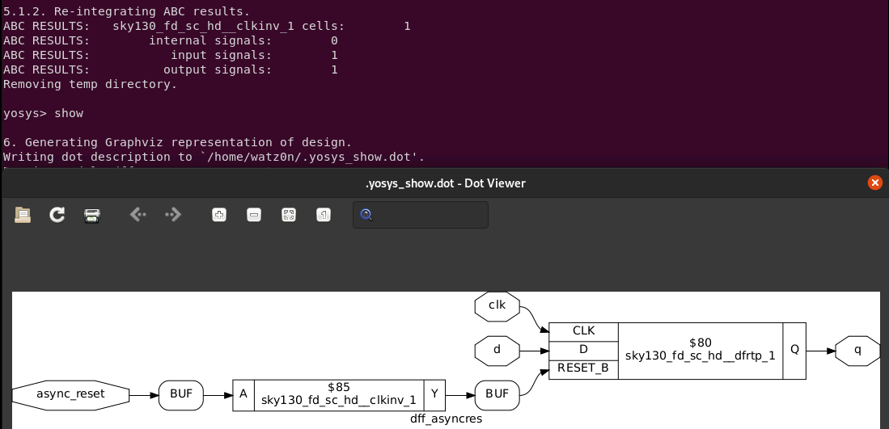<br />
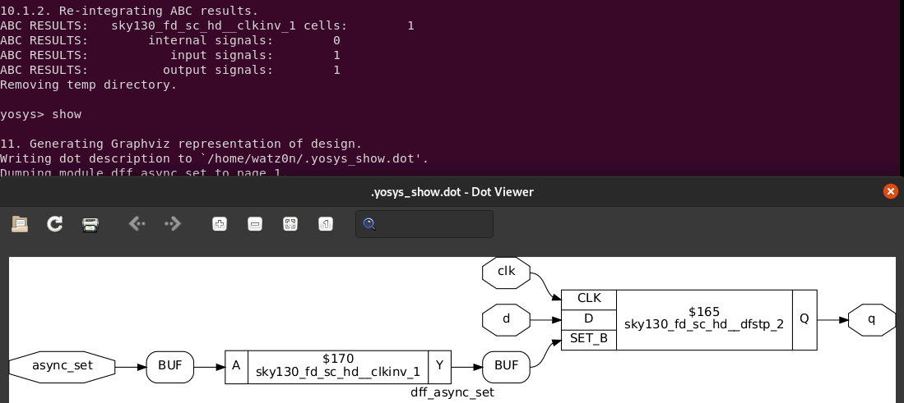<br />
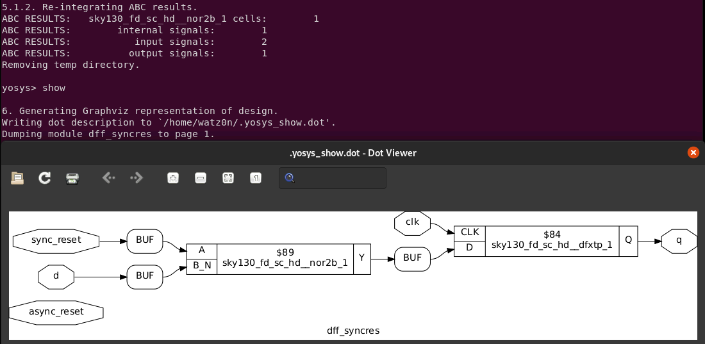<br />

### Day2-Lab4: Interesting Optimization

Work-Flow:
```
$ yosys
> read_liberty -lib ../lib/sky130_fd_sc_hd__tt_025C_1v80.lib
> read_verilog mult_2.v
> synth -top mul2
> abc -liberty ../lib/sky130_fd_sc_hd__tt_025C_1v80.lib
> write_verilog -noattr mult2_net.v
> show
> read_verilog mult_8.v
> synth -top mult8
> abc -liberty ../lib/sky130_fd_sc_hd__tt_025C_1v80.lib
> write_verilog -noattr mult8_net.v
> show
```

Progress Images:

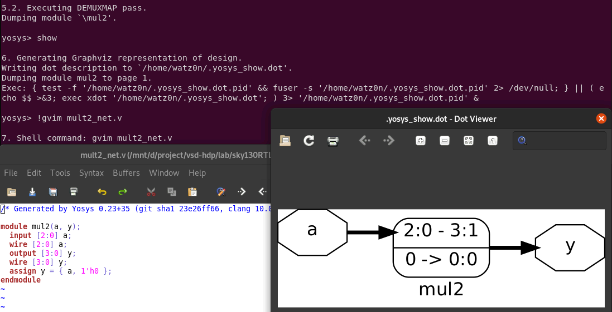<br />
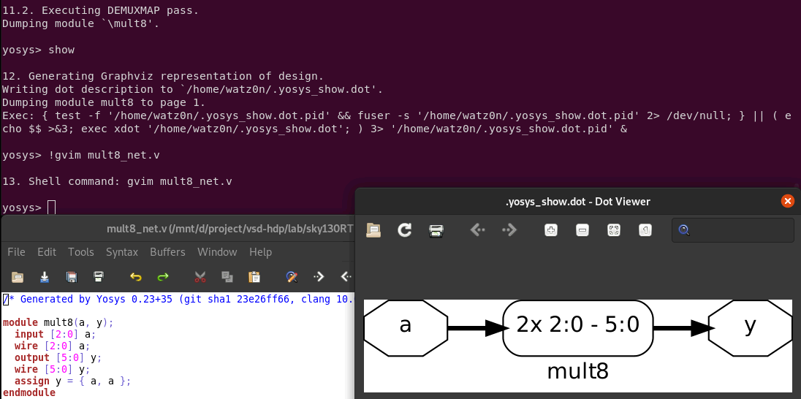<br />

------

## Day3

Goals:
1. Combinational Logic Synthesis Optimization
2. Sequential Logic Synthesis Optimization

Lecture-Notes:
* Optimization for reducing Area and Power
    * Constant Propagation
        * Sequential Logic need to consider reset/set if identical to D-pin behavior
    * Boolean Logic Optimization
        * K-MAP, Quine-McCluskey
* State Optimization
    * Cloning, Physical Aware for Placement Graph Optimization
    * Retiming, make combinational logic delay is nearly equality in multi-phase pipe-line
* Unused output optimization, remove no output dependency resources

### Day3-Lab1: Combinational Logic Optimization - Synthesis

Work-Flow:
```
$ cd verilog_files
$ yosys
> read_liberty -lib ../lib/sky130_fd_sc_hd__tt_025C_1v80.lib
> read_verilog opt_check.v
> synth -top opt_check
> opt_clean -purge
> abc -liberty  ../lib/sky130_fd_sc_hd__tt_025C_1v80.lib
> show
> read_verilog opt_check2.v
> synth -top opt_check2
> opt_clean -purge
> abc -liberty  ../lib/sky130_fd_sc_hd__tt_025C_1v80.lib
> show
> read_verilog opt_check3.v
> synth -top opt_check3
> opt_clean -purge
> abc -liberty  ../lib/sky130_fd_sc_hd__tt_025C_1v80.lib
> show
//--- Multiple Modules, need flatten
> read_verilog opt_check4.v
> synth -top opt_check4
> flatten
> opt_clean -purge
> abc -liberty  ../lib/sky130_fd_sc_hd__tt_025C_1v80.lib
> show
```

Progress Images:

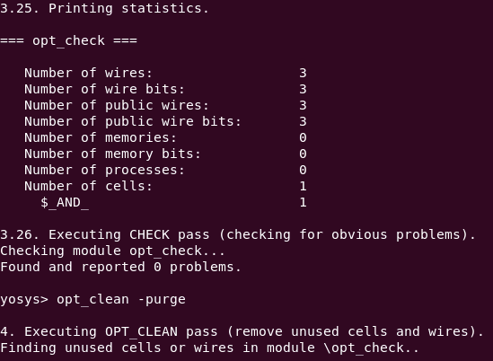<br />
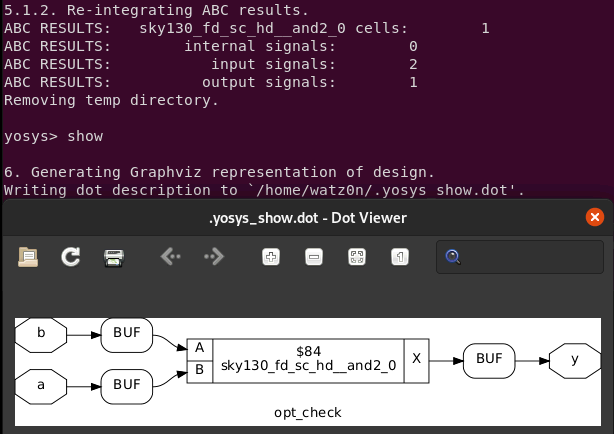<br />
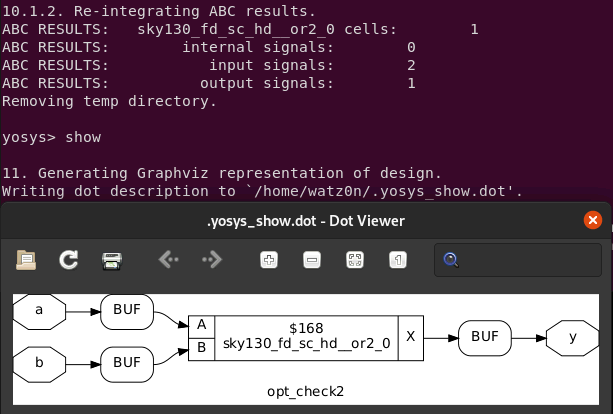<br />
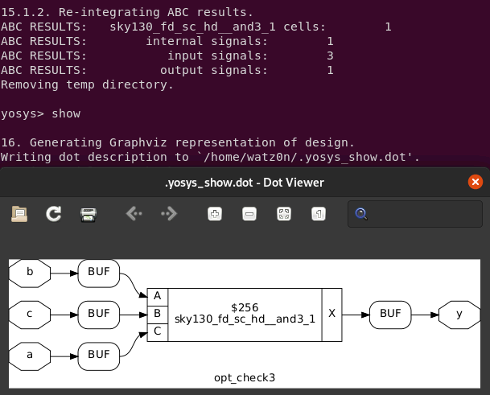<br />
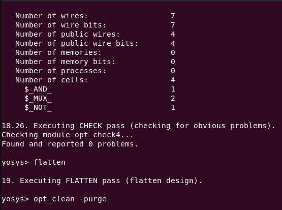<br />
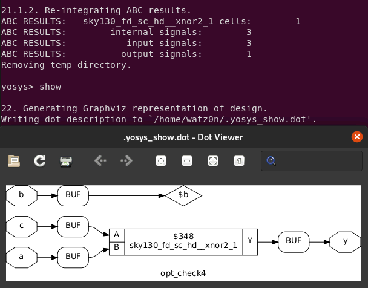<br />

### Day3-Lab2: Sequential Logic Optimization - Simulation

Work-Flow:
```
$ iverilog dff_const1.v tb_dff_const1.v
$ ./a.out
$ gtkwave tb_dff_const1.vcd
$ iverilog dff_const2.v tb_dff_const2.v
$ ./a.out
$ gtkwave tb_dff_const2.vcd
```

Progress Images:

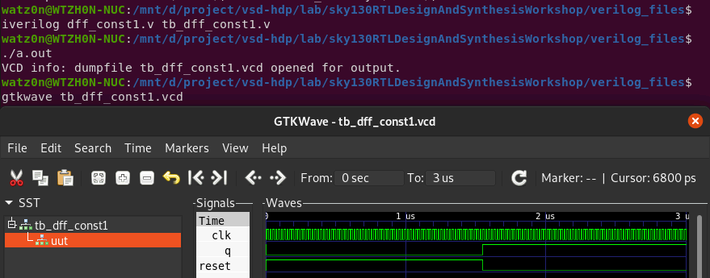<br />
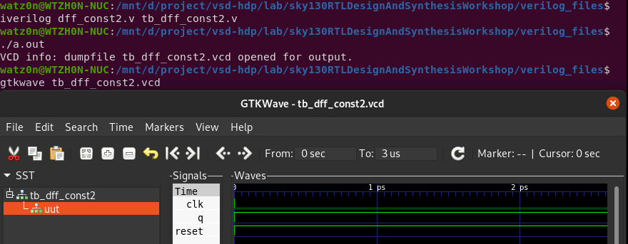<br />

### Day3-Lab3: Sequential Logic Optimization - Synthesis

Work-Flow:
```
$ yosys
> read_liberty -lib ../lib/sky130_fd_sc_hd__tt_025C_1v80.lib
> read_verilog dff_const1.v
> synth -top dff_const1
> dfflibmap -liberty ../lib/sky130_fd_sc_hd__tt_025C_1v80.lib
> abc -liberty  ../lib/sky130_fd_sc_hd__tt_025C_1v80.lib
> show
> read_verilog dff_const2.v
> synth -top dff_const2
> abc -liberty  ../lib/sky130_fd_sc_hd__tt_025C_1v80.lib
> show
```

Progress Images:

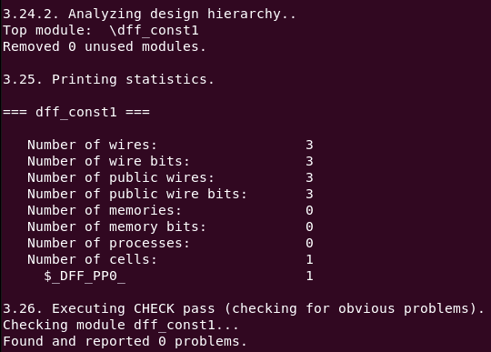<br />
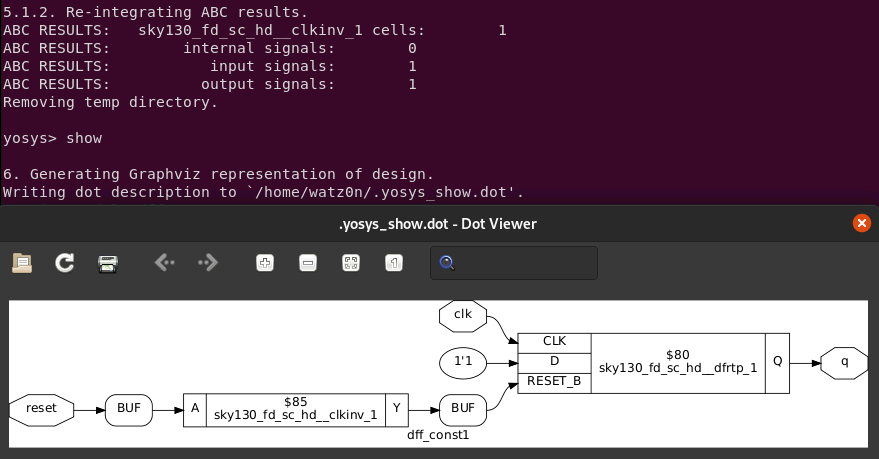<br />
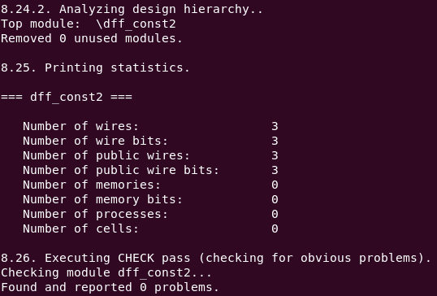<br />
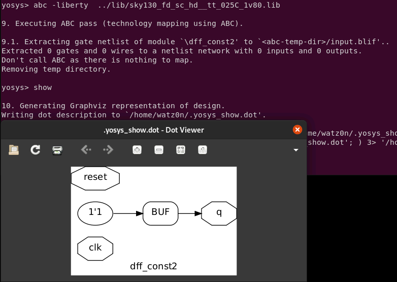<br />

### Day3-Lab4: Stack Flip-Flop - Simulation

Work-Flow:
```
$ iverilog dff_const3.v tb_dff_const3.v
$ ./a.out
$ gtkwave tb_dff_const3.vcd
$ iverilog dff_const4.v tb_dff_const4.v
$ ./a.out
$ gtkwave tb_dff_const4.vcd
$ iverilog dff_const5.v tb_dff_const5.v
$ ./a.out
$ gtkwave tb_dff_const5.vcd
```

Progress Images:

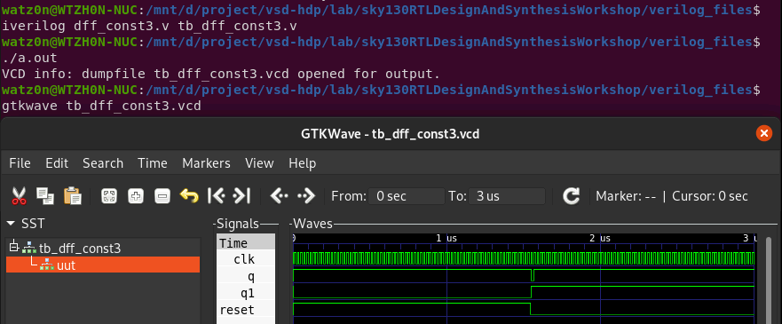<br />
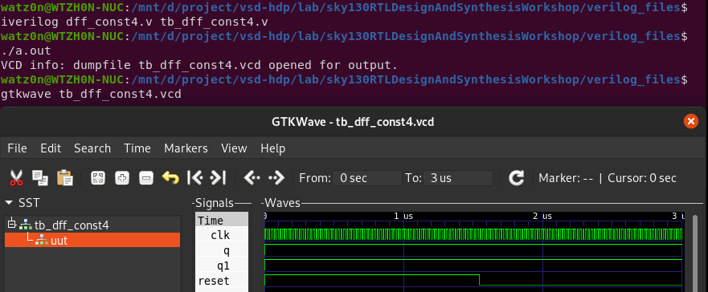<br />
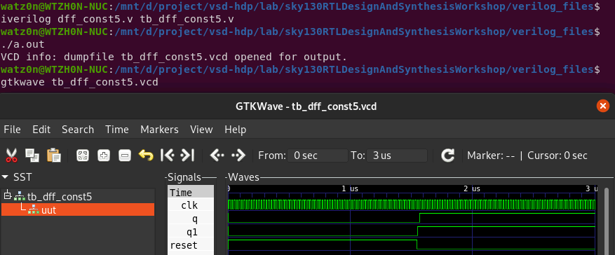<br />

### Day3-Lab5: Stack Flip-Flop - Synthesis

Work-Flow:
```
$ yosys
> read_liberty -lib ../lib/sky130_fd_sc_hd__tt_025C_1v80.lib
> read_verilog dff_const3.v
> synth -top dff_const3
> dfflibmap -liberty ../lib/sky130_fd_sc_hd__tt_025C_1v80.lib
> abc -liberty  ../lib/sky130_fd_sc_hd__tt_025C_1v80.lib
> show
> read_verilog dff_const4.v
> synth -top dff_const4
> dfflibmap -liberty ../lib/sky130_fd_sc_hd__tt_025C_1v80.lib
> abc -liberty  ../lib/sky130_fd_sc_hd__tt_025C_1v80.lib
> show
> read_verilog dff_const5.v
> synth -top dff_const5
> dfflibmap -liberty ../lib/sky130_fd_sc_hd__tt_025C_1v80.lib
> abc -liberty  ../lib/sky130_fd_sc_hd__tt_025C_1v80.lib
> show
```

Progress Images:

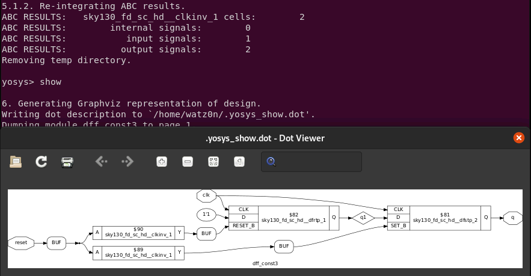<br />
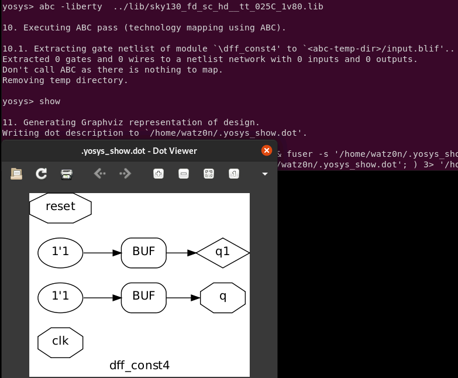<br />
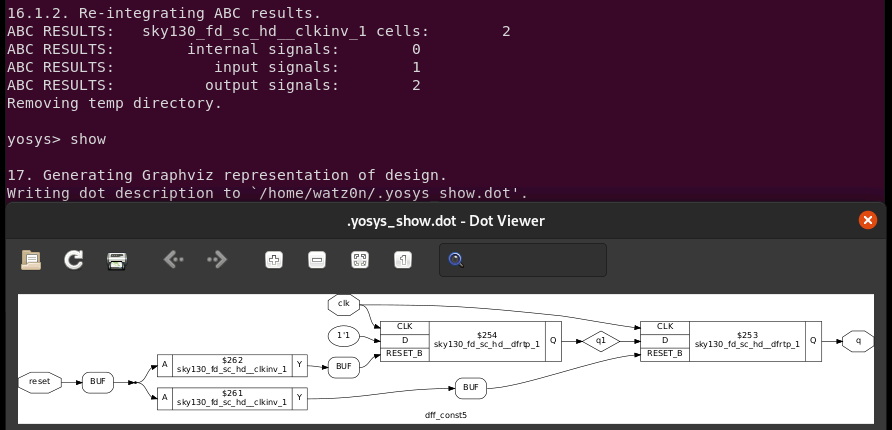<br />

### Day3-Lab6: Unused Output - Synthesis

Work-Flow:
```
$ yosys
> read_liberty -lib ../lib/sky130_fd_sc_hd__tt_025C_1v80.lib
> read_verilog counter_opt.v
> synth -top counter_opt
> dfflibmap -liberty ../lib/sky130_fd_sc_hd__tt_025C_1v80.lib
> abc -liberty  ../lib/sky130_fd_sc_hd__tt_025C_1v80.lib
> show
> read_verilog counter_opt2.v
> synth -top counter_opt2
> dfflibmap -liberty ../lib/sky130_fd_sc_hd__tt_025C_1v80.lib
> abc -liberty  ../lib/sky130_fd_sc_hd__tt_025C_1v80.lib
> show
```

Progress Images:

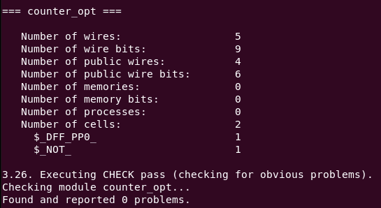<br />
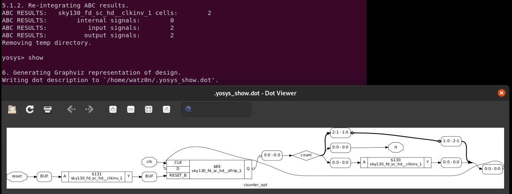<br />
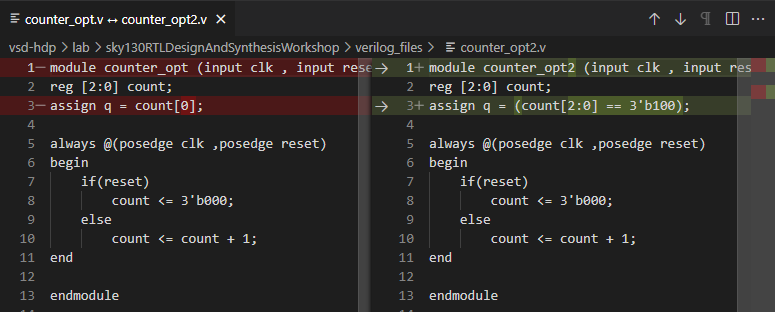<br />
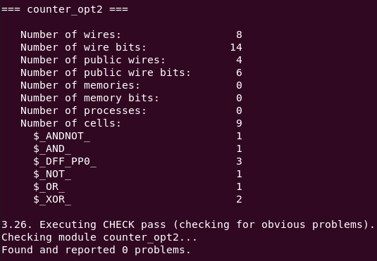<br />
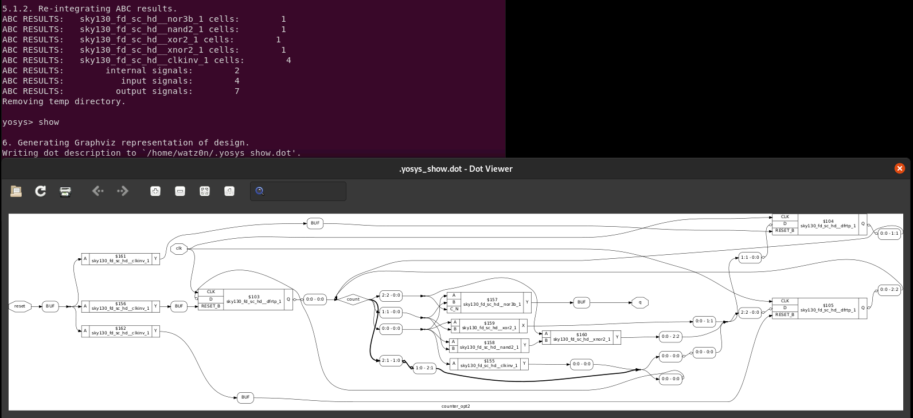<br />

------

## Day4

Goals:
1. Gate-Level Simulation Flow
2. Behavior (RTL) v.s. Synthesis (Gate) simulate result mismatch issue

Lecture-Notes:
* Ensuring the timing requirement is met for Gate-Level Models with delay-annotated.
* Behavior (RTL) v.s. Synthesis (Gate) Simulation Mismatch
    1. Missing sensitivity list
        * always@(sensitivity-list), usually apply always(*), (*) means evaluate all chagnes in statements
    2. Blocking v.s. Non-Blocking Assignment
    3. Non-Standard (non-synthsizable) Verilog coding
* Blocking v.s. Non-Blocking
    * Blocking evaluate statements in order sequence, may incur latch to hold previous evaluated result
    * Non-Blocking evaluate statements in the same time, if LHS has multiple evaluations, use last/bottom one
* Use Non-Blocking for sequential circuit coding is perform better synthesis quality

### Day4-Lab1: Gate-Level Simulation (GLS)

Work-Flow:
```
$ iverilog ternary_operator_mux.v tb_ternary_operator_mux.v
$ ./a.out
$ gtkwave tb_ternary_operator_mux.vcd
$ yosys
> read_liberty -lib ../lib/sky130_fd_sc_hd__tt_025C_1v80.lib
> read_verilog ternary_operator_mux.v
> synth -top ternary_operator_mux
> abc -liberty  ../lib/sky130_fd_sc_hd__tt_025C_1v80.lib
> write_verilog -noattr ternary_operator_mux_net.v
> show

$ iverilog ../my_lib/verilog_model/primitives.v ../my_lib/verilog_model/sky130_fd_sc_hd.v ternary_operator_mux_net.v tb_ternary_operator_mux.v
$ ./a.out
$ gtkwave tb_ternary_operator_mux.vcd

```

Progress Images:

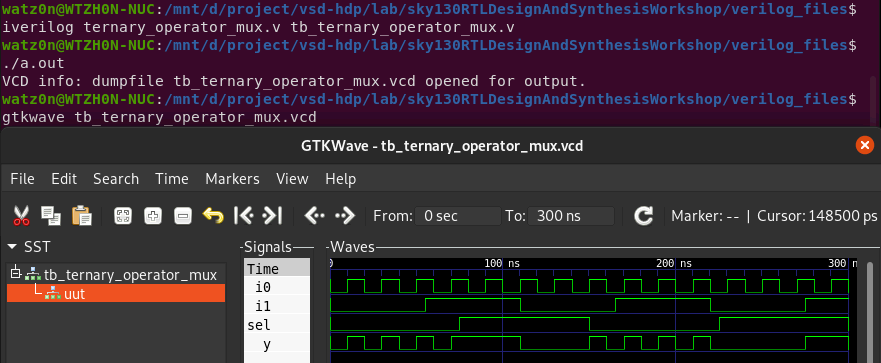<br />
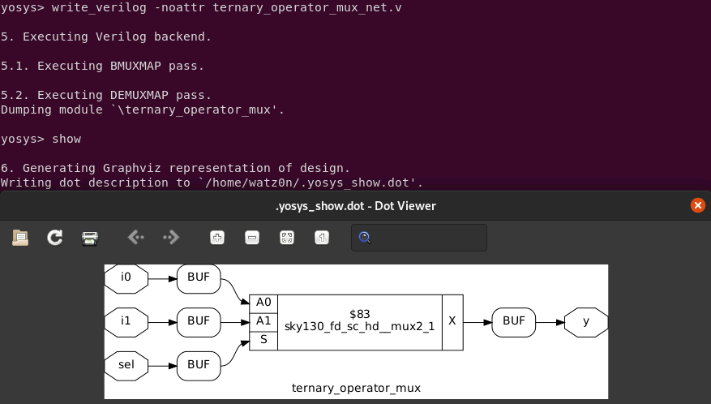<br />
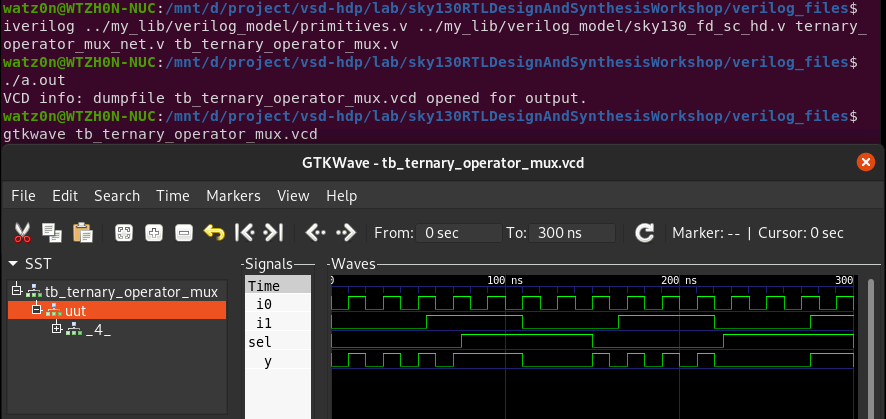<br />

### Day4-Lab2: Bad MUX Synthsis-Behavior Mismatch

Work-Flow:
```
$ iverilog bad_mux.v tb_bad_mux.v
$ ./a.out
$ gtkwave tb_bad_mux.vcd
$ yosys
> read_liberty -lib ../lib/sky130_fd_sc_hd__tt_025C_1v80.lib
> read_verilog bad_mux.v
> synth -top bad_mux
> abc -liberty  ../lib/sky130_fd_sc_hd__tt_025C_1v80.lib
> write_verilog -noattr bad_mux_net.v
> show

$ iverilog ../my_lib/verilog_model/primitives.v ../my_lib/verilog_model/sky130_fd_sc_hd.v bad_mux_net.v tb_bad_mux.v
$ ./a.out
$ gtkwave tb_bad_mux.vcd
```

Progress Images:

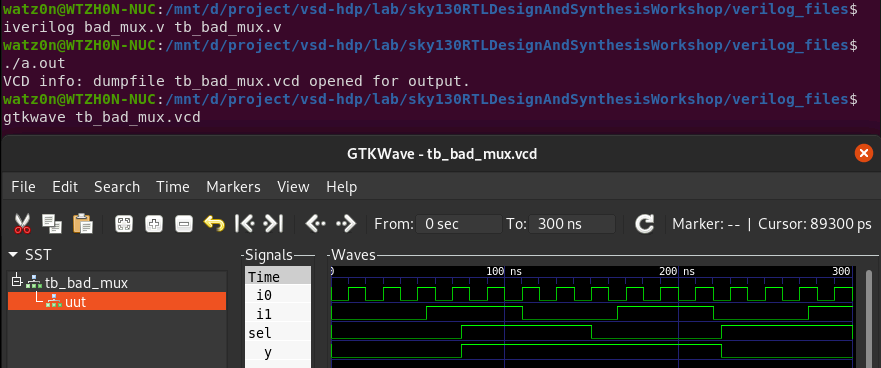<br />
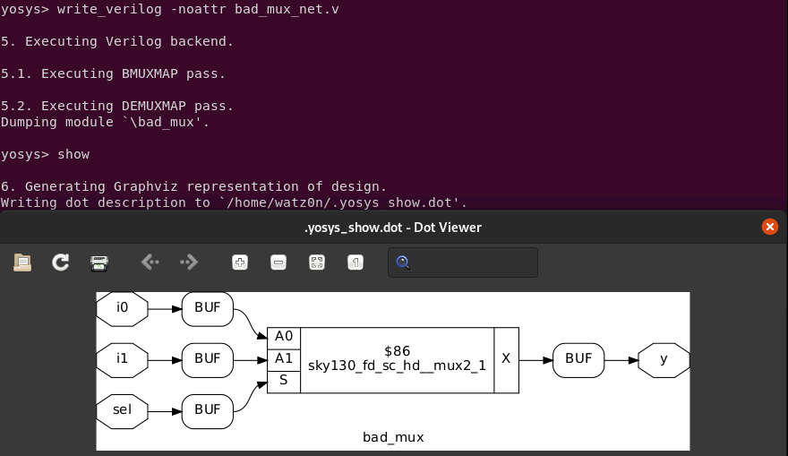<br />
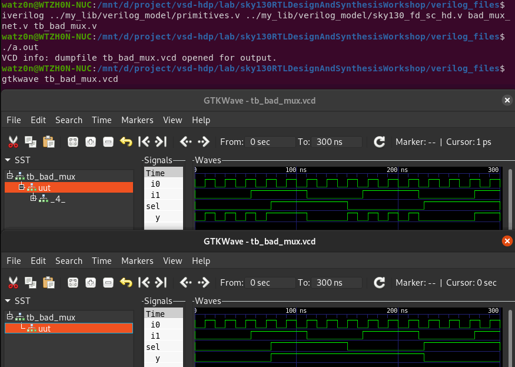<br />

### Day4-Lab3: Synthsis-Behavior Simulation Mismatch for Blocking Statement

Work-Flow:
```
$ iverilog blocking_caveat.v tb_blocking_caveat.v
$ ./a.out
$ gtkwave tb_blocking_mux.vcd
$ yosys
> read_liberty -lib ../lib/sky130_fd_sc_hd__tt_025C_1v80.lib
> read_verilog blocking_caveat.v
> synth -top blocking_caveat
> abc -liberty  ../lib/sky130_fd_sc_hd__tt_025C_1v80.lib
> write_verilog -noattr blocking_caveat_net.v
> show

$ iverilog ../my_lib/verilog_model/primitives.v ../my_lib/verilog_model/sky130_fd_sc_hd.v blocking_caveat_net.v tb_blocking_caveat.v
$ ./a.out
$ gtkwave tb_blocking_mux.vcd
//--- test expect behavior simulation
$ iverilog blocking_caveat_exp.v tb_blocking_caveat.v
$ ./a.out
$ gtkwave tb_blocking_mux.vcd
```

Progress Images:

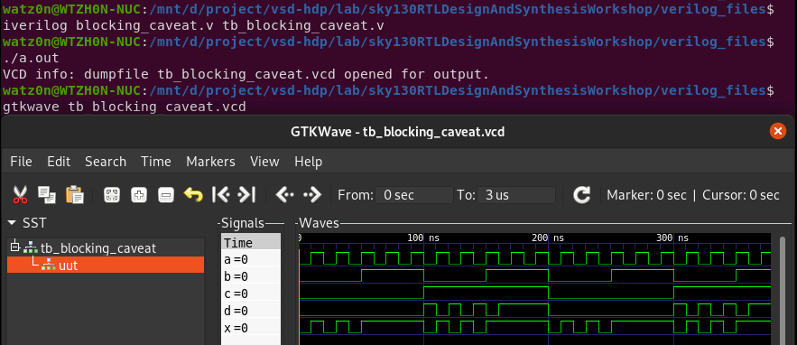<br />
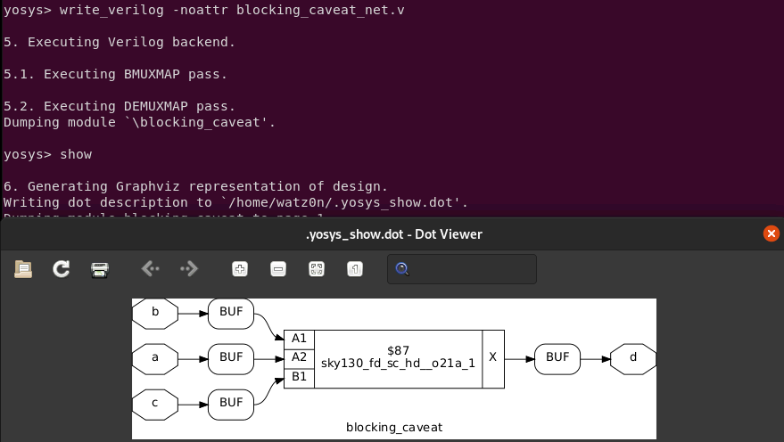<br />
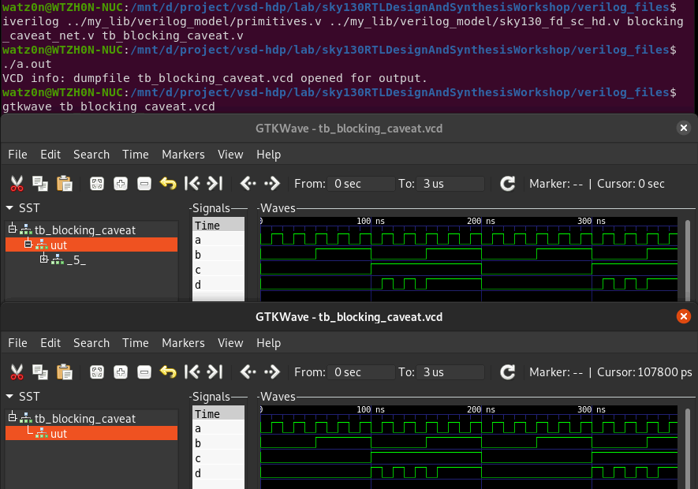<br />

Test Expect-Behavior RTL simulation:

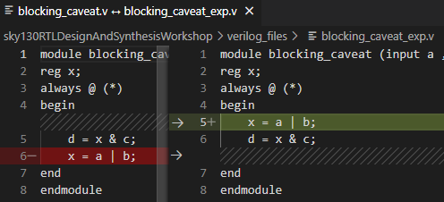<br />
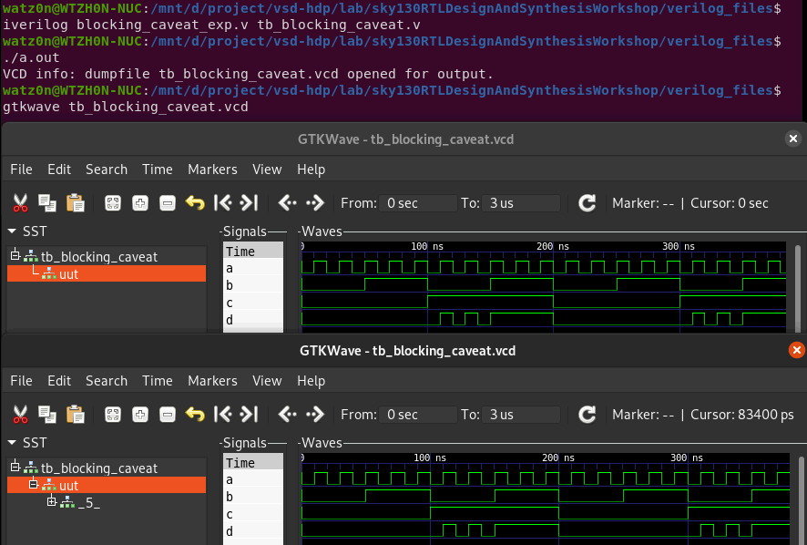<br />

------

## Day5

Goals:
1. If-Else/Case Statement Usage and Malfunctional Style
2. For-Loop/For-Generate Usage

Lecture-Notes:
* If-Else Statement
    1. priority logic, may lead to long stack multiplexers
    2. Incomplete If-Else statement would produce `inferred latches`
```
if(cnd1)
    y=a;
else if(cnd2)
    y=b;
```
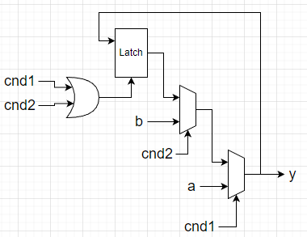<br />

* Case Statement
    1. balanced multiplexer to reduce gate delay
    2. Imcomplete case statements would produce `inferred latches`
        * without default keyword and conditions not complete
        * LHS under each conditions are not identical
    3. Malfunction from overlapping case conditions
        * be careful with `?` (any-value) in conditions
        * overlapping means multiple conditions are evaluated at same time

* For-Loop
    * evaluating expressions for wide MUX/deMUX
```
//--- 2:1 MUX by case

output y;
input i0,i1;

always@(*) begin
    case(sel)
        1'b0: y=i0;
        i'b1: y=i1;
    endcase
end

//--- 32:1 MUX by For-Loop

output       y;
input [31:0] inp;

integer i;
always@(*) begin
    for(i=0; i<32; i=i+1) begin
        if(i==sel)
            y=inp[i];
    end
end

//--- 1:8 deMUX by For-Loop

output [7:0] out;
input        inp;

integer i;
always@(*) begin
    out[7:0] = 8'h0;
    for(i=0; i<8; i=i+1) begin
        if(i==sel)
            out=inp;
    end
end

```
    
* For-Generate
    * instantiating multiple same source modules

```
output [7:0] y;
input  [7:0] in1, in2;

genvar i;
generate
    for(i=0; i<8; i=i+1) begin
        and u_and(.a(in1[i]), .b(in2[i]), .c(y[i]))
    end
endgenerate

```

### Day5-Lab1: Imcomplete If-Else Statements

Work-Flow:
```
$ iverilog incomp_if.v tb_incomp_if.v
$ ./a.out
$ gtkwave tb_incomp_if.vcd
$ yosys
> read_liberty -lib ../lib/sky130_fd_sc_hd__tt_025C_1v80.lib
> read_verilog incomp_if.v
> synth -top incomp_if
> abc -liberty  ../lib/sky130_fd_sc_hd__tt_025C_1v80.lib
> show

$ iverilog incomp_if2.v tb_incomp_if2.v
$ ./a.out
$ gtkwave tb_incomp_if2.vcd
$ yosys
> read_liberty -lib ../lib/sky130_fd_sc_hd__tt_025C_1v80.lib
> read_verilog incomp_if2.v
> synth -top incomp_if2
> abc -liberty  ../lib/sky130_fd_sc_hd__tt_025C_1v80.lib
> show
```

Progress Images:

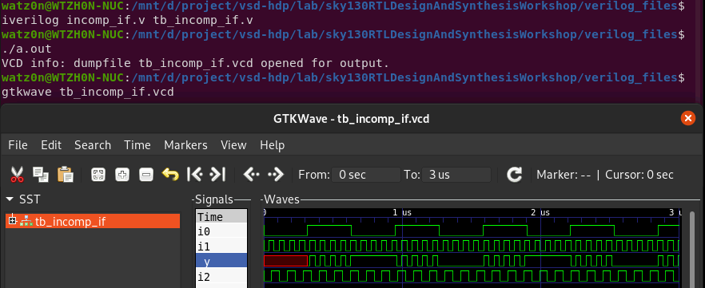<br />
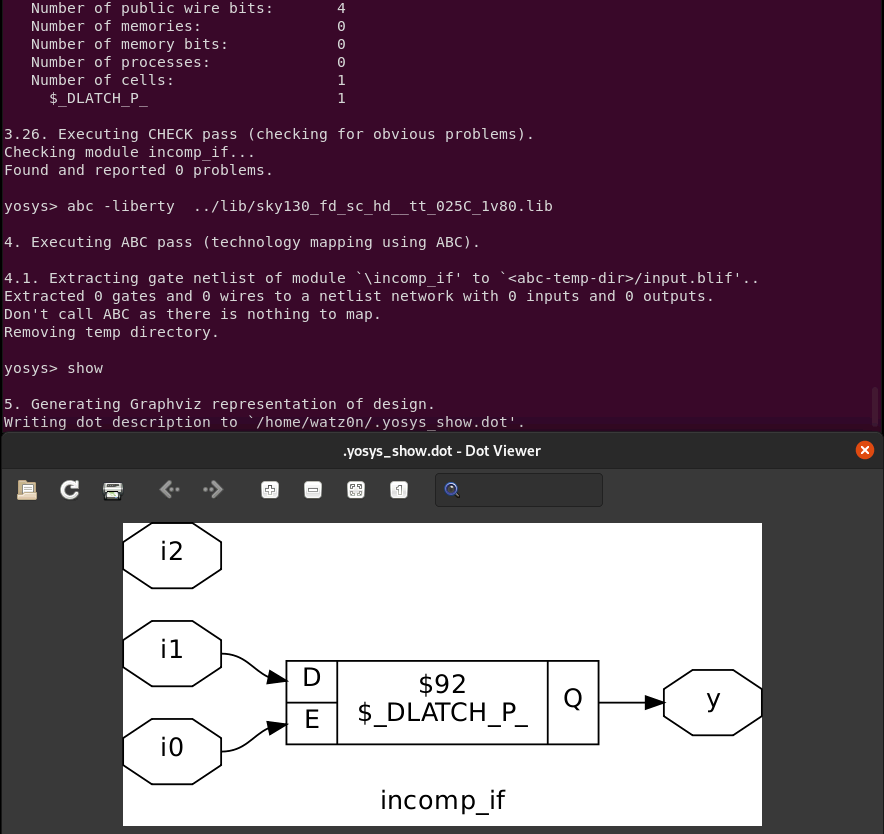<br />
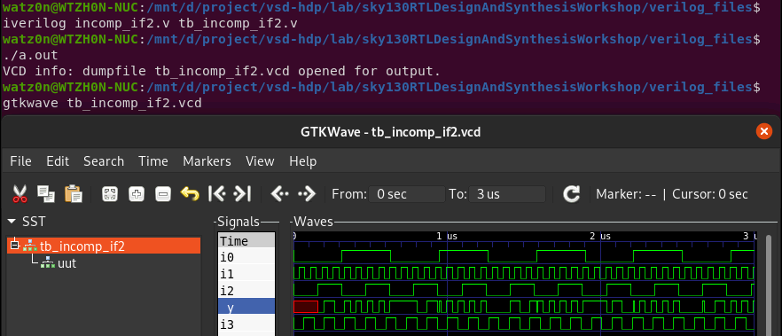<br />
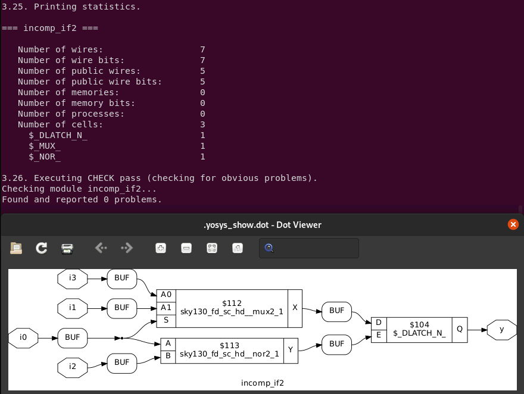<br />

### Day5-Lab2: Incomplete Case Statements

Work-Flow:
```
$ iverilog incomp_case.v tb_incomp_case.v
$ ./a.out
$ gtkwave tb_incomp_case.vcd
$ yosys
> read_liberty -lib ../lib/sky130_fd_sc_hd__tt_025C_1v80.lib
> read_verilog incomp_case.v
> synth -top incomp_case
> abc -liberty  ../lib/sky130_fd_sc_hd__tt_025C_1v80.lib
> show

$ iverilog comp_case.v tb_comp_case.v
$ ./a.out
$ gtkwave tb_comp_case.vcd
$ yosys
> read_liberty -lib ../lib/sky130_fd_sc_hd__tt_025C_1v80.lib
> read_verilog comp_case.v
> synth -top comp_case
> abc -liberty  ../lib/sky130_fd_sc_hd__tt_025C_1v80.lib
> show

$ yosys
> read_liberty -lib ../lib/sky130_fd_sc_hd__tt_025C_1v80.lib
> read_verilog partial_case_assign.v
> synth -top partial_case_assign
> abc -liberty  ../lib/sky130_fd_sc_hd__tt_025C_1v80.lib
> show

$ iverilog bad_case.v tb_bad_case.v
$ ./a.out
$ gtkwave tb_bad_case.vcd
$ yosys
> read_liberty -lib ../lib/sky130_fd_sc_hd__tt_025C_1v80.lib
> read_verilog bad_case.v
> synth -top bad_case
> abc -liberty  ../lib/sky130_fd_sc_hd__tt_025C_1v80.lib
> write_verilog -noattr bad_case_net.v
$ iverilog ../my_lib/verilog_model/primitives.v ../my_lib/verilog_model/sky130_fd_sc_hd.v bad_case_net.v tb_bad_case.v
$ ./a.out
$ gtkwave tb_bad_case.vcd

```

Progress Images:

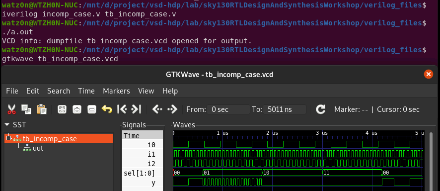<br />
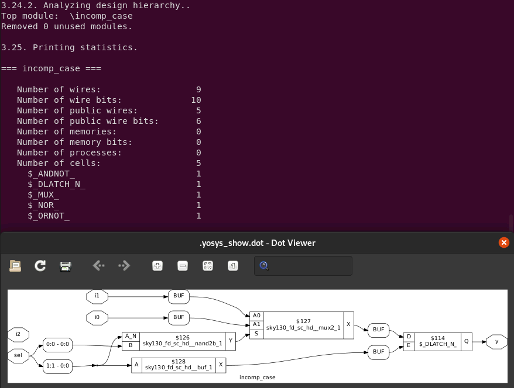<br />
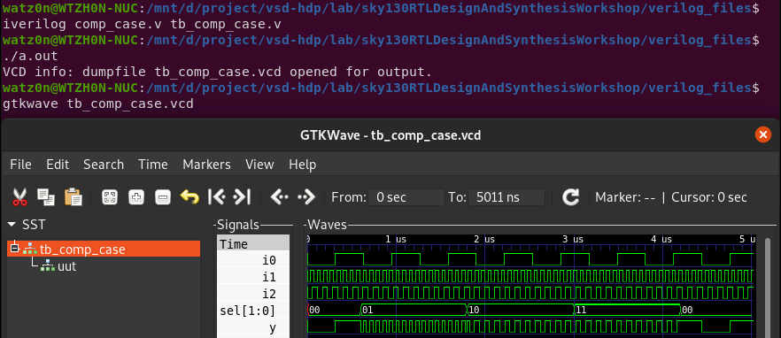<br />
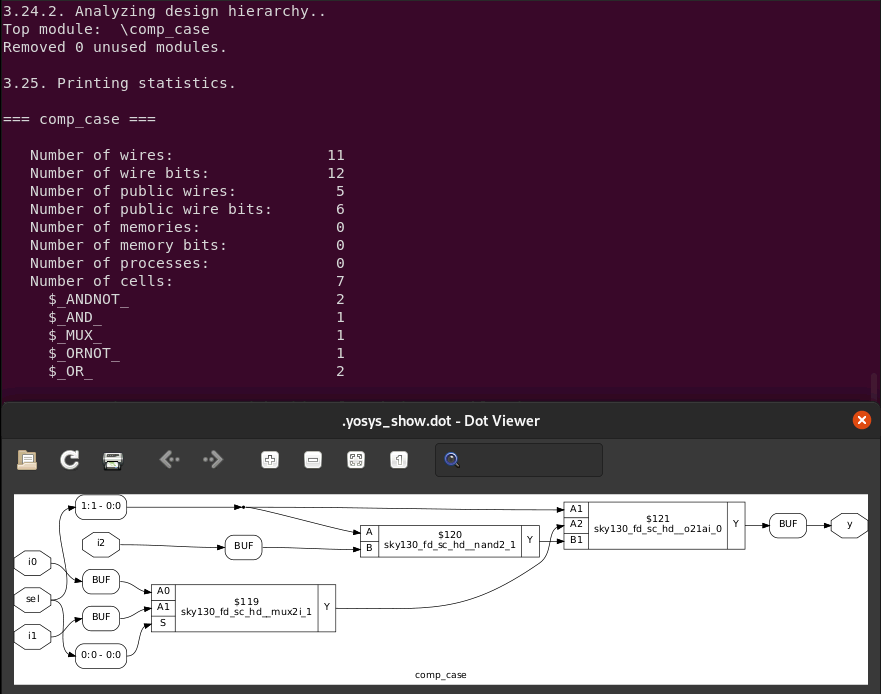<br />
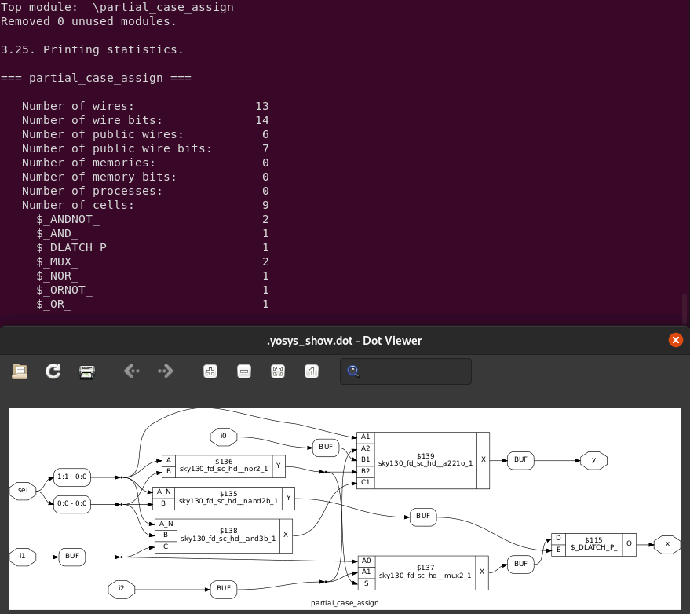<br />
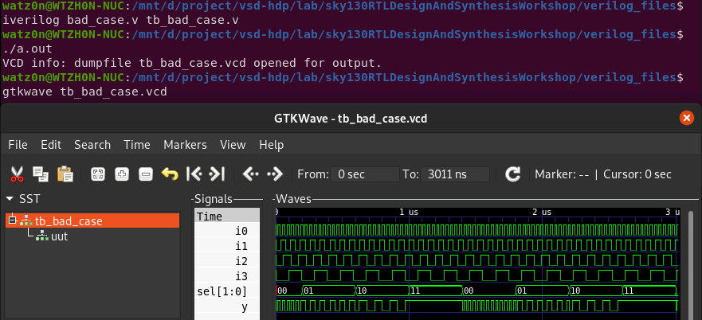<br />
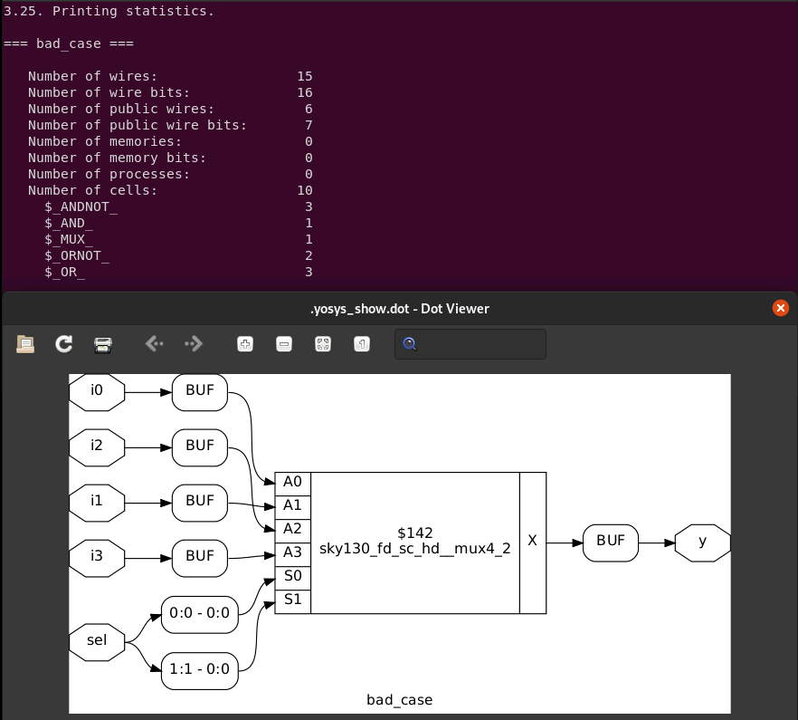<br />
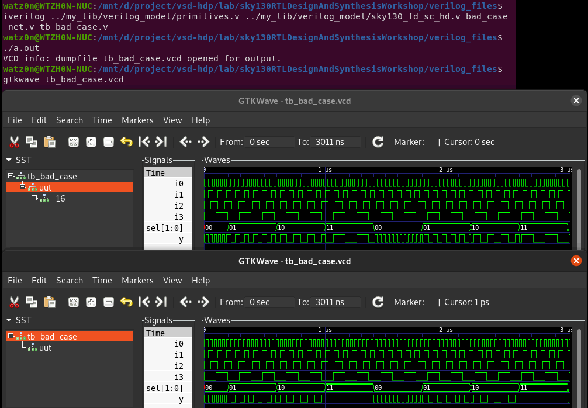<br />

### Day5-Lab3: For Loop and For Generate

Work-Flow:
```
$ iverilog mux_generate.v tb_mux_generate.v
$ ./a.out
$ gtkwave tb_mux_generate.vcd

$ iverilog demux_case.v tb_demux_case.v
$ ./a.out
$ gtkwave tb_demux_case.vcd
$ iverilog demux_generate.v tb_demux_generate.v
$ ./a.out
$ gtkwave tb_demux_generate.vcd

$ iverilog fa.v rca.v tb_rca.v
$ ./a.out
$ gtkwave tb_rca.vcd

```

Progress Images:

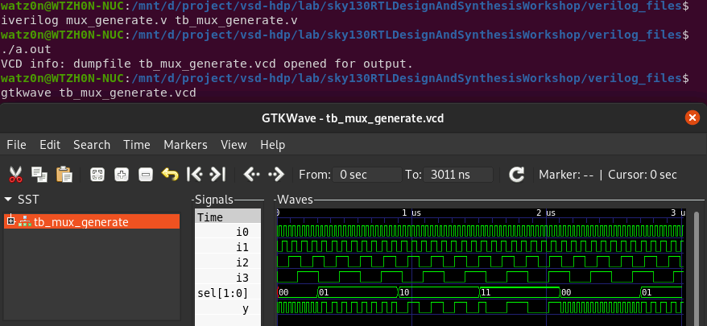<br />
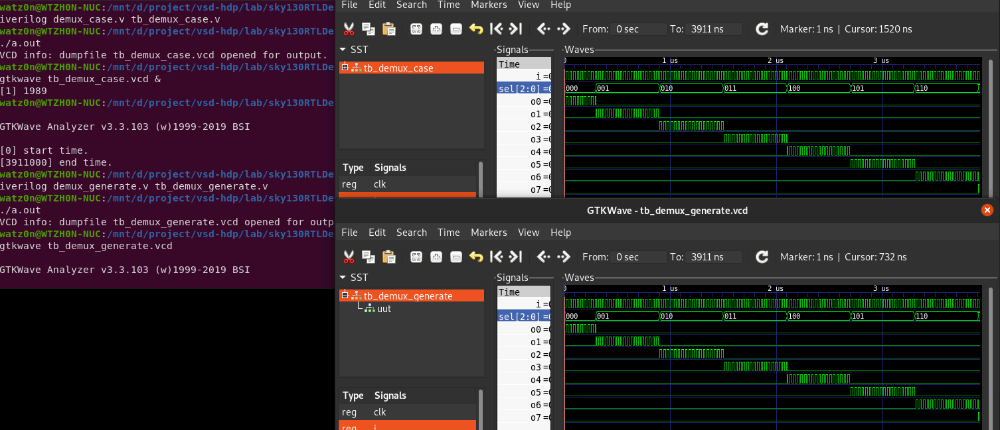<br />
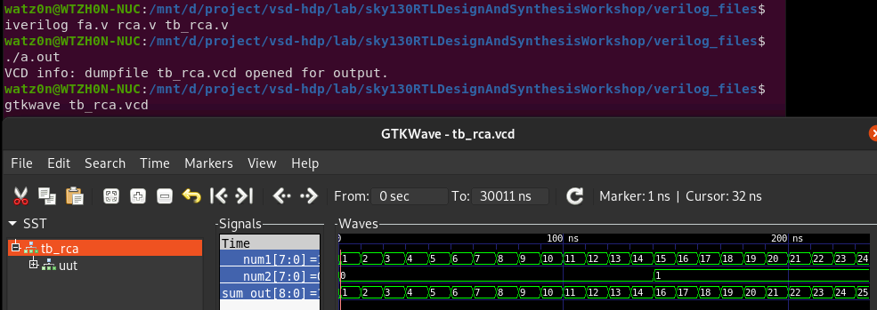<br />

------

## Day6

Topic: Design Preparation 

Goals:
1. Synthesizable RTL and Testbench Ready
2. Behavior and Synthesis Simlation Consistancy

Status: Design RTL-Code Fixed 
* development-stage progress: [project.md](project.md)
* design database: [project/README.md](project/README.md)
* design report: [design_report.md](reports/design_report.md)

------

## Day7

Topic: Basic SDC constraints

Goals:
1. Logic Synthesis Flow by Design-Compiler from Synopsys
2. Basic Logic Synthesis knowledge introduction

Lecture-Note:

    * Logic Synthesis
        1. RTL+.LIB->Netlist(Gates)
        2. .LIB is collection of logic modules from same function but different strengeh/timing variation
            * Need Cells that work fast enough to meet required performance (setup-time)
            * Need Cells that work slow enough to avoid contamination (hold-time)
    * Design Compiler
        1. SDC, synopsys design constraints, industry standard constraint for EDA automation
        2. .LIB, design library which contains the standard cell information
        3. .DB, same as .LIB for DC import related libraries
        4. .DDC, Synopsys's proprietary format for libraries
        5. SDC for timing-constraint, UPF for power-constraint
    * Design(RTL) + Library (.DB) + SDC -> Verilog Netlist + DDC + Synthesis Reports
    * Implementation Flow for ASIC
        `[RTL]->[SYN]->[DFT]->[FP]->[CTS]->[PnR]->[GDS]`
    * DC Synthesis Flow:
        1. Read STD Cell/Tech .lib
        2. Read Design (Verilog/VHDL, Design .LIB)
        3. Read Design Constraints (SDC)
        4. Link the Design
        5. Synthesize the Design
        6. Generate Report and Analyze QoR
    * Library Name : `sky130_fd_sc_hd_tt_025C_1v80.lib`
        * fd -> fundary, sc -> standard cell, hd->high-density, tt->typical-typical, 025C-> 25 degree temperature, 1v80->1.8V
    * PVT -> Power/Voltage/Temerature
        * PVT corner -> typical/fast/slow
    * DC Operation Flow
```
    $dc_shell
    >read_verilog lab1.v
    >read_db sky130.db
    >set link_library {* sky130.db}
    >link
    >compile
    >write -f verilog -out lib1_net_sky130.v
    >write -f ddc -out lib1.ddc
```
    * Design Visison
```
    $design_vision
    >start gui
    //---
    >read_ddc lab1.ddc
    //--- Use GTECH (gech.db) /standard.sldb
    >read_verlog lib1_net_sky130.v
```
    * Start-up Script to set environment
        * File-Name: `.synopsys_dc.setup`, put in home directory

    * TCL Quick Reference
```
    * set a [ expr $a + $b ]
    * if { cond } { true-stat } else { false-stat }
    * echo "hello world"
    * while { cond } { loop-stat }
    * for { init } {  cond } { end-op } { loop-stat }
    * foreach <var-name> <list-name> { statements }
    //DC only
    * foreach <var-name> <collection-name> { statements }
    * get_lib_cells */*and* > get collection
    * source script.tcl
```

    * STA
        * Max (Setup) and Min (Hold) delay constraints
        * Delay for Cells:
            1. Input Transition (Driving Slew-Rate)
            2. Output Load (Capcitance)
        * Timing Arc
            * Combinational Cell: input port to output port changes elasped time
            * Sequential Cell:
                1. Clock to Q -> DFF
                2. Clock to D + D to Q -> D-Latch (DLAT)

<br />
        
        * Timing-Path:
            * Start Point : 1. Input-Port 2. Clock Pin of Register
            * End Point : 1. Output-Port 2. D Pin of Register
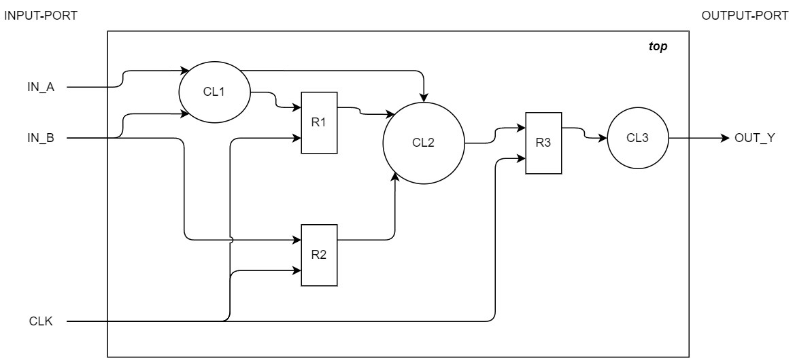<br />          
        
        * Timing-Path Constraint:
            * REG2REG: Clock Constraint
            * REG2OUT: Output External Delay + Clock Constraint
            * IN2REG: Input External Delay + Clock Constraint

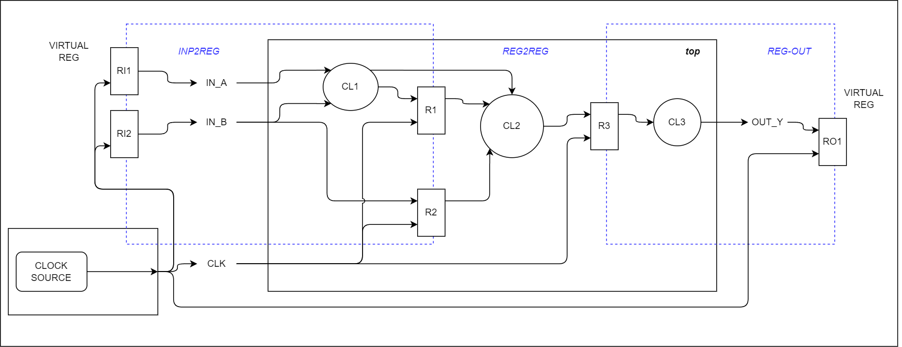<br />

        * IO Constraint:
            * Delay isn't ideal as zero -> Consider input transition and output load
            * Rule of Thumb: 70% Eternal Delay, 30% Internal Delay from Clock constraint
        
        * .LIB Timing:
            * `default_+max_transition` in ps
            * C_load = C_pin+C_net+SUM(C_input_cap) -> max capcitance limit
            * Add buffer to balance high fanout driving strength
        
        * Delay Model Table
            * X-Axis: Output Load (pf)
            * Y-Axis: Input Transition (ns)
        
        * Unateness -> If only 1-pin changes, if output pin has same behavior
            * Positive: AND, OR
            * Negative: NOT, NAND, NOR
            * Non: XOR, DFF


------

## Day8

Topic: Advanced SDC contraints

Goals:
1. Clock/Input/Output Constraint Details
2. Useful DC commands

Lecture-Note:
    
    * Constraint for Clock
        * Before CTS, clock is an ideal network for Synthesis stage
        * Post-CTS generate real clock
    * Clock Generation
        1. Oscillator
        2. PLL
        3. External Clock Source
    * Real Clock : Ideal Clock + Jitter + Skew
        * Jitter : physical world stochastic behavior
        * Skew : Routing topographical delay
    * Clock Modeling
        1. Period
        2. Source Latency
        3. Clock Network Latency
        4. Clock Skew
        5. Jitter
    * Clock Skew+Jitter => Clock Uncertainty

    * Define `net` : connecting of two or more pins or ports in target design region

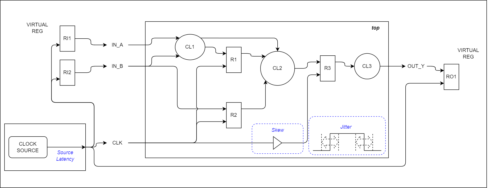<br />  

    * DC-Shell Operations
```
    > get_ports *clk*;
    > get_ports * -filter "direction == in";
    > get_ports * -filter "direction == out";
    > get_clocks * -filter "period > 10";
    > get_attribute [ get_clocks my_clk ] period ;
    > get_attribute [ get_clocks my_clk ] is_generated ;
    > report_clocks my_clk ;
```
    * Hierarchical/Physical Cell/PIn
```
    > get_cells * -hier
    > get_attribute [ get_cells <cell-name> ] is_hierarchical
```
    * Clock Constraint
        * Uncertainty in different stage
            * Jitter+Skew for CTS
            * Jitter only for PnR
```
    > create_clock -name <clk-name> -period <time> [get_ports <clk-port>] ;
    > set_clock_latency <time> <clk-name>
    > create_clock -name <clk-name> -period <time> [get_ports <clk-port>] -wave { <rise-time-point> <fall-time-point> } ;
```
    * Input IO Modeling
```
    > set_input_delay -max <time> -clock [get_clocks <clk-name>] [get_ports <port-name>] ;
    > set_input_delay -min <time> -clock [get_clocks <clk-name>] [get_ports <port-name>] ;
    > set_input_transition -max <unit> [get_ports <port-name>]
    > set_input_transition -min <unit> [get_ports <port-name>]
```
    * Output IO Modeling
```
    > set_output_delay -max <time> -clock [get_clocks <clk_name>] [get_ports <port-name>]
    > set_output_delay -min <time> -clock [get_clocks <clk_name>] [get_ports <port-name>]
    > set_output_load -max <cap_unit> [get_ports <port-name>]
    > set_output_load -min <cap_unit> [get_ports <port-name>]
```
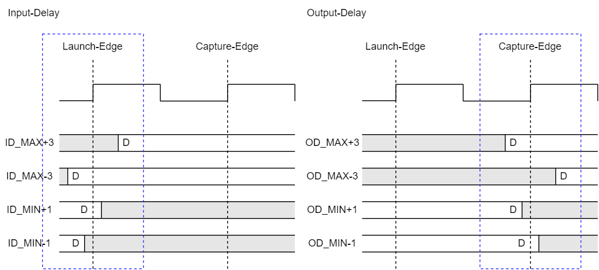<br />  

    * DC-Shell Lab
``` 
    > get_cells/get_ports/get_nets/get_clocks/get_pins
    > all_connected <net-name>
    > regex <pattern> <expression> # return 1 when pattern match expression, otherwise 0
    > get_attribnute [get_pins <pin-name>] clock # report if this is clock pin
    > get_attribnute [get_pins <pin-name>] clocks # report clocks reach to this pin
    > current_design # report name of top module
    > report_clocks *
    > remove_clock <clk_name>
```
    * Clock Network Modeling
```
    > set_clock_latency -source <time> [get_clocks <clk_name>] # source latency (clock source)
    > set_clock_latency <time> [get_clocks <clk_name>] # network latency (to top module)
    > set_clock_uncertainty -setup <time> [get_clocks <clk_name>]
    > set_clock_uncertainty -hold <time> [get_clocks <clk_name>]
    > report_timing
    > report_timing -to <pin-name>
    > report_timing -to <pin-name> -delay min
    > report_timing -from <pin-name>
    > report_timing -verbose
    > report_port -verbose
    > report_timing -from <pin-name> -trans -net -cap -nosplit
    > report_timing -from <pin-name> -trans -net -cap -nosplit -delay_type min # Hold time
    > set_input_transition -max <amount> [get_ports <port-name>]
    > set_input_transition -min <amount> [get_ports <port-name>]
        # add input transition, input pin data arrival time is increased
    > set_load -max <amount> [get_ports <port-name>]
    > set_load -min <amount> [get_ports <port-name>]
        # add output load, output pin data arrival time is increased
```
    * Generated Clock
        * Handle clock physically variation like long-delay from input to output port.
```
    > create_generated_clock -name <gen-clk-name> -master [get_clocks <base-clk>] -source [get_port <src-port>] -div 1 [get_ports <dst-port>]
    > reset_design # restart a new design
    > get_generated_clocks
```
    * Constraint for pure combinational path from input to output port
        1. set_max_latency
        2. virtual clock

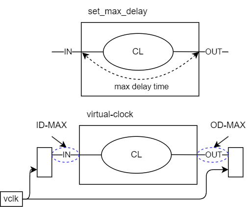<br />  

```
    > set_max_latency <time> -from [get_ports <input>] -to [get_ports <output>]
    > create_clock -name <vclk> -period <time> # if path has no clock definition point, virtual clock inferred

    > set_input_delay -max <time> -clock [get_clocks <vclk>] [get_ports <input>]
    > set_output_delay -max <time> -clock [get_clocks <vclk>] [get_ports <output>]
    > set_input_delay -max <time> -clock [get_clocks <vclk>] -clock_fall [get_ports <input>] # for virtual negedge sampling DFF
    > set_output_delay -max <time> -clock [get_clocks <vclk>] -clock_fall [get_ports <output>] # for virtual negedge sampling DFF
    
    > set_driving_cell -lib_cell <lib_cell_name> <ports>

    > all_inputs/all_outputs/all_clocks/all_registers
    > all_fanout -from <pin/port name> (-endpoints_only -flat)
    > all_fanin -to <pin/port name> (-endpoints_only -flat)
    > get_cells -of_objects [get_pins <pin-name>]
    > report_timing -to <output-port> -sig <unit> # report decimal number
```

    * Multi-Cycle Path

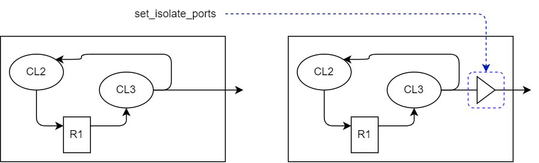<br />
    
    * Output Isolation between External and Internal Path

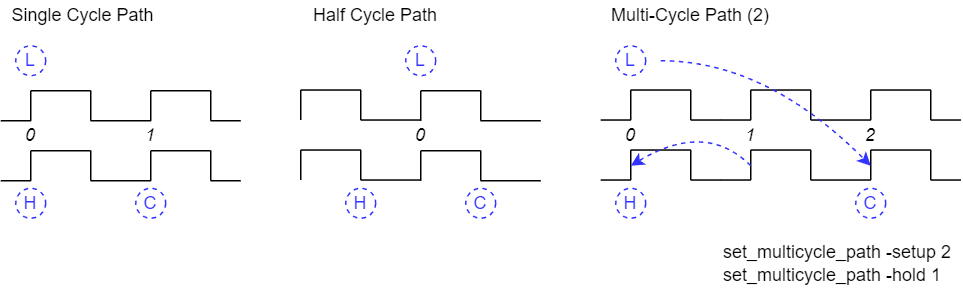<br />  

```
    > set_multicycle_path -setup <num> -from <pin/port> -to <pin/port>
    > set_multicycle_path -hold <num> -from <pin/port> -to <pin/port>
    > set_false_path -from <pin/port> -to <pin/port>
    > set_false_path -through <net/pin>
    > set_isolate_ports -type buffer <output-ports>
    // retiming applied in compile option, not SDC command
```

------

## Day9

Topic: Contraint Development

Goals:
1. Try the ideal Timing Constraint for Project Design
2. Analysis OpenSTA results to tune the constraint for design

Status:
* development-stage progress: [project.md](project.md)
* design database: [project/README.md](project/README.md)
* design report: [design_report.md](reports/design_report.md)

------

## Day10

Topic: Introduction to STA and importance of MOSFETs in STA/EDA

Goals:
1. Fundamental N/P MOSFET Simulation from SPICE model
2. Know the pitfall on standard cell from basic circuit element (MOSFET)

Lecture Notes:
* Circuit Design
    * Fundamental combination from N/P MOSFETs to Funcational Gate Cells
    * Analysis Delay and Safe-Margin by SPICE system
    * Get Delay-Table `f(Input-Slew,Output-Load)` from SPICE modelling to verify STA correctness
* N-MOS
    * P-Substract, n+ Diffusion Region
    * Isolation Region (SiO2), PolySi or Metal Gate
    * 4-Terminal element, G (Gate), S (Source), D (Drain), B (Body)
* Threshold Voltage
    * Vs=0, Vd=0, Vgs large enough to perform `Strong Inversion` point `(Vt)`, diode B-S and B-D are off
    * Increase Vgs, electrons from `n+` are drawn to the region under gate `G` as strong inversion
    * The conductivity of S-D path is modulated by Vgs strength
    * Add Vsb voltage, additional potential is required for strong inversion
    * `Vto` means threshold voltage at Vsb=0, a function of manufacturing process

* SPICE Simulation

SPICE File: day1_nfet_idvds_L1p2_W1p8.spice
```
*Model Description
.param temp=27

*Including sky130 library files
.lib "sky130_fd_pr/models/sky130.lib.spice" tt

*Netlist Description
XM1 Vdd n1 0 0 sky130_fd_pr__nfet_01v8 w=1.8 l=1.2
R1 n1 in 55
Vdd vdd 0 1.8V
Vin in 0 1.8V

*simulation commands
.op
.dc Vdd 0 1.8 0.1 Vin 0 1.8 0.2

.control
run
display
setplot dc1
.endc

.end

```

[1] SPICE NMOS id/vds Diagram<br />
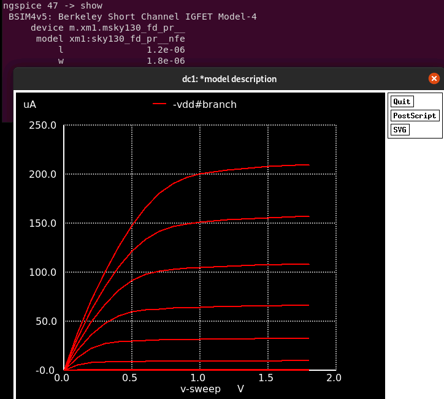<br />  

------

## Day11

Topic: Basics of NMOS Drain current (Id) vs Drain-to-source Voltage (Vds)

Goals:
1. Syntax and Parameters for SPICE modelling
2. Graphically Id to Vds, Id to Vgs relationship from SPICE

Lecture-Note:
* Resistive Operation
    * At Vgs>Vt condition with small Vds
    * Affect by Effective Channel Length
    * Currents in this condition
        * Drift Current, from the difference of potential voltage
        * Diffusion Current, from the difference of carrier concentration
    * Id = `Kn'*(W/L)*((Vgs-Vt)*Vds-(Vds**2)/2)` = `Kn*((Vgs-Vt)*Vds-(Vds**2)/2)`
        * `Kn'`, as porocess transconductance
        * `Kn=Kn'*(W/L)`, as gain factor
    * While `(Vgs-Vt)>>Vds`, Id ~= `Kn*((Vgs-Vt)*Vds)`, linear function by Vds
* Saturation Region
    * Pinch-Off from `(Vgs-Vds)<=Vt`, electron channel under the gate begins to disappear
    * Channel Voltage clamp to (Vgs-Vt)
        * Id(sat) = `Kn((Vgs-Vt)*(Vgs-Vt)-((Vgs-Vt)**2)/2)` = `Kn/2*(Vgs-Vt)**2`
    * Seems a perfect current source from equation, but affected by  Vds in reality
        * Id(sat) = `Kn/2*((Vgs-Vt)**2)*(1+lambda*Vds)`

* SPICE Simulation

SPICE File: day2_nfet_idvds_L0p25_W0p375.spice
```
*Model Description
.param temp=27

*Including sky130 library files
.lib "sky130_fd_pr/models/sky130.lib.spice" tt

*Netlist Description
XM1 Vdd n1 0 0 sky130_fd_pr__nfet_01v8 w=0.375 l=0.25
R1 n1 in 55
Vdd vdd 0 1.8V
Vin in 0 1.8V

*simulation commands
.op
.dc Vdd 0 1.8 0.1 Vin 0 1.8 0.2

.control
run
display
setplot dc1
.endc

.end
```

SPICE File: day2_nfet_idvgs_L0p25_W0p375.spice
```
*Model Description
.param temp=27

*Including sky130 library files
.lib "sky130_fd_pr/models/sky130.lib.spice" tt

*Netlist Description
XM1 Vdd n1 0 0 sky130_fd_pr__nfet_01v8 w=0.375 l=0.25
R1 n1 in 55
Vdd vdd 0 1.8V
Vin in 0 1.8V

*simulation commands
.op
*remove Vdd variation
.dc Vin 0 1.8 0.1 

.control
run
display
setplot dc1
.endc

.end
```

[1] SPICE NMOS id/vds Diagram, small area but keep same ratio from day10 <br />
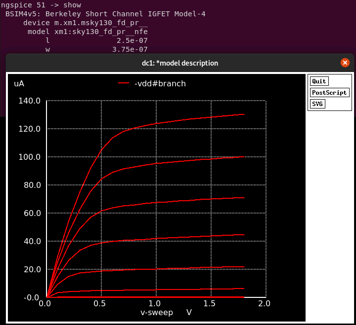<br />  

[2] SPICE NMOS id/vgs Diagram <br />
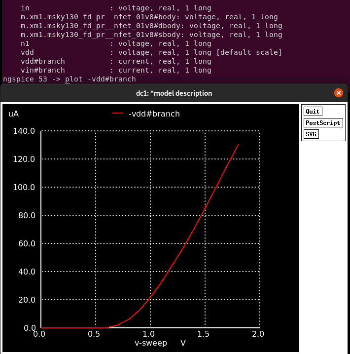<br />  

------

## Day12 

Topic: Velocity Saturation and basics of CMOS inverter VTC

Goals:
1. Velocity Saturation from Channel Length Difference
2. Voltage-Transfer Characteristics (VTC) for CMOS inverter

Lecture-Note:
* Velocity Saturation Effect
    * Long-Channel (>250nm)
    * Short-Channel (<250nm)
    * Id = `Kn*((Vgt-Vmin)-(Vmin**2)/2)*(1+lambda*Vds)`
    * Vmin = `min(Vgt, Vds, Vd(Sat))`

|Long-Chan. |Short-Chan.|
|-----------|-----------|
|Cut-Off    |Cut-Off    |
|Resistive  |Resistive  |
|           |Vel-Sat    |
|Saturation |Saturation |

* Voltage-Transfer Characteristics (VTC)
    * Transistor
        * Switch Off when `|Vgs|<|Vt|`
        * Switch On when `|Vgs|>|Vt|`
    * CMOS inverter => NOT Gate, PMOS+NMOS

* Assume CMOS inverter in 0-2V range

|Vin |Vout|PMOS|NMOS|
|----|----|----|----|
|0   |2   |LIN |OFF |
|~0.5|~1.5|LIN |SAT |
|1   |1   |SAT |SAT |
|~1.5|~0.5|SAT |LIN |
|2   |0   |OFF |LIN |

* SPICE Simulation

[1] Long-Channel vs Short-Channel<br />
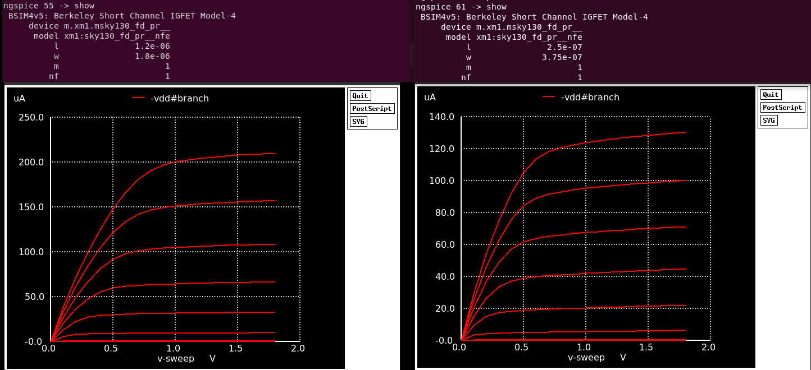<br />  

SPICE File: day3_inv_vtc_W0p084_W0n084.spice
```
*Model Description
.param temp=27


*Including sky130 library files
.lib "sky130_fd_pr/models/sky130.lib.spice" tt

*Netlist Description
XM1 out in vdd vdd sky130_fd_pr__pfet_01v8 w=0.84 l=0.15
XM2 out in 0 0 sky130_fd_pr__nfet_01v8 w=0.84 l=0.15
Cload out 0 50fF
Vdd vdd 0 1.8V
Vin in 0 1.8V

*simulation commands
.op
.dc Vin 0 1.8 0.01

.control
run
setplot dc1
display
.endc

.end
```
[2] VTC from identical (W/L) P/NMOS<br />
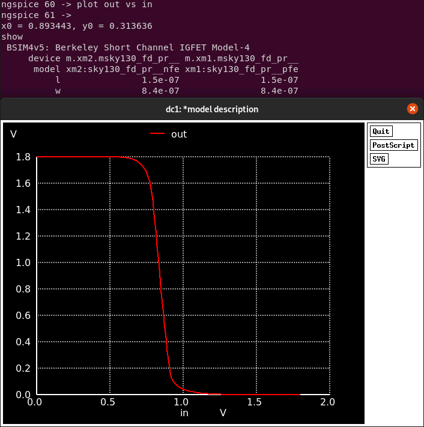<br />  

------

## Day13

Topic: CMOS Switching threshold and dynamic simulations

Goals:
1. Switching Threshold and Quality for CMOS inverter
2. Switching Transition Delay Timing

Lecture-Note:
* Switching Threshold
    * `Vm`, should near the middle of VTC on CMOS inverter
    * `Vm` = `R`*Vdd/(1+`R`), `R`=`(Rp*(Wp/Lp)*Vdp)/(Rn*(Wn/Ln)*Vdn)`

* Transition Delay
    * Rise-Delay, Input 0 then Output 1
    * Fall-Delay, Input 1 then Output 0
    * Find balanced rise/fall delay based on fixed `(Wp/Lp)`, search in variable `(Wn/Ln)`
    * From Device Physics, Ron(PMOS) ~= 2.5*Ron(NMOS)
    * Regular inverter/buffer preferred for data-path

* SPICE Simulation

SPICE File: day3_inv_vtc_W0p084_W0n036.spice
```
*Model Description
.param temp=27

*Including sky130 library files
.lib "sky130_fd_pr/models/sky130.lib.spice" tt

*Netlist Description
XM1 out in vdd vdd sky130_fd_pr__pfet_01v8 w=0.84 l=0.15
XM2 out in 0 0 sky130_fd_pr__nfet_01v8 w=0.36 l=0.15
Cload out 0 50fF
Vdd vdd 0 1.8V
Vin in 0 1.8V

*simulation commands
.op
.dc Vin 0 1.8 0.01

.control
run
setplot dc1
display
.endc

.end
```

[1] VTC from Balanced P/NMOS Driving Strength<br />
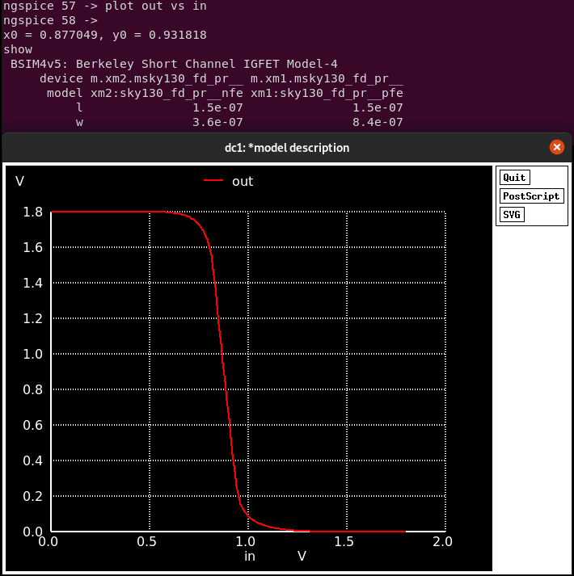<br />  

SPICE File: day3_inv_tran_W0p084_W0n036.spice
```
*Model Description
.param temp=27

*Including sky130 library files
.lib "sky130_fd_pr/models/sky130.lib.spice" tt

*Netlist Description
XM1 out in vdd vdd sky130_fd_pr__pfet_01v8 w=0.84 l=0.15
XM2 out in 0 0 sky130_fd_pr__nfet_01v8 w=0.36 l=0.15
Cload out 0 50fF
Vdd vdd 0 1.8V
Vin in 0 PULSE(0V 1.8V 0 0.1ns 0.1ns 2ns 4ns)

*simulation commands
.tran 1n 10n

.control
run
.endc

.end
```

[2] Inverter Switching Transition Diagram<br />
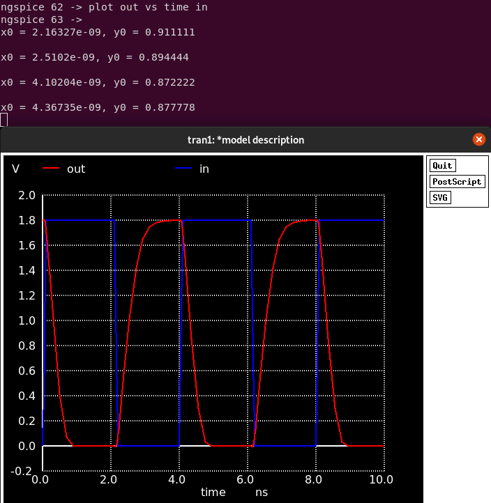<br />  

|ITEM      |TIME (ns) |
|----------|----------|
|Rise-Delay| 0.34693  |
|Fall-Delay| 0.26531  |

------

## Day14

Topic: CMOS Noise Margin robustness evaluation

Goals:
1. Inverter Gate Noise Margin

Lecture-Note:
* Noise Margin
    * Preserve Noise Margin to against environmental noise
```
    NMH = VOH-VIH
    NML = VIL-VOL
```
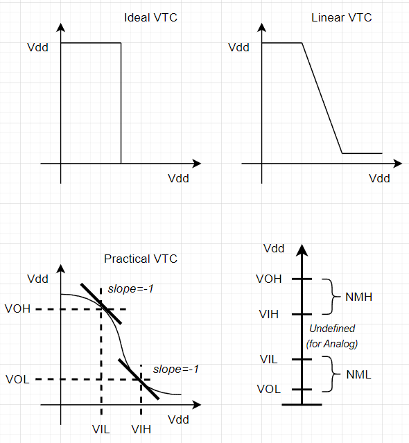<br /> 

* SPICE Simulation
SPICE File: day4_inv_noisemargin_wp1_wn036.spice
```
*Model Description
.param temp=27

*Including sky130 library files
.lib "sky130_fd_pr/models/sky130.lib.spice" tt

*Netlist Description

XM1 out in vdd vdd sky130_fd_pr__pfet_01v8 w=1 l=0.15
XM2 out in 0 0 sky130_fd_pr__nfet_01v8 w=0.36 l=0.15

Cload out 0 50fF

Vdd vdd 0 1.8V
Vin in 0 1.8V

*simulation commands

.op
.dc Vin 0 1.8 0.01

.control
run
setplot dc1
display
.endc

.end
```

[1] Inverter Switching Transition Diagram<br />
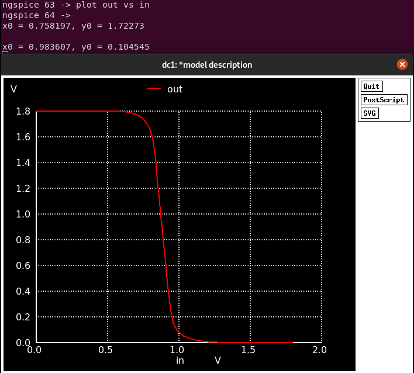<br />  

|ITEM      | Voltage  |
|----------|----------|
|VOH       | 1.72273  |
|VOL       | 0.104545 |
|VIH       | 0.983607 |
|VIL       | 0.75819  |
|NMH       | 0.739123 |
|NML       | 0.653645 |

------

## Day15

Topic: CMOS power supply and device variation robustness evaluation

Goals:
1. Inverter Robustness on Power Supply Scaling
2. Inverter Robustness on Process Variation

Lecture-Note:
* Power Supply Scaling
    * |Gain| = |Vout(VIH)-Vout(VIL)|/|VIH-VIL|
    * Advantage :
        1. Increase in Gain (~50% improvement)
        2. Reduction in Energy (~90% improvement, from Energy=`1/2*C*Vdd**2`)
    * Disadvantage :
        1. Performance Impact on dymanic transition (increasing large delay)
* Process Variation
    * Etching, layout shape variation, not expect rectangle formation
    * Oxide Thickness, not uniformly thickness on Oxide layer
* Device Variation
    * Shift in Vm
    * Variation in NMH/NML
    * Operation of `Gate` is intact

* SPICE Simulation
SPICE File: day5_inv_supplyvariation_Wp1_Wn036.spice
```
*Model Description
.param temp=27

*Including sky130 library files
.lib "sky130_fd_pr/models/sky130.lib.spice" tt

*Netlist Description

XM1 out in vdd vdd sky130_fd_pr__pfet_01v8 w=1 l=0.15
XM2 out in 0 0 sky130_fd_pr__nfet_01v8 w=0.36 l=0.15

Cload out 0 50fF

Vdd vdd 0 1.8V
Vin in 0 1.8V

.control

let powersupply = 1.8
alter Vdd = powersupply
	let voltagesupplyvariation = 0
	dowhile voltagesupplyvariation < 6
	dc Vin 0 1.8 0.01
	let powersupply = powersupply - 0.2
	alter Vdd = powersupply
	let voltagesupplyvariation = voltagesupplyvariation + 1
      end
 
plot dc1.out vs in dc2.out vs in dc3.out vs in dc4.out vs in dc5.out vs in dc6.out vs in xlabel "input voltage(V)" ylabel "output voltage(V)" title "Inveter dc characteristics as a function of supply voltage"

.endc

.end
```

[1] Power-Supply Scaling<br />
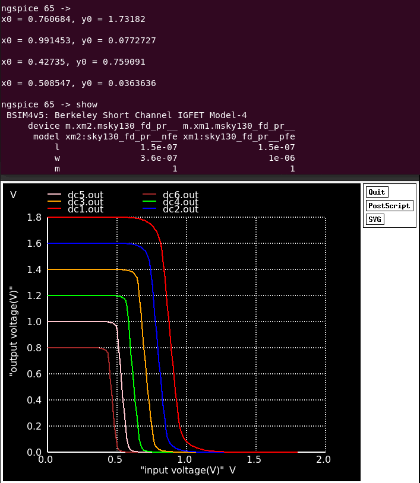<br />  

|GAIN    |Ratio  |
|--------|-------|
|dc1.out |7.1697 |
|dc6.out |8.9009 |


SPICE File: day5_inv_devicevariation_wpv_wnv.spice
```
*Model Description
.param temp=27

*Including sky130 library files
.lib "sky130_fd_pr/models/sky130.lib.spice" tt

*Netlist Description

XM1 out in vdd vdd sky130_fd_pr__pfet_01v8 w=0.84 l=0.15
XM2 out in 0 0 sky130_fd_pr__nfet_01v8 w=0.36 l=0.15

Cload out 0 50fF

Vdd vdd 0 1.8V
Vin in 0 1.8V

*simulation commands

.control

    let nmoswidth = 0.36
    alter m.xm2.msky130_fd_pr__nfet_01v8 w = nmoswidth
    let pmoswidth = 1.2
    alter m.xm1.msky130_fd_pr__pfet_01v8 w = pmoswidth

    let widthVariation = 0
    dowhile widthVariation < 5
        echo "nmos width: $&nmoswidth u"
        echo "pmos width: $&pmoswidth u"
        *** dc analysis
        dc vin 0 1.8 0.01
        *** change to next env.
        let nmoswidth = nmoswidth + 0.32
        let pmoswidth = pmoswidth - 0.12
        alter @m.xm2.msky130_fd_pr__nfet_01v8[W] = nmoswidth
        alter @m.xm1.msky130_fd_pr__pfet_01v8[W] = pmoswidth
        let widthVariation = widthVariation + 1
    end

    plot dc1.out vs in dc2.out vs in dc3.out vs in dc4.out vs in dc5.out vs in xlabel "input voltage(V)" ylabel "output voltage(V)" title "Inveter dc characteristics as a function of P/NMOS width"

.endc

.end
```

[2] Device Variation<br />
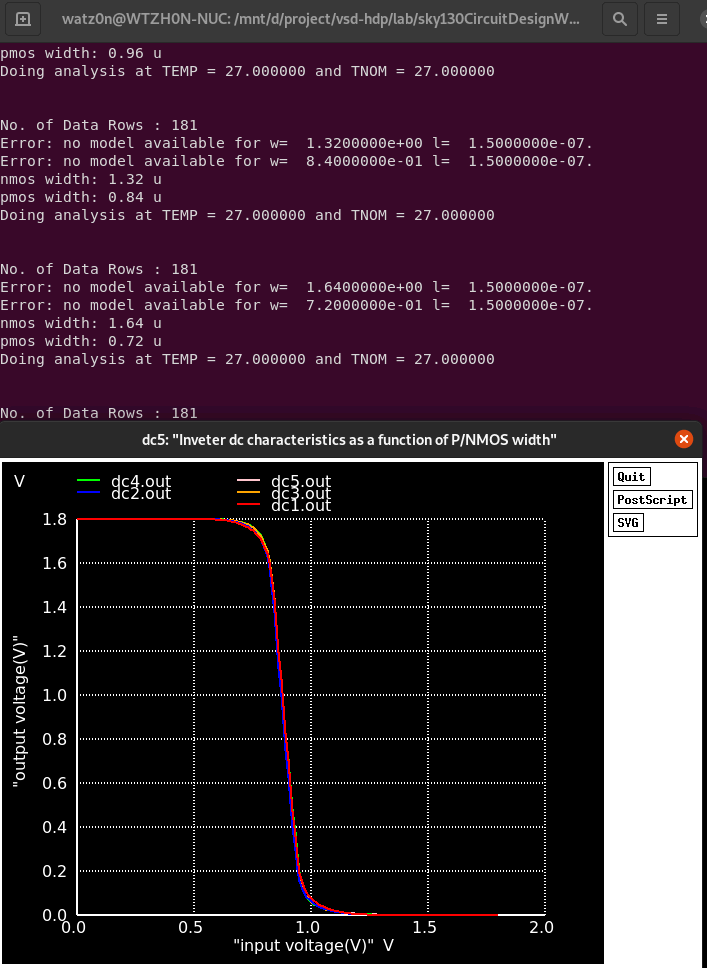<br />  

------

## Day16

Topic: Post synthesis STA checks for your design on ss,ff,tt corners

Goals:
1. Perform OpenSTA in different corners to collect PVT-Corner statistics

Status:

[1] PVT Corner Summary for rv151_soc @10MHz, [OpenSTA Script](project/hardware/sta/opensta_report_timing.tcl) (230112) <br />
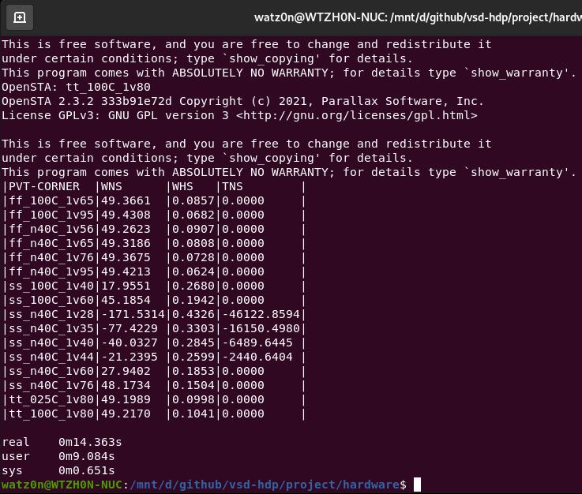<br />

[2] PVT Corner Summary for rv151_soc @10MHz (230114)<br />

|PVT-CORNER  |WNS      |WHS   |TNS        |
|------------|---------|------|-----------|
|ff_100C_1v65|49.3627  |0.0857|0.0000     |
|ff_100C_1v95|49.4286  |0.0682|0.0000     |
|ff_n40C_1v56|49.2588  |0.0907|0.0000     |
|ff_n40C_1v65|49.3154  |0.0808|0.0000     |
|ff_n40C_1v76|49.3647  |0.0728|0.0000     |
|ff_n40C_1v95|49.4193  |0.0624|0.0000     |
|ss_100C_1v40|26.7578  |0.2680|0.0000     |
|ss_100C_1v60|48.6292  |0.1942|0.0000     |
|ss_n40C_1v28|-144.6696|0.4326|-41106.7656|
|ss_n40C_1v35|-58.3321 |0.3303|-11878.8076|
|ss_n40C_1v40|-24.7735 |0.2845|-3739.3464 |
|ss_n40C_1v44|-7.7941  |0.2599|-673.2036  |
|ss_n40C_1v60|35.8965  |0.1853|0.0000     |
|ss_n40C_1v76|48.8085  |0.1504|0.0000     |
|tt_025C_1v80|49.1947  |0.0998|0.0000     |
|tt_100C_1v80|49.2124  |0.1041|0.0000     |

[3] PVT Corner Line-Chart for rv151_soc @10MHz (230114)<br />
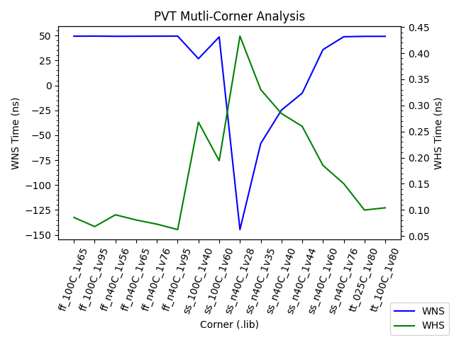<br />

------

## Day17

Topic: Inception of open-source EDA, OpenLANE and Sky130 PDK

Goals:
1. Known the basic Physical Implementation concepts, include RTL-to-GDS flow and IC-Package

Lecture-Notes:

* Package QFN-48
    * Quad Flat No-lead
    * Package = Wire-Bond + Chip-Die
    * Chip-Die = Chip-Core + Pad-ring
    * Chip-Core = Foundry-IPs + Harden-Macros

* RISCV Architecture
    * C/Cpp -> Binary Code -> Circuit in Layout

* From SOftware Application to Hardware
    * App -> Compiler -> Assembler -> Application Binary Code (ELF or EXE)

* Operation-System, Hardware start Application Binary Code from OS fetch from storage device
    1. Handle IO driver Service
    2. Memory Management
    3. Low-Level System Interface (Program Loader)

* OpenLane Overview
    * Digital ASIC Desgin: RTL IP's + EDA Tools + PDK Data
    * PDK : Interface between FAB and the designer, Process Design Kit, include:
        * Process Design Rule: DRC, LVS, PEX
        * Device Models
        * Digital Standard Cell Libraries
        * I/O Libraries
    * Is 130nm Fast? Yes, Intel P4EE @3.46GHz (Q4'04)

* OpenLane ASIC Flow : (RTL+PDK) -> |SYN| -> |FP+PP| -> |Place| -> |CTS| -> |Route| -> |Sign-Off| -> (GDS-II)
    * SYN: Synthesis, Convert RTL to circuit from Standard Cell Library (SCL)
        * Standard Cells have regular layout
    * FP+PP: Floor-Planning + Power-Planning
        * Floor-Planning : Partition the chip-die between different IPs, Macros, and I/O Pads
        * Power-Planning : Share VDD by multiple power pads to power rings/straps (use upper metal layer)
    * Place: Placement, place the std-cells on floorplan rows, aligned with the pitch
        * Global Place: IP/Macros may overlapped
        * Detailed Place: Align to rows/columns definition
    * CTS: Clock Tree Synthesis, create a clock distribution network
        * To deliver the clock to all sequential elements
        * With small intrinsic skew in practical, zero is hard to achieve
        * Usually a Tree structure (H, X, ...)
    * Route: Routing, Implement the interconnect using the available metal layers
        * Metal tracks from a routing grid
        * Divide and Conquer huge routing grid
            * Global Routing : Generate Routing Guides
            * Detailed Routing : Use the routing guides to implement the actual wires
    * Sign-Off:
        1. Physical Verifications
            1. Design Rules Checking (DRC)
            2. Layout v.s. Schematic (LVS)
        2. Timing Verifications
            * Static Timing Analysis (STA)

* OpenLane Introduction:
    * Started as an Open-Source Flow fro a True Open-Source Tape-Out Experiment (striVe)
    * Main-Goal: Produce a clean GDS-II with no human intervention flow
        * `clean` means no LVS violations, no DRC violations, and no Timing violations
    * Can be used with harden Macros and Chips
    * Modes of operation: Autonomous or Interactive
    * Design Space Exploration, find the best setting of flow configuration
        * Feasible to be used for regression testing (CI)

* OpenLane ASIC Flow:
    * Synthesis: yosys+abc
    * Post-Synth STA: OpenSTA
    * DFT Insertion: Fault DFT
    * FP + Place + Global-Route + CTS: OpenROAD
    * Fake Antenna(Ant.) Diode Insertion: OpenROAD
    * LEC: yosys
    * Detailed-Route: TritonRoute
    * Fack Ant. Diode Swapping Script
    * RC Extraction
    * Post-Route STA: OpenSTA
    * Physical Verification: Magic and netgen
    * GDS2 Streaming: Magic

* OpenROAD: Automated PnR (Place-and-Route)
    * Floor/Power Planning
    * End Decoupling Capcitors and Tap-Cells insertion
    * Placement: Global and Detailed
    * Post Placement Optimization
    * Clock-Tree Synthesis (CTS)
    * Routing: Global and Detailed

* LEC (Logic Equivalence Check)
    * Verify modified netlist
        * Post-CTS
        * Post-Placement Optimization
    * Formally confirm that the function didn't change after flow modifying the netlist

* Antenna Didoe: Antenna Rules Violation
    * When a metal wire segment is fabricated, it can act as antenna, especially long-wire
        * Reactive ion etching causes charge to accumulate on wires
        * Transister gates can be damaged during fabrication
    * Solution:
        1. Bridging attaches a higer layer bridge (Router awareness, hard to achieve)
        2. Add antenna diode cell to leak away charges, which cell is provided by std-cell library
    * Preventive Apporach
        * Add a fake antenna diode next to every cell input after placement
        * Run the Antenna Checker (Magic) on the routed layout
        * If checker report a violation on cell input pin, replace the fake diode cell by a real one

* RC Extraction: DEF2SPEF
* DRC: Magic, and do SPICE extraction from layout
* LVS: Magic and netgen, extracted spice v.s. verilog netlist

* OpenLane Tutorial:
    * sky130A/lib.ref/ -> process design libraries information
    * sky130/lib.tech/ -> technology information for EDA-tools

* OpenLane Operation:
```
    $ ./flow.tcl -interactive
    % package require openlane 0.9
  # prepare picorv32a environment from <oipenlane>/designs/picorv32a/config.tcl 
    % prep -design picorv32a
  # generate "runs" directory -> check runs/<date>_<time>/config.tcl
    $ run synthesis
  # check result netlist: runs/<date>_<time>/synthesis/<deisgn>.synthesis.v
  # check synth-stat report:                /reports/synthesis/yosys_2_stat.rpt
  # check timing report:                                      /opensta_main.timing.rpt
```

[1] OpenLane Prepare Design<br />
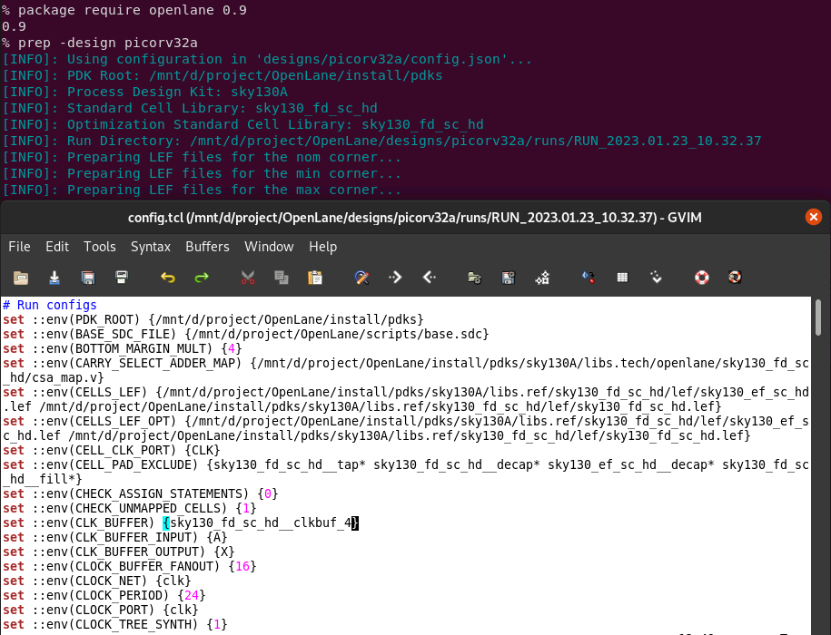<br />
[2] OpenLane Timing Report<br />
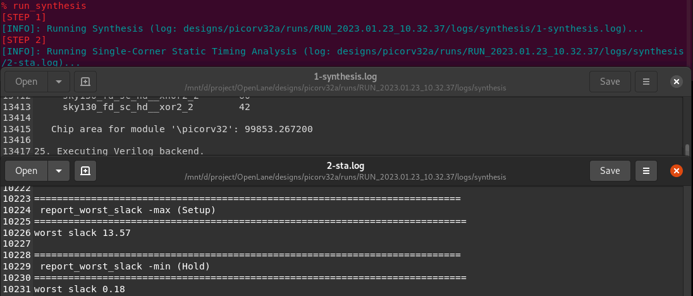<br />

------

## Day18

Topic: Understand importance of good floorplan vs bad floorplan and introduction to library cells

Goals:
1. Known the things about Floor-Planning
2. Known the cell statistics to affect Floor-Planning

Lecture-Notes:

* Utilization Factor and Aspect
    * Utilization Factor = (Area Occupied by Netlist)/(Total Area of the Core)
    * Aspect Ratio = (Height of Core)/(Width of Core)

* Pre-placed cells, i.e. Hard-Macro or Block-Box Cells
    * Arrangement of these IP's in a chip is referred as Floor-Planning

* Define location of pre-placed cells

* De-coupling Capacitors
    * Alleviate voltage-drop from circuit switches to currput noise-margin limitation
    * De-couples main voltage supplier to responsible cells
    * Replenish the decoupling capcitor after circuit switches

* Power-Planning
    * De-coupling limitation: single voltage source may leakage through multiple de-coupling region
    * Solution: multiple voltage source, i.e. power mesh

* Pin-Placement
    * Place pins near the target/source macro/std-cells

* OpenLane Operation

```
  # openlane/configurations/README.md, floorplan.tcl
    % run floorplan
  # FP_IO_MODE (same distribution length or nearnest)
  # FP_IO_VMETAL N (use metal N+1)
  # FP_IO_HMETAL M (use metal M+1)
  # results in <design>/runs/<date>_<time>/logs/floorplan/ioPlacer.log
  #                                       /config.tcl
  # DIEAREA in:                           /result/floorplan/<design>.floorplan.def

  # Magic open DEF file
    $ magic -T sky130A.tech lef read .../merged.lef def read .../<design>.floorplan.def
```

[1] OpenLane Placement<br />
> FP_IO_HMETAL/FP_IO_VMETAL has been deprecated, as [OpenLane Doc](https://openlane.readthedocs.io/en/latest/reference/configuration.html#deprecated-i-o-layer-variables)<br />
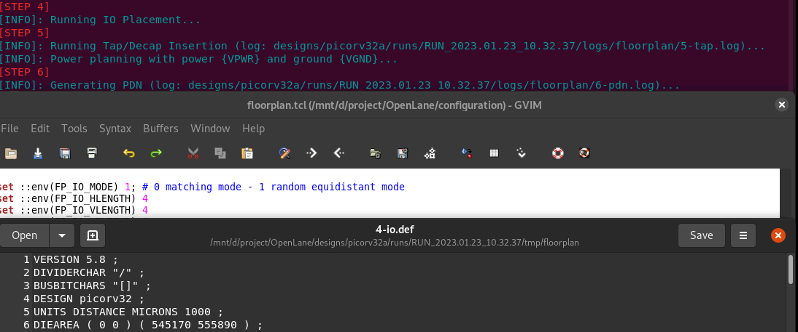<br />

[2] OpenLane Floor-Plane, Horizontal I/O Metal-Layer<br />
> Apply FP_IO_HLAYER/FP_IO_VLAYER as new I/O Metal-Layer statement<br />
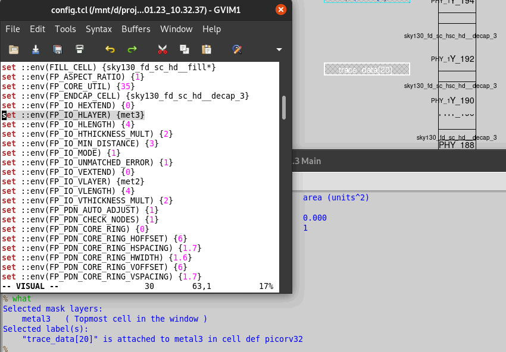<br />

* Bind netlist with physical cells
    1. Get cell actual layout
    2. Get Cell actual timing

* Optimize Placement
    * Estimate wire length and capcitance, then insert buffer (repeater) to adjust timing
    * Quick Timing Analysis with ideal clocks

* OpenLane Operation

```
    % run placement
  # result in <design>/runs/<date>_<time>/results/placement/
  # Magic open DEF file
    $ magic -T sky130A.tech lef read .../merged.lef def read .../<design>.placement.def
  # Note: power-grid generated before routing
```

[3] OpenLane Placement<br />
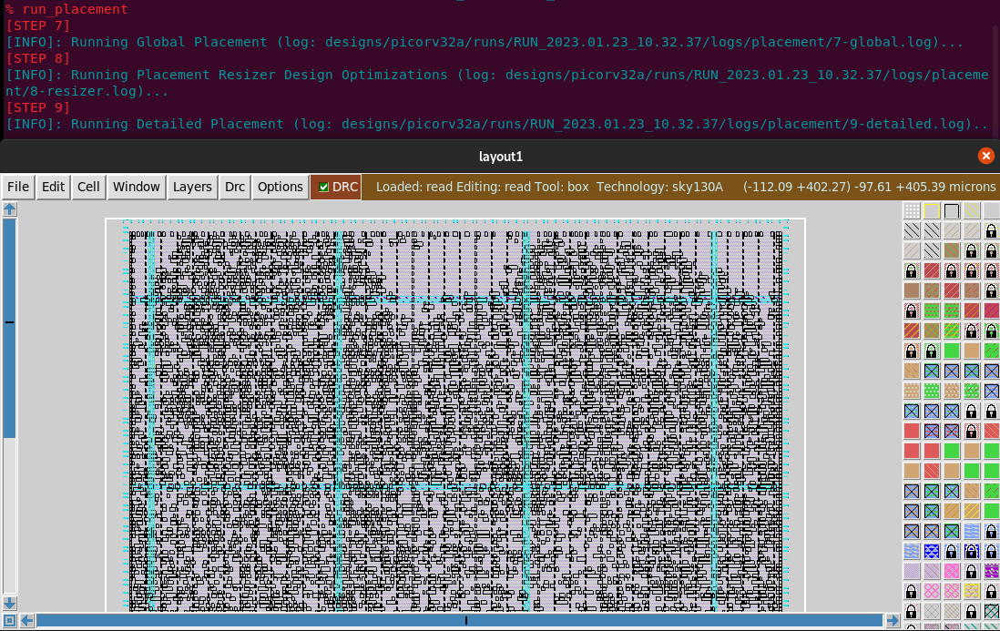<br />

* Cell-Design Flow
    * Analysis different function, size, Vt lead to corresponding delay, power, area
    * Cell-Design Input: PDKs
        * DRC & LVS rules (Tech-File)
        * SPICE models (SPICE parameters)
        * User-Defined Spec.
            1. Cell-Height(Width)
            2. Supply Voltage
            3. Metal Layers
            4. Pin Location
            5. Drawn Gate-Length
    * Cell-Deisgn Steps:
        1. Circuit Design:
            1. Circuit Function
            2. PMOS/NMOS Modelling
        2. Layout Design:
            1. Desire PMOS/NMOS network graph
            2. Apply Euler's Path (Go-Through Once) and stick diagram
        3. Characterization
            1. Extract to SPICE netlist from layout information
            2. Software: GUNA
            3. Timing Threshold Definitions(for Buffer):
                * slew_low_rise
                * slew_high_rise
                * slew_low_fall
                * slew_high_fall
                * in_rise
                * in_fall
                * out_rist
                * out_fall
            4. Propagation Delay:
                * Rise: out_rise-in_rise
                * Fall: out_fall-in_fall
            5. Transition Time:
                * Rise: slew_high_rise-slew_low_rise
                * Fall: slew_low_fall-slew_high_fall
    * Cell-Design Output:
        1. CDL (Circuit Description Language)
        2. GDS-II, LEF, Extraced SPICE Netlist
        3. Timing, Noise, Power, .libs, Function

------

## Day19

Topic: Design and characterize one library cell using Magic Layout tool and ngspice

Goals:
1. CMOS Process Introduction
2. Cell-Design for SPICE Extration 

Lecture-Notes:

* OpenLane Operation

```
    # make io-placer stack as std-cells
    %set ::env(FP_IO_MODE) 2
    %run floorplan
```

* 16-Mask CMOS Process
    1. Select a substract (P-type, high resistivity (5~50ohms), doping level(`10**13 cm**2`), orientation(100))
        * Substract doping should be less than `well` doping
    2. Create active region for transistors
        * ~40nm of SiO2 + ~80nm of Si3N4 + ~1um Photo-Resist
        * Mask1 + UV-Light
        * Washed out + Si3N4 Etched
        * Photo-Resist Chemically Removed, residue SI3N4and SiO2
        * Placed in oxidation furnace, field of SiO2 is grownn for isolation area
            * LOCOS, local oxidation of silicon
        * Si3N4 stripped by using hot phosphoric acid
    3. N-Well and P-Well Formation
        * Photo-Resist + Mask2 + UV-Light + Wash-OUt
        * Ion Implantation (Boron, ~200KeV), formating P-Well + Si3N4 etched
        * Photo-Resist + Mask3 + UV-Light + Wash-Out
        * Ion Implantation (Phosphorous, ~400KeV), formating N-Well + Si3N4 etched
        * High Temperature Furnace, drive-in diffusion
    4. Formation of `Gate` (Na(doping concentration), Cox(oxide capcitance)) -> Control Vt
        * Photo-Resist + Mask4
        * Ion Implantation (Boron, ~60KeV) on P-Well Region (P-Layer)
        * Photo-Resist + Mask5
        * Ion Implantation (Arsenic) on N-Well Region (N-Layer)
        * Origional Oxide etched/stripped by using dilute hydrofluoric (HF) solution
        * Re-grown high quality oxide layer (~10um thin), remove defected by process
        * ~0.4um polysilicon layer
        * Photo-Resist + Mask6 to mark `Gate` area
        * Wash-Out polysilicon with UV-Light
    5. Lightly Doped Drain (LDD) Formation
        * Photo-Resist + Mask7, Phosphorous(lightly doped) in P-Well to form N-implant region around `Gate`
        * Photo-Resist + Mask8, Boron(lightly doped) in N-Well to form P-implant region around `Gate`
        * ~0.1um Si3N4 or SiO2 + Plasma anisotropic etching, add side-wall spacer
    6. Source and Drain Formation
        * Photo-Resist + Mask9, Arsenic(75KeV, N+ implant) in P-Well Region, enhance LDD region
        * Photo-Resist + Mask10, Boron(50KeV, P+ implant) in N-Well Region, enhance LDD region
        * High Temperature furnace, high temperature annealing
    7. Form contacts and interconnections (local)
        * Etch thin oxide in HF Solution
        * Deposit titanium(very low resistance) on wafer surface, using sputtering
            * sputtering: Argon(Ar+) gas to smash Ti to spreading on substrate
        * Wafer heated at about 650~700 C-degree, with N2 ambient for 60 secs, result low resistant TiSi2 (low resistant from SiO2 on `Gate`) and TiN (local-layer)
        * Photo-Resist + Mask11, form local TiN connections
        * TiN is etched using RCA cleaning, form required local connections under mask11
    8. Higher Level Metal Formation
        * 1um of SiO2, which doped with phosphorous or boron, deposited on wafer surface
        * Chemical mechanical polishing (CMP) technique for planarizing wafer surface
        * Photo-Resist + Mask12, etch vertical contact path to local TiN
        * Aluminum (Al) layer deposition
        * Photo-Resist + Mask13, then Plasma-Etch Al layer
        * SiO2 surface deposit + Mask14 for contact holes + TiN with Tungsten + Al-layer
        * repeat to Mask15, final with dielectric (Si3N4)  to protect the chip
        * Use Mask16 to etch contact hole to bond-wire connect pin

* Lab on Extracting SPICE form Layout

```
  # in `vsdstdcelldesign`
    $ magic -T sky130A.tech sky130_inv.mag &
  # Technology LEF: only available metal layer, via/contact information and DRC for placer and router
  # Extract SPICE in magic tkcon:
    % extract all -> sky130_inv.ext
    % ext2spice cthresh 0 rthresh 0
    % ext2spice -> generate sky130_inv.spice
```

[1] sky130_inv spice extraction<br />
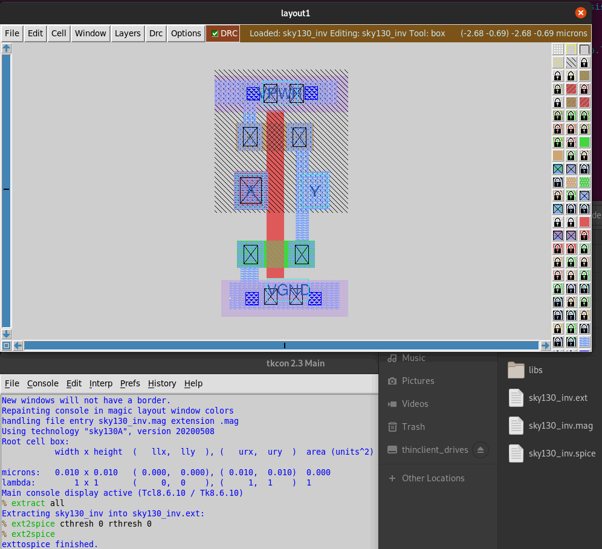<br />

* Lab to modify SPICE file:

```
  # change scale
    .option scale=1000 -> scale=0.01u
  # add model library
    .include ./libs/pshort.lib
    .include ./libs/nshort.lib
  # modify model name
    pshort -> pshort_model.0
    nshort -> nshort_model.0
  # add VDD/GND/Vin
    VDD VPWR 0 3.3V
    VSS VGND 0 0V
    Va A VGND PULSE(0V 3.3V 0 0.1ns 0.1ns 2ns 4ns)
  # add analysis command
    .tran 1n 20n
    .control
    run
    .endc
    .end
  # perform ngspice simulation
  $ ngspice sky130_inv.spice
  > plot y vs tims a
```

[2] Modified sky130_inv.spice<br />
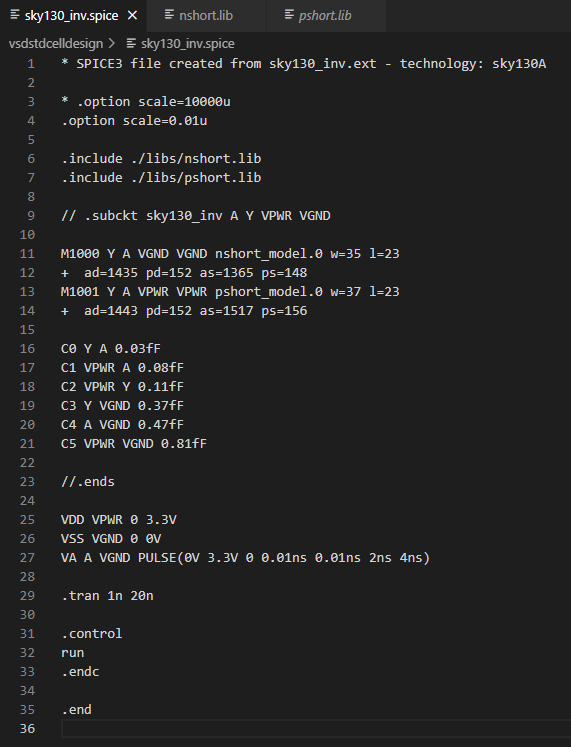<br />
[3] Vin and Vout Timing Diagram<br />
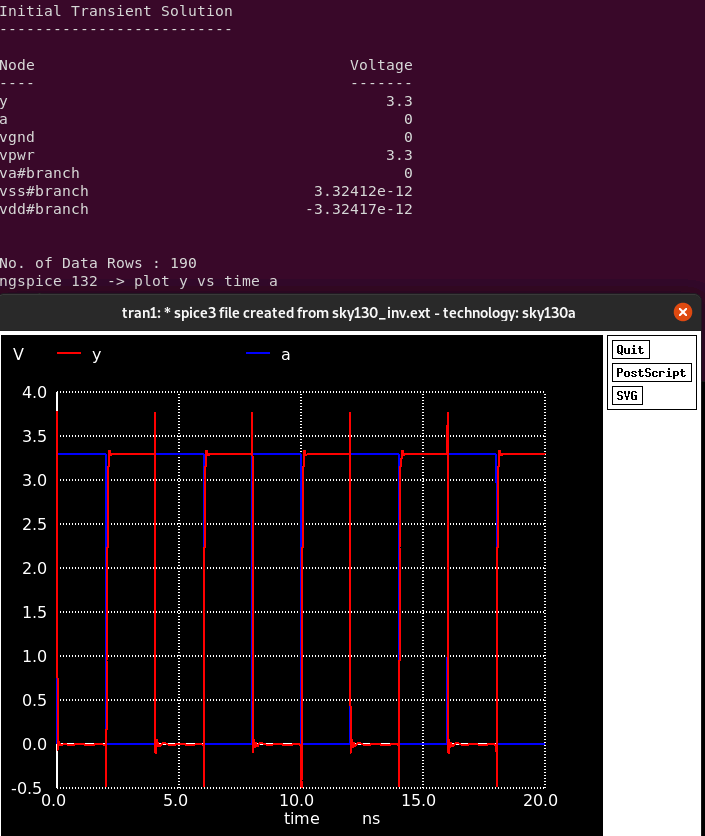<br />

* Lab-Exercise: Magic DRC
    * Website: opencircuitdesign.com/magic/
        * Technology File: Magic Technology File Format
            1. DRC section
            2. Cifoutput section 
    * Lab-File: http://opencircuitdesign.com/open_pdks/archive/drc_test.tgz

```
    $ magic -d XR
  # "Open" -> "met3.mag", errors in SkyWater SKY130 Process Design Rules, Periphery Rules
  # fix poly.9 error => poly and polyres are too close
  # reload magic tech file
    % tech load sky130A.tech
```

------

## Day20

Topic: Pre-layout timing analysis and importance of good clock tree

Goals:
1. Known Routing Grid informations
2. How to add new std-cell in OpenLane
3. How Clock-Tree Synthesis works

Lecture-Notes:

* Lab: convert grid info to track info
    * LEF file: reduced GDS information, only contains ports(power, ground, input, output) for digital PnR flow.
    * Guide-Line
        1. input/output port must line-up on the intersection of horizontal/vertical tracks
        2. width/height of standard cell should be multiple of horizontal/vertical pitch

```
  # pdks/sky130A/libs.tech/popenlane/sky130_fd_sc_hd/tracks.info
    li1 X 0.23 0.46 # Horizontal Track(0.23) Pitch(0.46)
    li1 Y 0.17 0.34 # Vertical   Track(0.17) Pitch(0.34)
  # adjust magic grid display
    % grid 0.46um 0.34um 0.23um 0.17um
```

* Lab: generate LEF file

```
    $ magic -T sky130A.tech sky130_vsdinv.mag &
    % lef write -> sky130_vsdinv.lef
  # Points in LEF File: SIGNAL/POWER, INPUT/OUTPUT
```

[1] Export LEF file from sky130_vsdinv.mag<br />
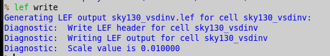<br />

* Lab: include new cell in synthesis
    1. copy sky130_vsdinv.lef to picorv32a/src
    2. add include new lef script in my_base.sdc
    3. apply timing .lib: sky130_fd_sc_hd__fast/slow/typical.lib
    4. modify config.tcl

> Note: Openlane changed config.tcl to config.json in latest version 

```
  # openlane
    % package require openlane 0.9
    % prep -design picorv32a -tag <date>_<time> -overwrite
    % set_left ...
    % add_lefs -src ...
    % run synthesis
  # yosys summary contain sky130_vsdinv
```

[2] Modify config.json from Lab statement<br />
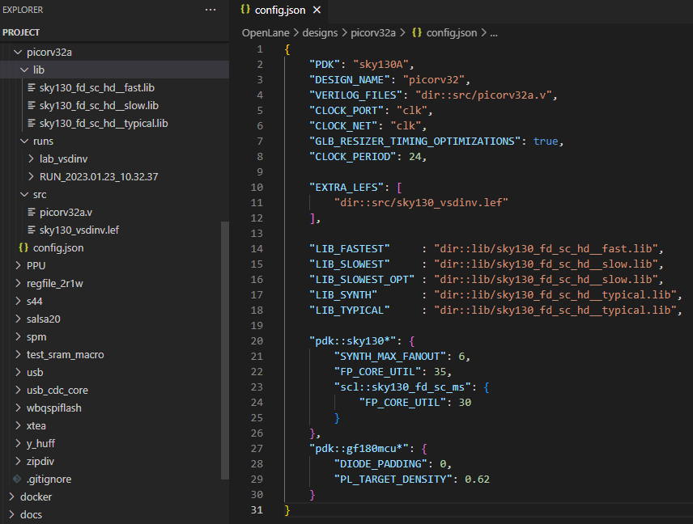<br />
[3] Perform synthesis with new config.json<br />
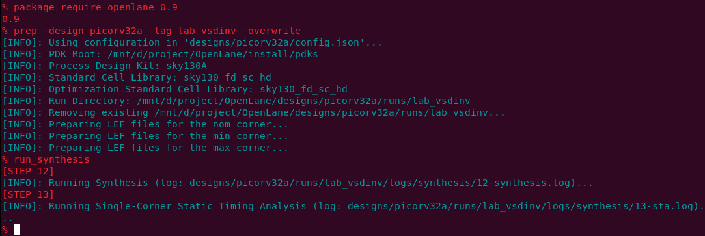<br />
[4] Checked synthesis result with sky130_vsdinv<br />
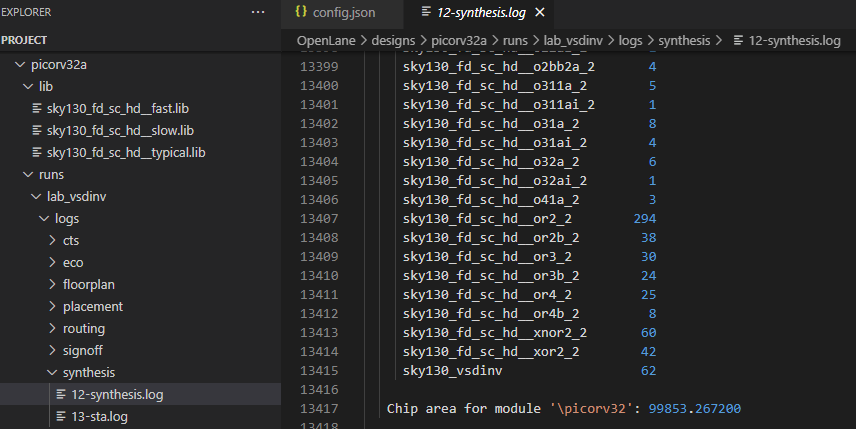<br />


* Introduction to delay tables
    * Power Aware CTS -> Apply clock-gating cells to disable circuit switching while gated
    * Observation:
        * At every level, each node driving same load
        * Identical buffer at same level
    * Practical:
        * Apply delay table to adjust buffer performance to meet timing
    * If input-slew/output-load in the middle of table elements, derive result by linear approximation

* Lab: fix slack from new vsdinv cell
    * SYNTH_STRATEGY = 1:timing/2:balance/3:area

```
    % run synthesis
    % run floorplan
    % run placement

    $ magic -T sky130A.tech lef read .../merged.lef def read .../<design>.placement.def
  # find sky130_vsdinv cell
```

[5] Found sky130_vsdinv in placement DEF<br />
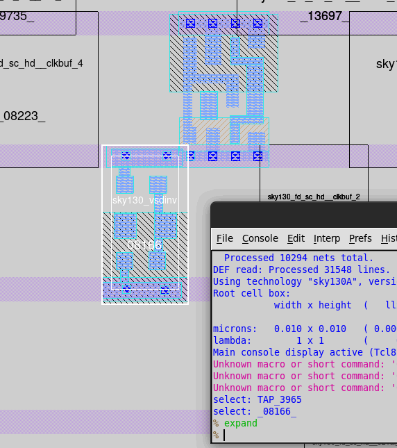<br />

* Timing Analysis (Ideal Clock)
    * Jitter: clock source variation, modelling as "uncertainty"
    * T:period, Tc: combinational-delay, Ts: Setup-Time, Tq: C-to-Q delay, Tsu: Jitter(uncertainty)
    * Ideal-Clock: Tc < T-Ts-Tq
    * With-Jitter: Tc < T-Ts-Tq-Tsu

* Lab: Post-Synth Timing Analysis
    * pre_sta.conf -> OpenSTA analysis script
    * my_base.sdc -> I/O, Clock adn slew/load definitions
        * ::env(SYNTH_DRIVING_CELL) sky130_fd_sc_hd__inv_8
        * ::env(SYNTH_DRIVING_CELL_PIN) Y
        * ::env(SYNTH_CAP_LOAD) 17.65 (fF) <- from synthesis lib, find pin:A capcitance

```
    $ sta pre_sta.conf
  # optimize synthesis to reduce setup violation
    % set ::env(SYNTH_STRATEGY) 1
    % set ::env(SYNTH_BUFFERING) 1
    % set ::env(SYNTH_SIZING) 1
    % set ::env(SYNTH_MAX_FANOUT) 4
    % run synthesis
    % report_net -connections <net-name> => Driver-Pins/Load-Pins
    % replace <inst-name> <lib-cell-name>
    % report_checks -fields {net cap slew input_pins} -digits 4
```

[6] Change Driving Cell and Max Fanout<br />
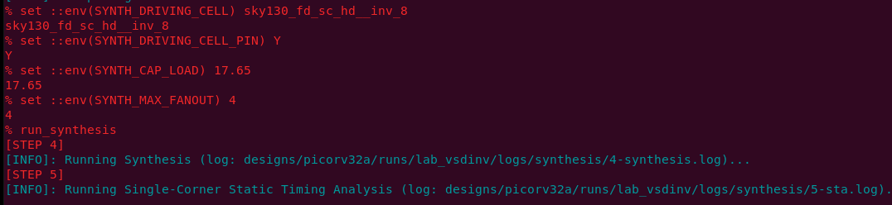<br />

[7] Check driving cell changes in STA log, right column is changed result<br />
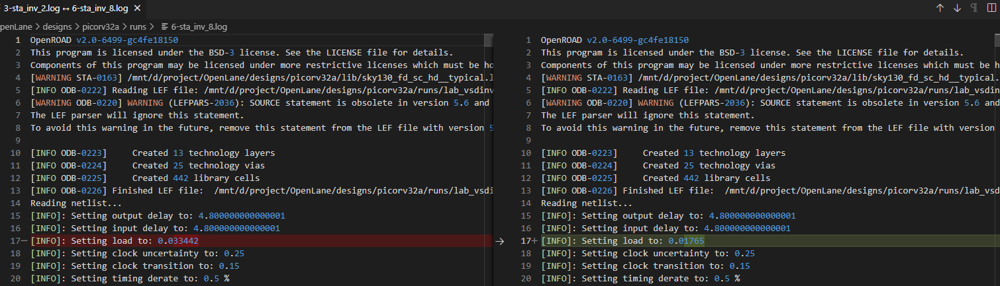<br />

[8] Check slack changes in STA log, right column is changed result<br />
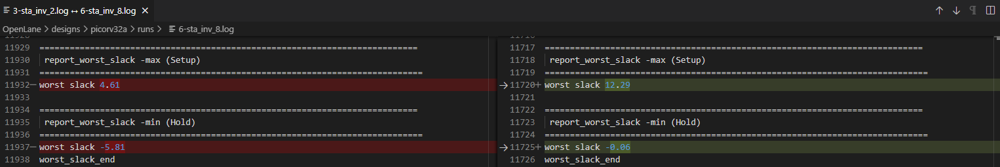<br />

* Clock-Tree Synthesis
    * Direct/Shortest Route to clock-pin: hard to balance skew
    * H-Tree : Got to the mid-point of clock-pins, then spread to sub-group of clock-pins, till touch all clock pin
        * Minimize skew for add balanced clock buffer
    
* Clock Net Shielding
    * Clock Net got glitch without shielding, from huge coupling capacitance by PWR/GND (high overlapping area)
    * Clock Net Crosstalk affect normal transition slew-rate, increase clock net delay

* Lab: Steps to run CTS using TritonCTS

```
    % write_verilog <design>_eco.v
    % run floorplan
    % run placement
    % run cts
  # generate <design>_synthesis_cts.v
  # <openlane-root>/scripts/tcl_commands/cts.tcl
  #                /scripts/openroad/or_cts.tcl
  # ::env(CTS_ROOT_BUFFER) => sky130_fd_sc_hd__clkbuf_16
  # ::env(CTS_MAX_CAP) => CTS_ROOT_BUFFER output port load-cap
```

[9] Run TritonCTS<br />
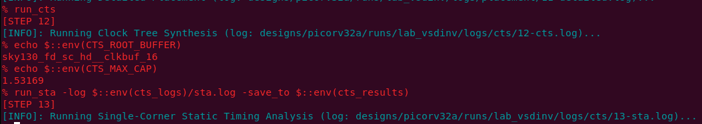<br />

* Timing Analysis (Read Clock)
    * Skew: Physical buffer unbalance between sequential logics
    * Td1: Clock-Net to launch FF clock-pin delay
    * Td2: Clock-Net to capture FF clock-pin delay
    * H: capture FF hold-time
    * Setup Analysis: (Tc+Td1) < (T+Td2-Ts-Tsu)
    * Slack (setup) : Data Require Time (T+Td2-Ts-Tsu) - Data Arrival Time (Tc+Td1)
    * Hold Analysis: (Tc+Td1) > (H + Td2)
    * Slack (hold) : Data Arrival Time (Tc+Td1) - Data Require Time (H + Td2)

* Lab: OpenLane analysis post-CTS timing

```
    % openroad -> use same env variable in openlane
    % read_lef .../merged.lef
    % read_def .../<design>.cts.lef
    % write_db <design>_cts.db
    % read_liberty -max $::env(LIB_MAX)
    % read_liberty -min $::env(LIB_MIN)
    % link_design <design-top>
    % read_sdc .../my_Base.sdc
    % set_propagated_clock [all_clocks]
    $ report_checks -path_delay min-max -format full_clock_expanded -digits 4
  # upper command produce false analysis from ff/ss analysis by tt synthesis
```

* Lab: Analysis TT timing

```
    % exit -> back to openlane
    % openroad
    % read_db <design>_cts.db
    % read_liberty $::env(LIB_SYNTH_COMPLETE)
    % link_design <design-top>
    % read_sdc .../my_Base.sdc
    % set_propagated_clock [all_clocks]
    $ report_checks -path_delay min-max -format full_clock_expanded -digits 4
```

[10] STA report after CTS, timing clean<br />
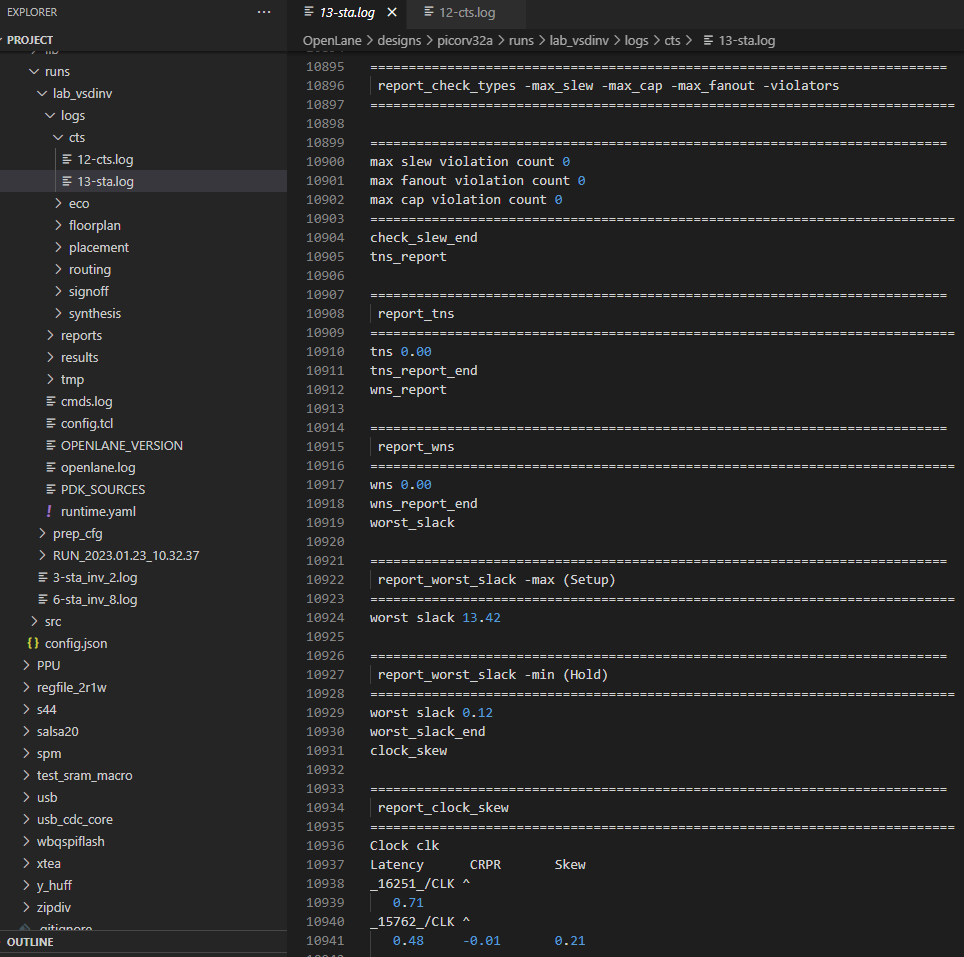<br />

* Lab: Change Clock Buffer Effect

```
    % set ::env(CTS_CLK_BUFFER_LIST) [ lreplace $::env(CTS_CLK_BUFFER_LIST) 0 0 ]
    % set ::env(CURRENT_DEF) .../placement/<design>.placement.def -> back to placement.def
    % run cts
  # Timing Report for skew
    % report_clock_skew -hold
    % report_clock_skew -setup
  # add back to clock buffer list
    % set ::env(CTS_CLK_BUFFER_LIST) [ linsert $::env(CTS_CLK_BUFFER_LIST) 0 sky130_..._clkbuf_1 ]
```

------

## Day21

Topic: Final steps for RTL2GDS

Goals:
1. Known basic of routing algorithm
2. Generate Power-Delivery Network
3. Extract SPEF from post-route netlist

Lecture-Notes:

* Maze Routing - Lee's Algorithm (Lee 1961)
    * Routing: Connection of two points in shortest path
    * No qblique routing path, only up,down,left,right in Lee's algorithm

* DRC Clean
    * Wire Width (at least)
    * Wire Pitch (distance from middle of lines)
    * Wire Spacing (space between nearest wire border)
    * Via Width (contact min width)
    * Via Spacing

* Parasitic Extraction
    * SPEF format for wire's RC information

* Lab: Steps to build power distribution network

```
    % prep -design <design> -tag <date>_<time> -> apply config.tcl and DEF file
    % gen_pdn
  # std-cell Rails: Width: 0.480, Pitch: 2.720
    % echo $::env(CURRENT_DEF) -> .../floorplan/pdn.def
```
[1] Perform Power-Delivery Network (PDN)<br />
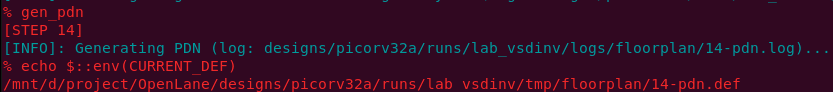<br />

[2] DEF file after performing PDN<br />
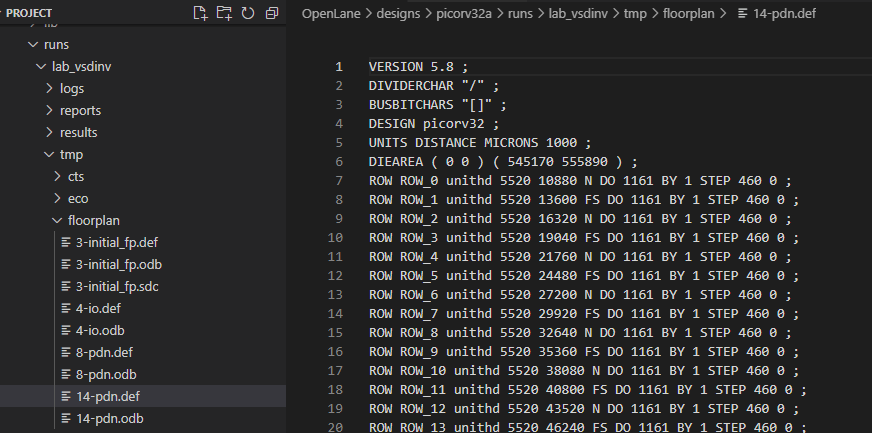<br />

* Lab: OpenLane Route

```
    % run routing
  # routing parameters
  # GLB_RT_MAXLAYER
  # GLB_RT_ADJUSTMENT
  # ROUTING_STRATEGY: 0 ~ 3, 0: less optimize, but drc-clean
```

[3] Run Routing, but ROUTING_STRATEGY has been deprecated in new OpenLane<br />
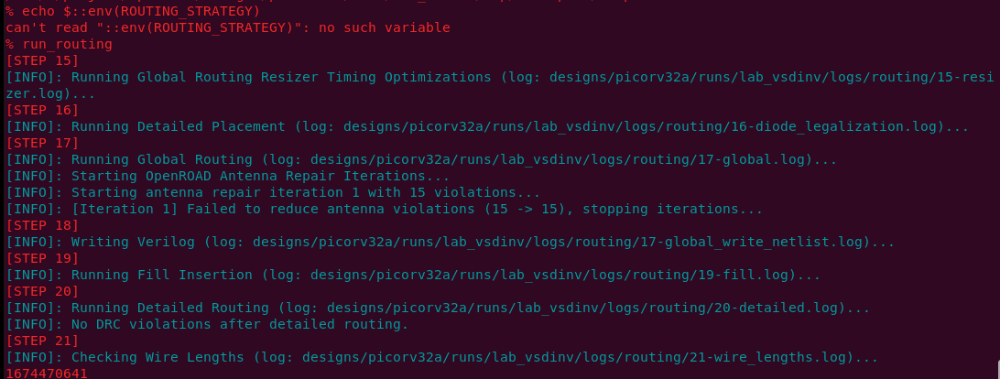<br />

* Routing in OpenLane/OpenRoad
    1. FastRoute (Global)
    2. TritonRoute (Detailed)

* TritonRoute
    1. honor the preproicessed route guide (from fast-route)
    2. assume route guide satisfy inter-guide connectivity
    3. MILP-based panel-routing scheme
        1. intra-layer parallel
        2. inter-layer sequential

* Preprocessed route guide
    * intial global route guide only have 1 layer information, modify to multi-layer guides
        * should have unit width
        * should be in the preferred direction in each layer (e.g. M1 prefer vertical, M2 prefer horizontal)

* Inter-guide connectivity:
    * Two route guide are connected if:
        1. They are on the same metal layer with touching edges
        2. they are on neighboring metal layer with non-zero vertically overlapped area
    * Unconnected terminal should have it's pin shape overlapped by a route guide

* Detailed Route Problem Statement:
    * Input: LEF, DEF, Preprocessed route guide
    * Output: Detailed routing solution with optimized wire-length and via-count
    * Constraint: Route guide honoring, connectivity constraint and design rules
    * Handling Connectivity: minimized routing resource usage in routing guide
    * Access Point (AP) : An on-grid point on the metal layer of the route guide, target lower/upper layer segment, pins and I/O ports
    * Access Point Cluster (APC) : An union of all APs from same sources
    * .../touting/fastroute.guide -> `eoi[<number>]` -> net

* Lab: SPEF-EXTRACTOR

```
    $ .../SPEF_EXTRACTOR/main.py .../merged.lef .../<design>.def
  # generated <design>.spef in <design>.def directory
    
  # before routing netlist
  # <design>/runs/.../results/synthesis/<design>.synthesis_diode.v -> inserted antenna diode
  #                                    /<design>.synthesis_preroute.v -> before route netlist
```

[4] Extract SPEF by `run_parasitics_sta` command in new OpenLane<br />
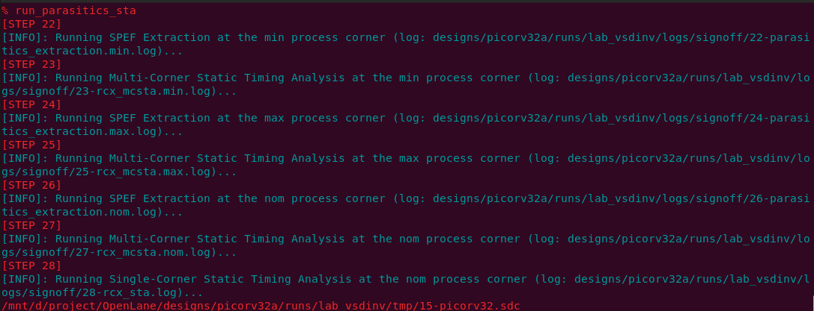<br />

[5] Nominal Corner SPEF from OpenRCX in new OpenLane<br />
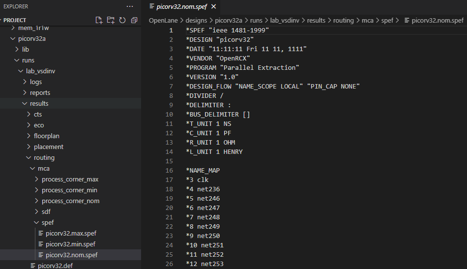<br />

------

## Day22-28<br />

Day 22 - Full RTL2GDS for your design
Day 23 & 24 - Post placement pre CTS STA checks for your design on ss,ff,tt corners and tabulate/compare with post-synth<br />
Day 25 & 26 - Post CTS pre-layout STA checks for your design on ss,ff,tt corners and tabulate/compare with pre-CTS<br />
Day 27 & 28 - Post layout STA checks for your design on ss,ff,tt corners and tabulate/compare with pre-payout<br />

* Goal: Apply OpenLane RTL-to-GDS flow on project (HDP-RV151)

* OpenLane Project File:
    * [config.json](reports/230127/config.json)
    * [macro_placement.cfg](reports/230127/macro_placement.cfg)
    * [base.sdc](reports/230127/base.sdc)

[1] HDP-RV151 Try-Route GDS<br />
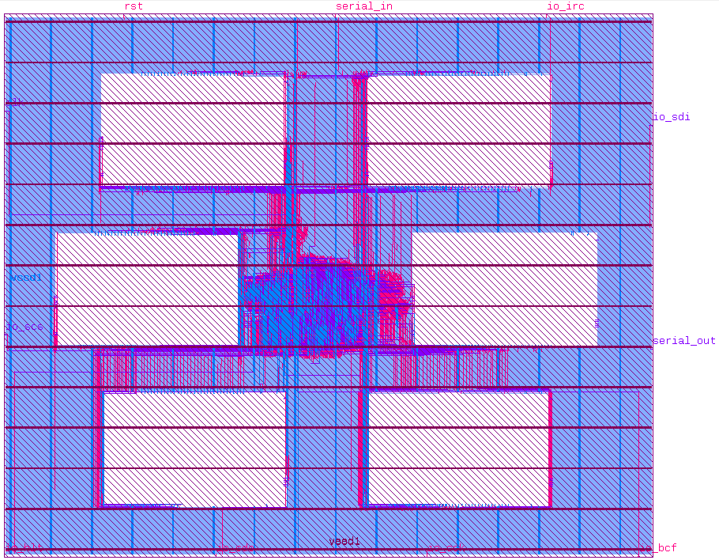<br />

[2] HDP-RV151 Post-Synth Timing<br />
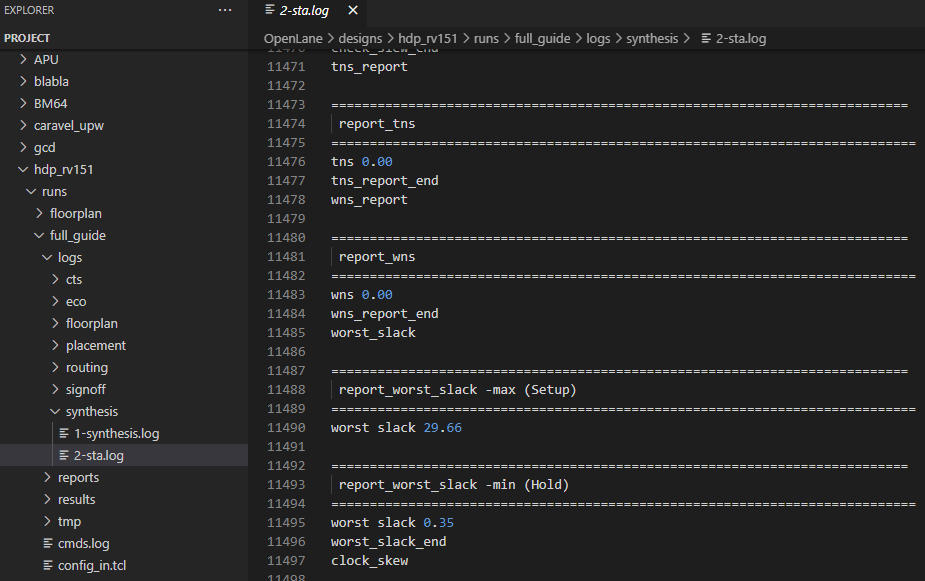<br />

[3] HDP-RV151 Post-Route Timing<br />
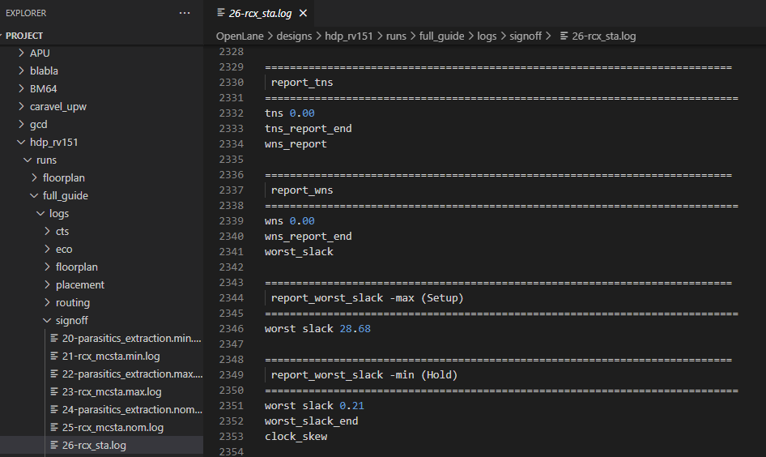<br />

------