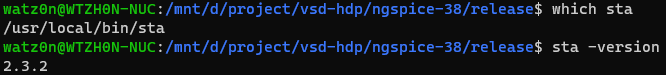
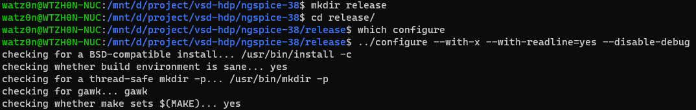

# VDS-HDP Progress Status

------

## Day0

Build Environment: Windows-11 + Ubuntu-20.04(WSL2)
Note: Update OS to Win11 for systemd feature in WSL2

### Tool: Yosys

Installation Guide:
> https://yosyshq.readthedocs.io/projects/sby/en/latest/install.html#yosys-yosys-smtbmc-and-abc

Installed Dependency:
```
$ sudo apt-get install build-essential clang bison flex libreadline-dev \
                       gawk tcl-dev libffi-dev git mercurial graphviz   \
                       xdot pkg-config python python3 libftdi-dev gperf \
                       libboost-program-options-dev autoconf libgmp-dev \
                       cmake curl
```
Installation Flow:
```
$ git clone https://github.com/YosysHQ/yosys
$ cd yosys
$ make -j4
$ sudo make install
```

Progress Images:


### Tool: OpenSTA

Installation Guide:
> https://github.com/The-OpenROAD-Project/OpenSTA#installing-with-cmake

Additional Dependency:
```
$ sudo apt-get install swig
```
Installation Flow:
```
$ git clone https://github.com/The-OpenROAD-Project/OpenSTA.git
$ cd OpenSTA
$ mkdir build
$ cd build
$ cmake ..
$ make
$ sudo make install
```

Progress Images:




### Tool: ngspice

Installation Source:
> https://sourceforge.net/projects/ngspice/files/ng-spice-rework/38/
> ngspice-38.tar.gz

Installation Guide:
> https://github.com/ngspice/ngspice/blob/master/INSTALL
> 1.2 Install from tarball (e.g. ngspice-26.tar.gz)

Installation Flow:
```
$ tar -zxvf ngspice-38.tar.gz
$ cd ngspice-38
$ mkdir release
$ cd release
$ ../configure  --with-x --with-readline=yes --disable-debug
$ make
$ sudo make install
```

Progress Images:




------
