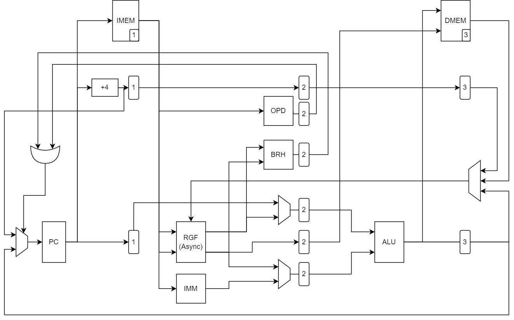

# VSD-HDP Project Proposal
- wats0n.edx@gmail.com(Watson Huang)
------

Project Name: HDP-RV151

Description: 

Implement RV151 from UCB EECS151 project, which contain following items:
1. A RISC-V core base on RV32I specification, build 3-Stage Pipeline
2. UART TX/RX, target 115200bps baud-rate, add configure-register for changing baud-rate.

Draft Data-Path Diagram:
 

Reused resource:
1. Digital Verification Flow for RV32I compilation tests
2. BIOS Boot-Sequence with UART communication

------