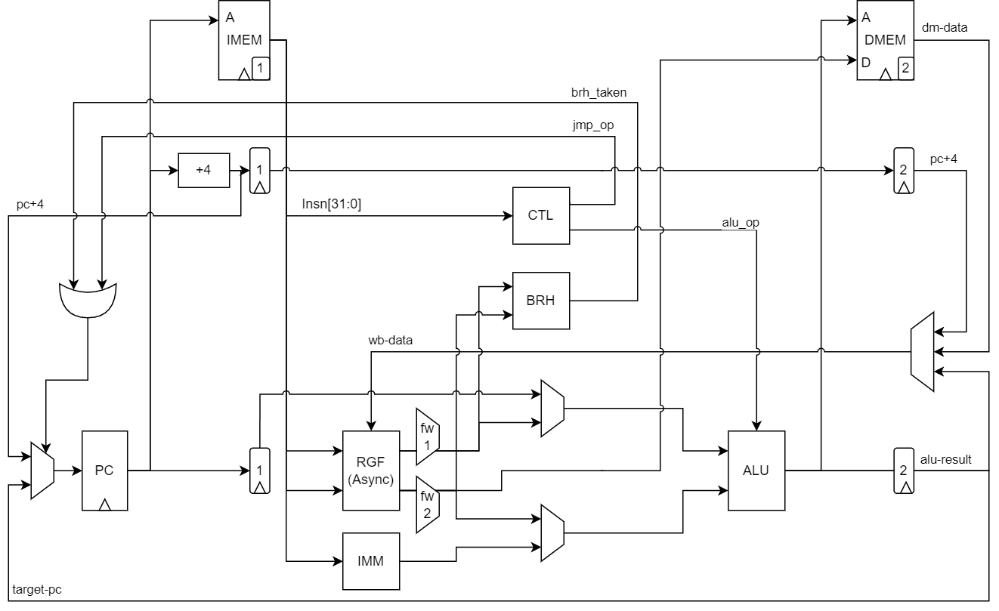
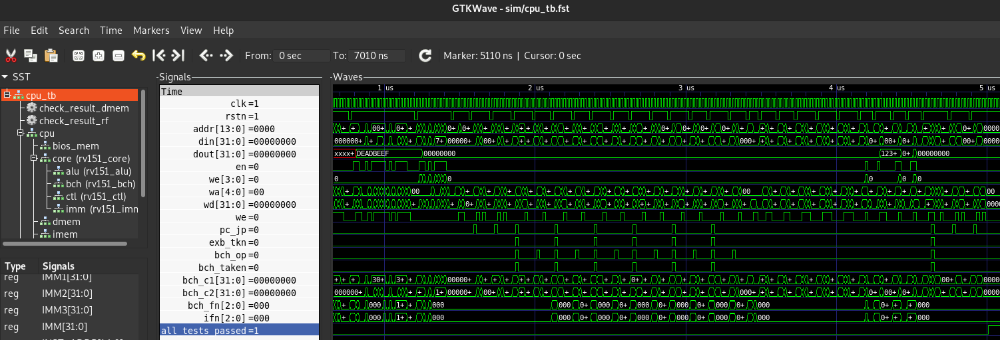

# VSD-HDP Project Proposal
- wats0n.edx@gmail.com(Watson Huang)
------

Project Name: HDP-RV151

Description: 

Implement RV151 from [UCB-EECS151 project](https://github.com/EECS150/fpga_project_skeleton_fa22), which contain following items:
1. A RISC-V core base on RV32I specification, build 3-Stage Pipeline
2. UART TX/RX, target 115200bps baud-rate, add configure-register for changing baud-rate.

Draft Data-Path Diagram:
<br />

Reuse resource from EECS151 course:
1. Digital Verification Flow for RV32I compilation tests
2. BIOS Boot-Sequence with UART communication

Require resource from VSD-IP:
* SRAM Memory(4KB), [vsdsram_sky130](https://github.com/vsdip/vsdsram_sky130)

------

Development Progress (@221217):

- [x] RV32I 3-Stage CPU core RTL passed `cpu_tb` tests
    - rv151_core.v
    - rv151_alu.v
    - rv151_brh.v
    - rv151_ctl.v
    - rv151_imm.v

From cpu_tb.log:
```
FST info: dumpfile cpu_tb.fst opened for output.
[         1] Test                       R-Type ADD passed!
[         2] Test                       R-Type SUB passed!
[         3] Test                       R-Type SLL passed!
[         4] Test                       R-Type SLT passed!
[         5] Test                      R-Type SLTU passed!
[         6] Test                       R-Type XOR passed!
[         7] Test                        R-Type OR passed!
[         8] Test                       R-Type AND passed!
[         9] Test                       R-Type SRL passed!
[        10] Test                       R-Type SRA passed!
[        11] Test                      R-Type SLLI passed!
[        12] Test                      R-Type SRLI passed!
[        13] Test                      R-Type SRAI passed!
[        14] Test                       I-Type ADD passed!
[        15] Test                       I-Type SLT passed!
[        16] Test                      I-Type SLTU passed!
[        17] Test                       I-Type XOR passed!
[        18] Test                        I-Type OR passed!
[        19] Test                       I-Type AND passed!
[        20] Test                        I-Type LW passed!
[        21] Test                      I-Type LH 0 passed!
[        22] Test                      I-Type LH 2 passed!
[        23] Test                      I-Type LB 0 passed!
[        24] Test                      I-Type LB 1 passed!
[        25] Test                      I-Type LB 2 passed!
[        26] Test                      I-Type LB 3 passed!
[        27] Test                     I-Type LHU 0 passed!
[        28] Test                     I-Type LHU 2 passed!
[        29] Test                     I-Type LBU 0 passed!
[        30] Test                     I-Type LBU 1 passed!
[        31] Test                     I-Type LBU 2 passed!
[        32] Test                     I-Type LBU 3 passed!
[        33] Test                        S-Type SW passed!
[        34] Test                      S-Type SH 1 passed!
[        35] Test                      S-Type SH 3 passed!
[        36] Test                      S-Type SB 1 passed!
[        37] Test                      S-Type SB 2 passed!
[        38] Test                      S-Type SB 3 passed!
[        39] Test                      S-Type SB 4 passed!
[        40] Test                       U-Type LUI passed!
[        41] Test                     U-Type AUIPC passed!
[        42] Test                       J-Type JAL passed!
[        43] Test                       J-Type JAL passed!
[        44] Test                       J-Type JAL passed!
[        45] Test                      J-Type JALR passed!
[        46] Test                      J-Type JALR passed!
[        47] Test                      J-Type JALR passed!
[        48] Test               B-Type BEQ Taken 1 passed!
[        49] Test               B-Type BEQ Taken 2 passed!
[        50] Test             B-Type BEQ Not Taken passed!
[        51] Test               B-Type BNE Taken 1 passed!
[        52] Test               B-Type BNE Taken 2 passed!
[        53] Test             B-Type BNE Not Taken passed!
[        54] Test               B-Type BLT Taken 1 passed!
[        55] Test               B-Type BLT Taken 2 passed!
[        56] Test             B-Type BLT Not Taken passed!
[        57] Test               B-Type BGE Taken 1 passed!
[        58] Test               B-Type BGE Taken 2 passed!
[        59] Test             B-Type BGE Not Taken passed!
[        60] Test              B-Type BLTU Taken 1 passed!
[        61] Test              B-Type BLTU Taken 2 passed!
[        62] Test            B-Type BLTU Not Taken passed!
[        63] Test              B-Type BGEU Taken 1 passed!
[        64] Test              B-Type BGEU Taken 2 passed!
[        65] Test            B-Type BGEU Not Taken passed!
[        66] Test CSRRW passed!
[        67] Test CSRRWI passed!
[        68] Test                         Hazard 1 passed!
[        69] Test                         Hazard 2 passed!
[        70] Test                         Hazard 3 passed!
[        71] Test                         Hazard 4 passed!
[        72] Test                         Hazard 5 passed!
[        73] Test                         Hazard 6 passed!
[        74] Test                         Hazard 7 passed!
[        75] Test                         Hazard 8 passed!
[        76] Test                         Hazard 9 passed!
[        77] Test                      Hazard 10 1 passed!
[        78] Test                      Hazard 10 2 passed!
[        79] Test                        Hazard 11 passed!
[        80] Test                        Hazard 12 passed!
All tests passed!
```
iVerilog Simulation Result:<br />
<br />
Gtkwave Waveform:<br />
<br />

Reference:
```
[1] David A. Patterson and John L. Hennessy. 2017. Computer Organization and Design RISC-V Edition: The Hardware Software Interface (1st. ed.). Morgan Kaufmann Publishers Inc., San Francisco, CA, USA.
[2] David Patterson and Andrew Waterman. 2017. The RISC-V Reader: An Open Architecture Atlas (1st. ed.). Strawberry Canyon
[3] FPGA Project from Berkeley EECS 151 Fall 2022, https://github.com/EECS150/fpga_project_skeleton_fa22/blob/master/spec/EECS151_FPGA_Project_Fa22.pdf
```

------

Development Progress (@221224):

- [x] Synthesis RTL to Gate Netlist by Yosys
- [x] Modified cpu_tb start from IMEM (0x10000000) to BIOS-RAM (0x40000000)
- [x] Perform Gate Simulation

Synthesis Steps:
```
> read_liberty -lib ../lib/sky130_fd_sc_hd__tt_025C_1v80.lib
> read_verilog ./src/riscv_core/rv151_core.v ./src/riscv_core/rv151_alu.v ./src/riscv_core/rv151_imm.v ./src/riscv_core/rv151_brh.v ./src/riscv_core/rv151_ctl.v
> synth -top rv151_core
> dfflibmap -liberty ../lib/sky130_fd_sc_hd__tt_025C_1v80.lib
> flatten
> opt_clean -purge
> abc -liberty ../lib/sky130_fd_sc_hd__tt_025C_1v80.lib
> write_verilog -noattr rv151_core_syn.v
```

Synthesis Progress:<br />
[1] Synthesis Utilization<br />
<br />
[2] DFF Mapping<br />
<br />
[3] Flatten and Optimization<br />
<br />
[4] ABC Technology Mapping<br />
<br />
[5] Write Verilog Netlist<br />
<br />
[6] Verilog Netlist Snippet<br />
<br />

Synthesis Statistics:<br />
```
=== rv151_core ===

   Number of wires:               4880
   Number of wire bits:           5609
   Number of public wires:          52
   Number of public wire bits:     781
   Number of memories:               0
   Number of memory bits:            0
   Number of processes:              0
   Number of cells:               2032
     sky130_fd_sc_hd__a2111oi_0      7
     sky130_fd_sc_hd__a211o_1        5
     sky130_fd_sc_hd__a211oi_1      21
     sky130_fd_sc_hd__a21boi_0       6
     sky130_fd_sc_hd__a21o_1        21
     sky130_fd_sc_hd__a21oi_1      210
     sky130_fd_sc_hd__a221o_1       35
     sky130_fd_sc_hd__a221oi_1      21
     sky130_fd_sc_hd__a222oi_1       1
     sky130_fd_sc_hd__a22o_1        33
     sky130_fd_sc_hd__a22oi_1       31
     sky130_fd_sc_hd__a311o_1        2
     sky130_fd_sc_hd__a311oi_1       8
     sky130_fd_sc_hd__a31o_1         3
     sky130_fd_sc_hd__a31oi_1       16
     sky130_fd_sc_hd__a32oi_1        4
     sky130_fd_sc_hd__and2_0        13
     sky130_fd_sc_hd__and3_1        12
     sky130_fd_sc_hd__clkinv_1      61
     sky130_fd_sc_hd__dfrtp_1      166
     sky130_fd_sc_hd__dfstp_2        1
     sky130_fd_sc_hd__maj3_1        10
     sky130_fd_sc_hd__mux2_1        55
     sky130_fd_sc_hd__mux2i_1       77
     sky130_fd_sc_hd__nand2_1      228
     sky130_fd_sc_hd__nand2b_1      31
     sky130_fd_sc_hd__nand3_1       42
     sky130_fd_sc_hd__nand3b_1       3
     sky130_fd_sc_hd__nand4_1        7
     sky130_fd_sc_hd__nand4b_1       5
     sky130_fd_sc_hd__nand4bb_1      1
     sky130_fd_sc_hd__nor2_1       296
     sky130_fd_sc_hd__nor2b_1       31
     sky130_fd_sc_hd__nor3_1        73
     sky130_fd_sc_hd__nor3b_1        4
     sky130_fd_sc_hd__nor4_1        10
     sky130_fd_sc_hd__o2111ai_1      4
     sky130_fd_sc_hd__o211ai_1      22
     sky130_fd_sc_hd__o21a_1        10
     sky130_fd_sc_hd__o21ai_0      214
     sky130_fd_sc_hd__o21ba_1        1
     sky130_fd_sc_hd__o21bai_1       7
     sky130_fd_sc_hd__o221ai_1      11
     sky130_fd_sc_hd__o22a_1         2
     sky130_fd_sc_hd__o22ai_1       19
     sky130_fd_sc_hd__o2bb2ai_1      2
     sky130_fd_sc_hd__o311a_1        1
     sky130_fd_sc_hd__o311ai_0       8
     sky130_fd_sc_hd__o31a_1         2
     sky130_fd_sc_hd__o31ai_1       11
     sky130_fd_sc_hd__o32a_1         4
     sky130_fd_sc_hd__o32ai_1        2
     sky130_fd_sc_hd__or2_0         17
     sky130_fd_sc_hd__or3_1         13
     sky130_fd_sc_hd__or3b_1         1
     sky130_fd_sc_hd__or4_1          4
     sky130_fd_sc_hd__or4b_1         1
     sky130_fd_sc_hd__xnor2_1       96
     sky130_fd_sc_hd__xor2_1        30
```

Fixed Gate Simulation Issue:<br />
[1] Mapped DFF List<br />
<br />
[2] Fix Reset DFF missed connections<br />
<br />
[3] Fix Set DFF missed connections<br />
<br />

Simulation Result:<br />
[1] RTL Simulation Pass<br />
<br />
[2] RTL Simulation File-List<br />
<br />
[3] Gate Simulation Pass<br />
<br />
[4] Gate Simulation File-List<br />
<br />

------

Development Progress (@221224):

- [x] Update PDK to Sky130 latest
- [x] Compile OpenRAM
- [ ] Perform OpenSTA Analysis


* Install Sky130-PDK and OpenRAM
```
//-- PDK Root-Path
$ cd /mnt/d/project/pdk

//--- Install SKY130 PDK
$ git clone https://github.com/google/skywater-pdk.git
$ cd skywater-pdk
$ SUBMODULE_VERSION=latest make submodules -j3 || make submodules -j1
$ //--- Second time for python depndency issue
$ SUBMODULE_VERSION=latest make submodules -j3 || make submodules -j1
$ make timing
$ cd ..

//--- Install open_sdk for sky130A library
$ git clone git://opencircuitdesign.com/open_pdks
$ cd open_pdks
$ ./configure --enable-sky130-pdk=/mnt/d/project/pdk/skywater-pdk
$ make
$ cp -R sky130/sky130A /mnt/d/project/pdk
$ cd ..

//--- Install sky130 sram libraries for OpenRAM
$ git clone https://github.com/vlsida/sky130_fd_bd_sram.git

```

* OpenRAM Compile Memory
```
cd /mnt/d/project/OpenRAM

$ export PDK_ROOT="/mnt/d/project/pdk"
$ export OPENRAM_HOME="/mnt/d/project/OpenRAM/compiler"
$ export OPENRAM_TECH="/mnt/d/project/OpenRAM/technology"

$ python3 $OPENRAM_HOME/openram.py hdpsram_sky130_32x2048_1rw.py
```

* OpenRAM configure file, hdpsram_sky130_32x2048_1rw.py
```
"""
Single port, 2 kbytes SRAM, with byte write, useful for RISC-V processor main
memory.
"""
word_size = 32 # Bits
num_words = 2048
human_byte_size = "{:.0f}kbytes".format((word_size * num_words)/1024/8)

# Allow byte writes
write_size = 8 # Bits

# Single port
num_rw_ports = 1
num_r_ports = 0
num_w_ports = 0
num_spare_rows = 1
num_spare_cols = 1
ports_human = '1rw'

tech_name = "sky130"

#nominal_corner_only = True
process_corners = ["SS", "TT", "FF"]
supply_voltages = [ 1.8 ]
temperatures = [ 25 ]

route_supplies = "ring"
check_lvsdrc = False
uniquify = True

output_name = "hdp_{tech_name}_sram_{human_byte_size}_{ports_human}_{word_size}x{num_words}_{write_size}".format(**locals())
output_path = "macro/{output_name}".format(**locals())

```


------