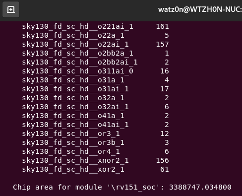
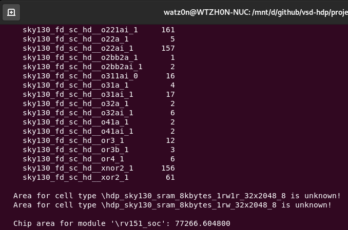

# VSD-HDP Project Design Report

* Author: wats0n.edx@gmail.com (Watson Huang)

------

Outline:<br />
[Design Specification](#1)<br />
[Function Consistancy](#2)<br />
[Physical Implementation](#3)<br />
[References](#4)<br />

------
## 1. Design Specification

### 1.1. Design Description

* Goal : Propose a simple but extendable architecture to go through open-source RTL-to-GDS (Physical Implementation) Flow.

* Design Name: HDP-RV151
    * Ideal from [UCB EECS-151 FPGA Project](https://github.com/EECS150/fpga_project_skeleton_fa22/blob/master/spec/EECS151_FPGA_Project_Fa22.pdf)

* Design Features:
    1. RISC-V (RV32I) core, 3-stage pipeline architecture
    2. Configurable BIOS SRAM by external clock SPI interface
    3. UART TX/RX interface, default target 115200bps
    4. 8-Bit GPIO interface (TBD)

> [1] System Diagram

<br />

> [2] RV151 Pipeline Architecture

<br />

> [3] BIOS-configuration SPI (BSPI)

<br />

> [4] Memory Map

<br />

### 1.2. Design Constraint 

1. Target Performance (Clock) : CPU/SPI at 10 MHz
2. Target Area (Utilization) : No constraint

### 1.3. IO-CSRs

|Address      |Function            |Access |Data-Encoding                                          |Default-Value|
|-------------|--------------------|-------|-------------------------------------------------------|-------------|
|32'h80000000 |UART Status         |Read   |{30'h0, uart_rx_data_out_valid, uart_tx_data_in_ready} |32'h00000001 |
|32'h80000004 |UART Received Data  |Read   |{24'h0, uart_rx_data_out[7:0]}                         |32'h00000000 |
|32'h80000008 |UART Send Data      |Write  |{24'h0, uart_tx_data_in[7:0]}                          |N/A          |
|32'h8000000C |UART Baud-Rate      |R/W    |{16'h0, uart_baud_edge[15:0]}                          |32'h00000056 |
|32'h80000010 |Cycle Counter       |Read   |{cc_cntr[31:0]}                                        |32'h00000000 |
|32'h80000014 |Instruction Counter |Read   |{ir_cntr[31:0]}                                        |32'h00000000 |
|32'h80000018 |Rest Counters       |Write  |N/A                                                    |N/A          |

------
## 2. Function Consistancy

### 2.1. Validation Plan

#### 2.1.1. Logic Behavior Simulation

> [1] cpu_tb_bmem

<br />

> [2] bspi_tb_bmem

<br />

> [3] echo_tb_bmem

<br />

### 2.2. Verification Plan

#### 2.2.1. Circuit Function Simulation

> 1. Post-Synthesis 

* cpu_tb_bmem not support gate-level simulation from the reg-file has been flattened.

> [1] bspi_tb_bmem

<br />

> [2] echo_tb_bmem

<br />

> 2. Post-Layout (with Delay-Information)

TBD

#### 2.2.2. Design-For-Test (DFT) Chain

TBD

#### 2.2.3. Design Source-Code Lint

TBD

------
## 3. Physical Implementation

### 3.1. Synthesis

* EDA-Tool : Yosys (0.23)

> [1] Area (Standard-Cell + SRAM-Library) : 3388747.034800 (um^2)

<br />

> [2] Area (Standard-Cell only) : 77266.604800 (um^2)

<br />

> [3] PVT Corners

|PVT-CORNER  |WNS      |WHS   |TNS        |
|------------|---------|------|-----------|
|ff_100C_1v65|49.3661  |0.0857|0.0000     |
|ff_100C_1v95|49.4308  |0.0682|0.0000     |
|ff_n40C_1v56|49.2623  |0.0907|0.0000     |
|ff_n40C_1v65|49.3186  |0.0808|0.0000     |
|ff_n40C_1v76|49.3675  |0.0728|0.0000     |
|ff_n40C_1v95|49.4213  |0.0624|0.0000     |
|ss_100C_1v40|17.9551  |0.2680|0.0000     |
|ss_100C_1v60|45.1854  |0.1942|0.0000     |
|ss_n40C_1v28|-171.5314|0.4326|-46122.8594|
|ss_n40C_1v35|-77.4229 |0.3303|-16150.4980|
|ss_n40C_1v40|-40.0327 |0.2845|-6489.6445 |
|ss_n40C_1v44|-21.2395 |0.2599|-2440.6404 |
|ss_n40C_1v60|27.9402  |0.1853|0.0000     |
|ss_n40C_1v76|48.1734  |0.1504|0.0000     |
|tt_025C_1v80|49.1989  |0.0998|0.0000     |
|tt_100C_1v80|49.2170  |0.1041|0.0000     |


### 3.2. Clock-Tree Synthesis (CTS)

TBD

### 3.3. Placement

TBD

### 3.4. Routing

TBD

### 3.5. Layout

TBD

------
## 4. References
```
[1] David A. Patterson and John L. Hennessy. 2017. Computer Organization and Design RISC-V Edition: The Hardware Software Interface (1st. ed.). Morgan Kaufmann Publishers Inc., San Francisco, CA, USA.
[2] David Patterson and Andrew Waterman. 2017. The RISC-V Reader: An Open Architecture Atlas (1st. ed.). Strawberry Canyon
[3] FPGA Project, Berkeley EECS-151 Fall 2022, https://github.com/EECS150/fpga_project_skeleton_fa22/blob/master/spec/EECS151_FPGA_Project_Fa22.pdf
```

------