# VSD-HDP Project Design Report

* Author: wats0n.edx@gmail.com (Watson Huang)

------

Outline:<br />
[Design Specification](#1)<br />
[Function Consistancy](#2)<br />
[Physical Implementation](#3)<br />
[References](#4)<br />

------
## 1. Design Specification

### 1.1. Design Description

* Goal : Propose a simple but extendable architecture to go through open-source RTL-to-GDS (Physical Implementation) Flow.

* Design Name: HDP-RV151
    * Ideal from [UCB EECS-151 FPGA Project](https://github.com/EECS150/fpga_project_skeleton_fa22/blob/master/spec/EECS151_FPGA_Project_Fa22.pdf)

* Design Features:
    1. RISC-V (RV32I) core, 3-stage pipeline architecture
    2. Configurable BIOS SRAM by external clock SPI interface
    3. UART TX/RX interface, default target 115200bps
    4. 8-Bit GPIO interface (TBD)

> [1] System Diagram

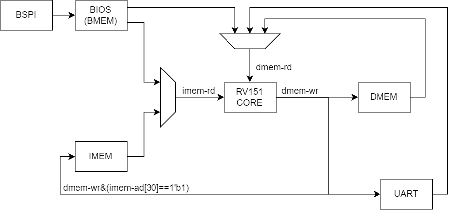<br />

> [2] RV151 Pipeline Architecture

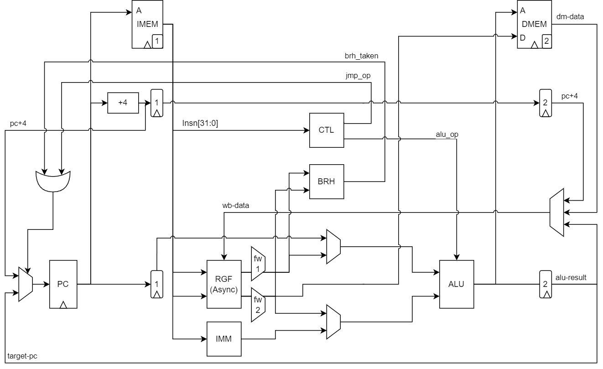<br />

> [3] BIOS-configuration SPI (BSPI)

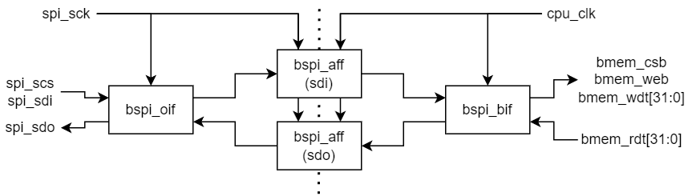<br />

> [4] Memory Map

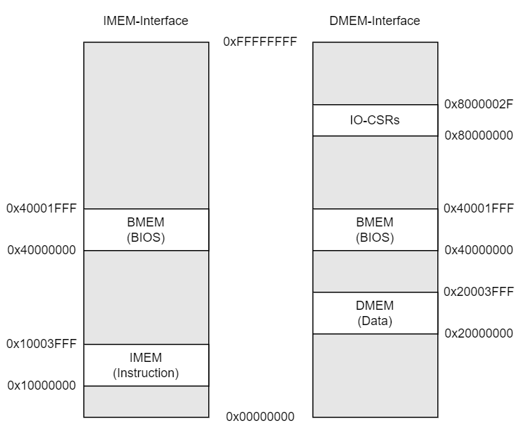<br />

### 1.2. Design Constraint 

1. Target Performance (Clock) : CPU/SPI at 10 MHz
2. Target Area (Utilization) : No constraint

### 1.3. IO-CSRs

|Address      |Function            |Access |Data-Encoding                                          |Default-Value|
|-------------|--------------------|-------|-------------------------------------------------------|-------------|
|32'h80000000 |UART Status         |Read   |{30'h0, uart_rx_data_out_valid, uart_tx_data_in_ready} |32'h00000001 |
|32'h80000004 |UART Received Data  |Read   |{24'h0, uart_rx_data_out[7:0]}                         |32'h00000000 |
|32'h80000008 |UART Send Data      |Write  |{24'h0, uart_tx_data_in[7:0]}                          |N/A          |
|32'h8000000C |UART Baud-Rate      |R/W    |{16'h0, uart_baud_edge[15:0]}                          |32'h00000056 |
|32'h80000010 |Cycle Counter       |Read   |{cc_cntr[31:0]}                                        |32'h00000000 |
|32'h80000014 |Instruction Counter |Read   |{ir_cntr[31:0]}                                        |32'h00000000 |
|32'h80000018 |Rest Counters       |Write  |N/A                                                    |N/A          |
|32'h8000001C |GPIO Configure      |Write  |{8'h0, gpio_oeb[7:0], 8'h0, gpio_out[7:0]}             |32'h00000000 |
|32'h8000001C |GPIO Status         |Read   |{8'h0, gpio_oeb[7:0], 8'h0, gpio_in[7:0]}              |32'h00000000 |

------
## 2. Function Consistancy

### 2.1. Validation Plan

#### 2.1.1. Logic Behavior Simulation

1. Register Transfer Level (RTL)

    1. cpu_tb_bmem

        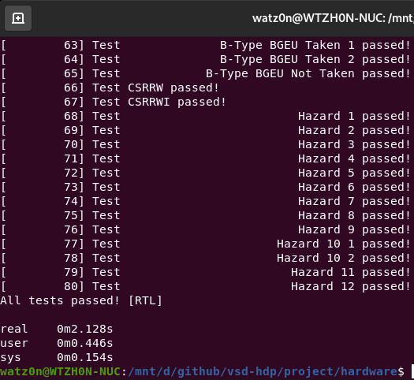<br />

    2. bspi_tb_bmem

        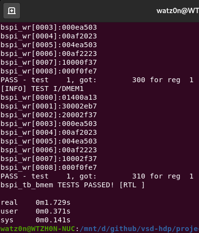<br />

    3. echo_tb_bmem

        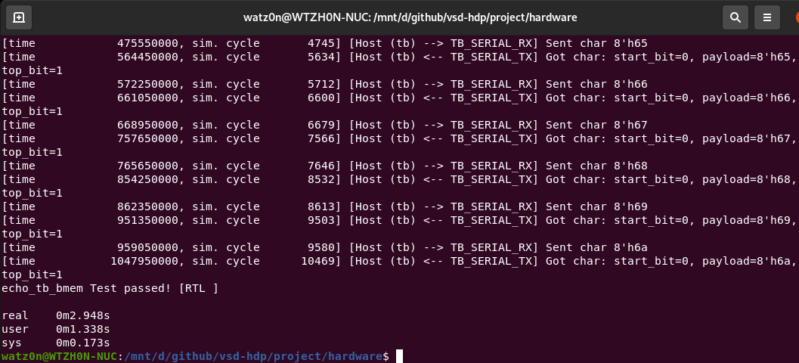<br />

    4. gpio_tb_bmem

        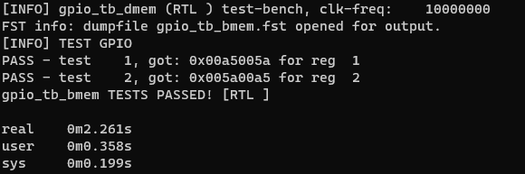<br />


### 2.2. Verification Plan

#### 2.2.1. Circuit Function Simulation

1. Post-Synthesis 

    * cpu_tb_bmem not support gate-level simulation from the reg-file has been flattened.

    1. bspi_tb_bmem

        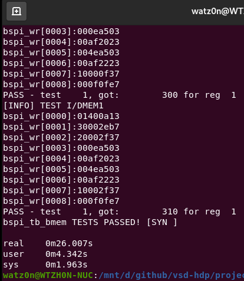<br />

    2. echo_tb_bmem

        <br />

    3. gpio_tb_bmem

        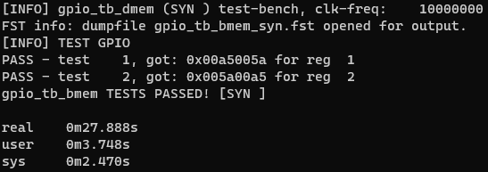<br />


2. Post-Layout (with Delay-Information)

    1. bspi_tb_bmem

        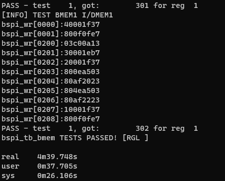<br />

    2. echo_tb_bmem

        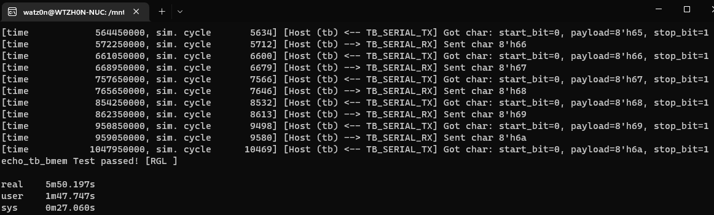<br />

    3. gpio_tb_bmem

        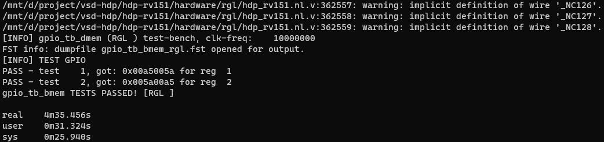<br />

#### 2.2.2. Design-For-Test (DFT) Chain

* [FALUT DFT Flow](https://github.com/AUCOHL/Fault), not for this time.

#### 2.2.3. Design Source-Code Lint

* [Verible Lint](https://chipsalliance.github.io/verible/verilog_lint.html), suitable for SystemVerilog, but too cumbersome for Verilog-Only.

------
## 3. Physical Implementation

### 3.1. Synthesis

* EDA-Tool : Yosys Standalone
    * Report: [Logic-Area](230207/ys_util_sdcl.log), [Total-Area](230207/ys_util_full.log)
    1. Logic Area (Standard-Cell only) : 77266.604800 (nm^2)
    2. Total Area (Standard-Cell + SRAM-Macro) : 3388747.034800 (nm^2)

* EDA-Tool : Yosys in OpenLane
    * Report: [Logic-Area](230207/OpenLane/hdp_rv151/runs/full_guide/reports/synthesis/1-synthesis.AREA_0.stat.rpt), [Total-Area](230207/OpenLane/hdp_rv151/runs/full_guide/reports/synthesis/2-syn_sta.area.rpt)
    1. Logic Area (Standard-Cell only) : 106364.512000 (nm^2)
    2. Total Area (Standard-Cell + SRAM-Macro) : 1813595 (nm^2)

### 3.2. FloorPlanning

* Macro-Placements: [macro_placement.cfg](230207/OpenLane/hdp_rv151/macro_placement.cfg)
* Pin-Locations: [pin_order.cfg](230207/OpenLane/hdp_rv151/pin_order.cfg)
* OpenRoad-GUI<br />
    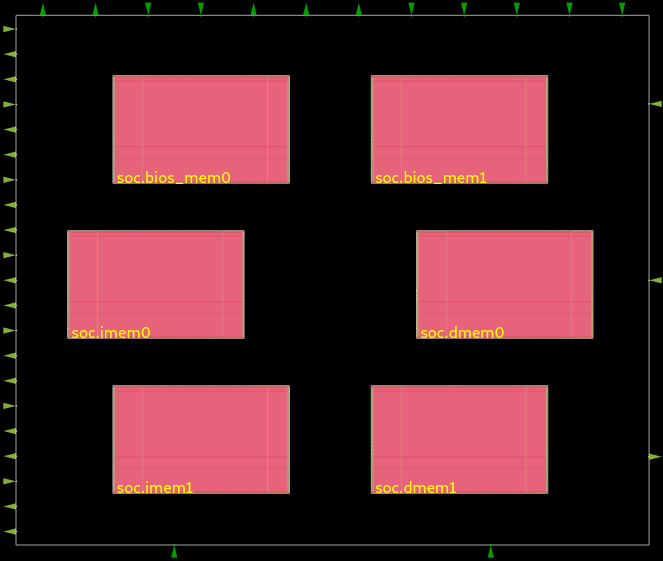

### 3.3. Clock-Tree-Synthesis

* Tota-Area: 1879092 (nm^2, [report-file](230207/OpenLane/hdp_rv151/runs/full_guide/reports/cts/12-cts_rsz_sta.area.rpt))
* OpenRoad-GUI<br />
    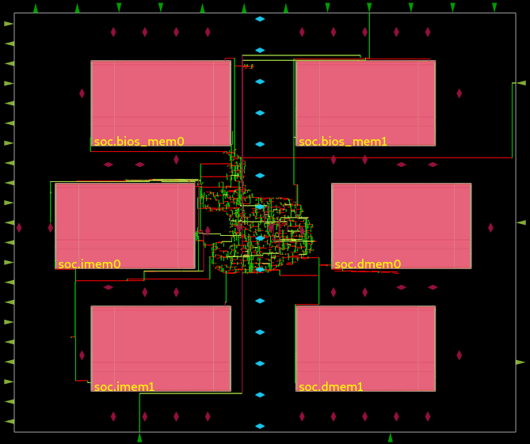

### 3.4. Placement and Routing

* Tota-Area: 1883814 (nm^2, [report-file](230207/OpenLane/hdp_rv151/runs/full_guide/reports/signoff/26-rcx_sta.area.rpt))
* OpenRoad-GUI<br />
    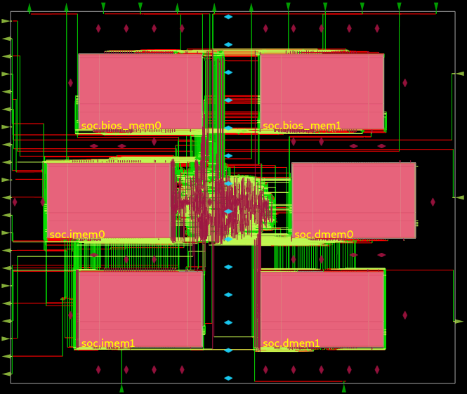

### 3.5. Layout and Sign-Off

* Klayout<br />
    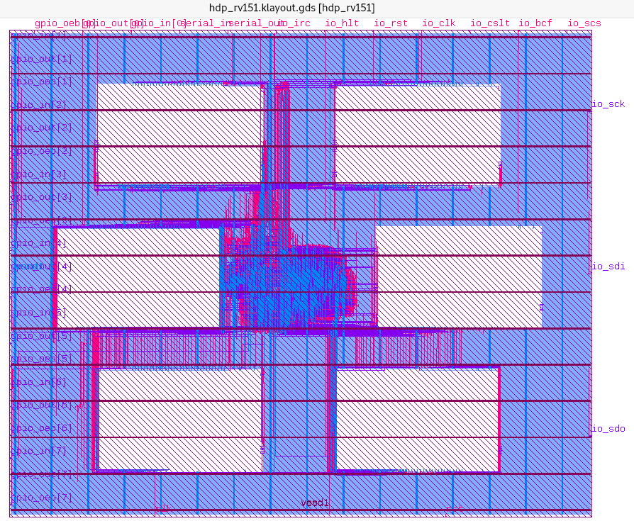

* LVS: Total Errors = 0, [report-file](230207/OpenLane/hdp_rv151/runs/full_guide/reports/signoff/33-hdp_rv151.lvs.rpt)

* DRC: Errors on SRAM-Macro, [report-file](230207/OpenLane/hdp_rv151/runs/full_guide/reports/manufacturability.rpt)
    * Pass in [MPW-Precheck Results](https://github.com/watz0n/mpw_hdp_rv151#results)
    * [efabless/mpw_precheck: Precheck crash with SRAM DRC](https://github.com/efabless/mpw_precheck/issues/180)

* Antenna Rule Check: 0 violatiors, [report-file](230207/OpenLane/hdp_rv151/runs/full_guide/reports/signoff/35-antenna_violators.rpt)

### 3.6. PVT Corners

* PVT-Corner(Synthesis-Yosys-Standalone)

    |PVT-CORNER  |WNS      |WHS   |TNS        |
    |------------|---------|------|-----------|
    |ff_100C_1v65|19.7068  |0.2638|0.0000     |
    |ff_100C_1v95|19.7695  |0.2099|0.0000     |
    |ff_n40C_1v56|19.6514  |0.2977|0.0000     |
    |ff_n40C_1v65|19.6944  |0.2633|0.0000     |
    |ff_n40C_1v76|19.7328  |0.2313|0.0000     |
    |ff_n40C_1v95|19.7771  |0.1949|0.0000     |
    |ss_100C_1v40|11.2004  |0.9399|0.0000     |
    |ss_100C_1v60|19.2776  |0.6481|0.0000     |
    |ss_n40C_1v28|-199.1358|1.8901|-64819.8203|
    |ss_n40C_1v35|-94.5224 |1.3856|-25342.5410|
    |ss_n40C_1v40|-53.4180 |1.1444|-12204.2646|
    |ss_n40C_1v44|-32.6214 |1.0077|-6067.6792 |
    |ss_n40C_1v60|19.2178  |0.6595|0.0000     |
    |ss_n40C_1v76|19.4299  |0.4964|0.0000     |
    |tt_025C_1v80|19.6459  |0.3166|0.0000     |
    |tt_100C_1v80|19.6439  |0.3247|0.0000     |

    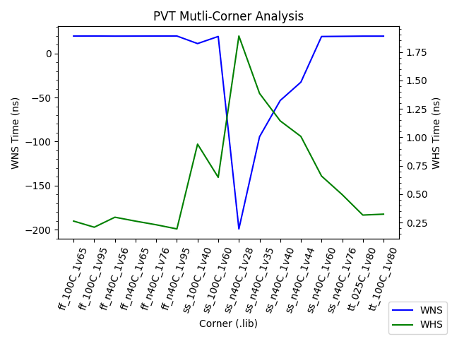

* PVT-Corner(RC-Max, Post-Route from OpenLane)

    |PVT-CORNER  |WNS    |WHS   |TNS   |
    |------------|-------|------|------|
    |ff_100C_1v65|18.9408|0.2661|0.0000|
    |ff_100C_1v95|19.0802|0.2117|0.0000|
    |ff_n40C_1v56|18.7087|0.3004|0.0000|
    |ff_n40C_1v65|18.8670|0.2657|0.0000|
    |ff_n40C_1v76|18.9707|0.2334|0.0000|
    |ff_n40C_1v95|19.0790|0.1967|0.0000|
    |ss_100C_1v40|16.6521|0.9456|0.0000|
    |ss_100C_1v60|17.6714|0.6525|0.0000|
    |ss_n40C_1v28|4.4281 |1.9281|0.0000|
    |ss_n40C_1v35|13.7879|1.3956|0.0000|
    |ss_n40C_1v40|14.9132|1.1527|0.0000|
    |ss_n40C_1v44|15.6054|1.0152|0.0000|
    |ss_n40C_1v60|17.1562|0.6645|0.0000|
    |ss_n40C_1v76|17.9284|0.5006|0.0000|
    |tt_025C_1v80|18.7393|0.3193|0.0000|
    |tt_100C_1v80|18.7540|0.3274|0.0000|

    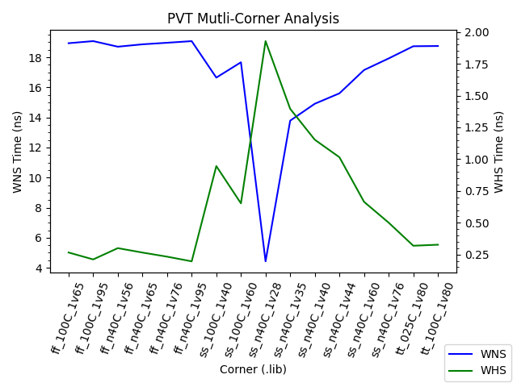

* PVT-Corner(RC-Min, Post-Route from OpenLane)

    |PVT-CORNER  |WNS    |WHS   |TNS   |
    |------------|-------|------|------|
    |ff_100C_1v65|19.0622|0.2656|0.0000|
    |ff_100C_1v95|19.2232|0.2113|0.0000|
    |ff_n40C_1v56|18.8493|0.2998|0.0000|
    |ff_n40C_1v65|18.9939|0.2651|0.0000|
    |ff_n40C_1v76|19.1235|0.2329|0.0000|
    |ff_n40C_1v95|19.2313|0.1963|0.0000|
    |ss_100C_1v40|16.9331|0.9450|0.0000|
    |ss_100C_1v60|17.8774|0.6520|0.0000|
    |ss_n40C_1v28|10.6932|1.9274|0.0000|
    |ss_n40C_1v35|14.3634|1.3949|0.0000|
    |ss_n40C_1v40|15.4111|1.1520|0.0000|
    |ss_n40C_1v44|16.0242|1.0146|0.0000|
    |ss_n40C_1v60|17.4409|0.6641|0.0000|
    |ss_n40C_1v76|18.1388|0.4997|0.0000|
    |tt_025C_1v80|18.8739|0.3187|0.0000|
    |tt_100C_1v80|18.8860|0.3268|0.0000|

    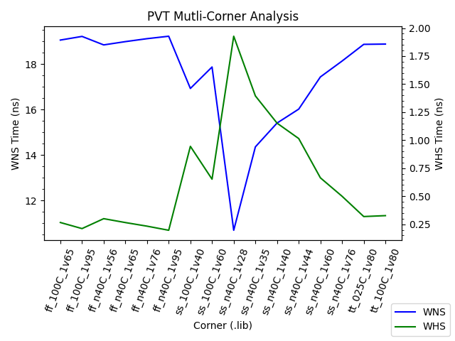

------

## 4. References

```
[1] David A. Patterson and John L. Hennessy. 2017. Computer Organization and Design RISC-V Edition: The Hardware Software Interface (1st. ed.). Morgan Kaufmann Publishers Inc., San Francisco, CA, USA.
[2] David Patterson and Andrew Waterman. 2017. The RISC-V Reader: An Open Architecture Atlas (1st. ed.). Strawberry Canyon
[3] FPGA Project, Berkeley EECS-151 Fall 2022, https://github.com/EECS150/fpga_project_skeleton_fa22/blob/master/spec/EECS151_FPGA_Project_Fa22.pdf
[4] Yosys Manual, https://yosyshq.readthedocs.io/projects/yosys/en/latest/CHAPTER_Approach.html#typical-use-case
[5] OpenSTA User-Guide, https://github.com/The-OpenROAD-Project/OpenSTA/blob/master/doc/OpenSTA.pdf
[6] OpenLane Tutorial, Designing a chip with an OpenRAM (sky130), https://openlane.readthedocs.io/en/latest/tutorials/openram.html
[7] OpenROAD GUI Mode, open ".odb" file in OpenLane "runs/.../results" directory, https://openroad.readthedocs.io/en/latest/main/src/gui/README.html
[8] MPW-Precheck, from Caravel User Project, https://github.com/efabless/caravel_user_project/blob/main/docs/source/index.rst#running-mpw-precheck-locally
```

------